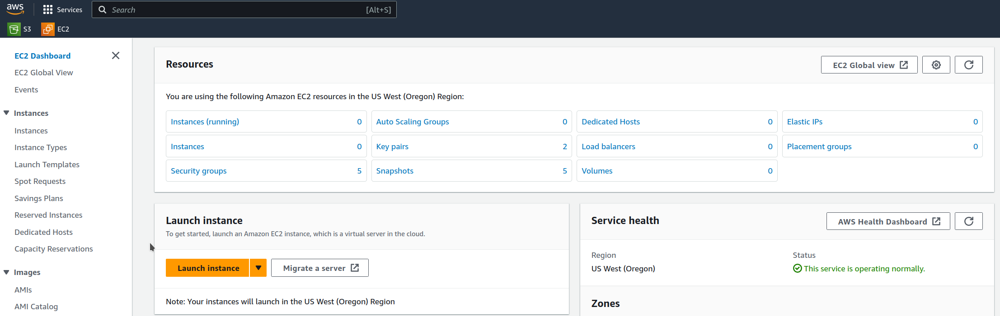
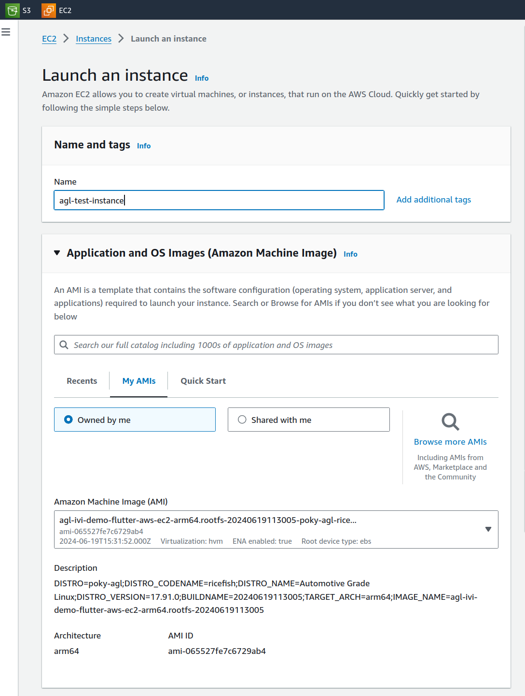
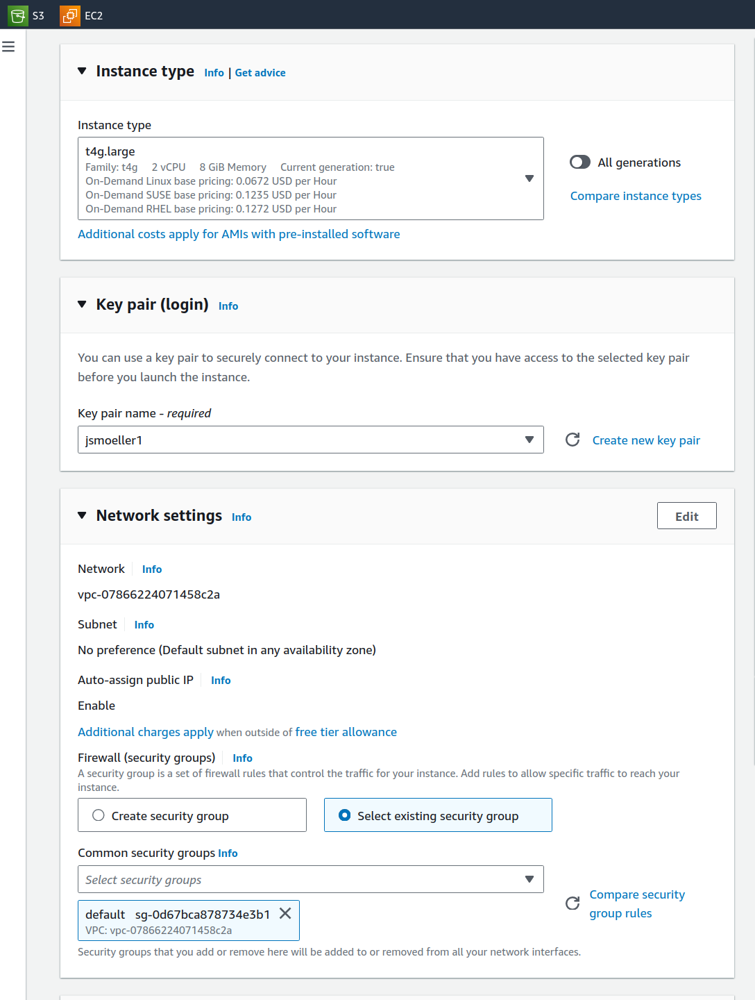

Building an image for emulation allows you to simulate your
image without actual target hardware. In this case using an EC2 instance.

This section describes the steps you need to take to build the
AGL demo image for emulation using EC2 either for arm64 or x86-64.

In the command-line examples below, we will focus on aws-ec2-arm64 primarily.
If you need x86-64, then replace it with aws-ec2-x86-64 likewise.

## 1. Making Sure Your Build Environment is Correct

The
"[Initializing Your Build Environment](./04_Initializing_Your_Build_Environment.md)"
section presented generic information for setting up your build environment
using the `aglsetup.sh` script.
If you are building the AGL demo image for emulation, you need to specify some
specific options when you run the script:

**Sample Qt based IVI demo :**

```sh
$ source meta-agl/scripts/aglsetup.sh -f -m aws-ec2-arm64 -b build-aws-ec2 agl-demo agl-devel
$ echo "# reuse download directories" >> $AGL_TOP/site.conf
$ echo "DL_DIR = \"$HOME/downloads/\"" >> $AGL_TOP/site.conf
$ echo "SSTATE_DIR = \"$AGL_TOP/sstate-cache/\"" >> $AGL_TOP/site.conf
$ ln -sf $AGL_TOP/site.conf conf/
```

**IVI-EG Flutter based demo :**

```
$ source meta-agl/scripts/aglsetup.sh -f -m aws-ec2-arm64 -b build-aws-ec2 agl-demo agl-devel
$ echo "# reuse download directories" >> $AGL_TOP/site.conf
$ echo "DL_DIR = \"$HOME/downloads/\"" >> $AGL_TOP/site.conf
$ echo "SSTATE_DIR = \"$AGL_TOP/sstate-cache/\"" >> $AGL_TOP/site.conf
$ ln -sf $AGL_TOP/site.conf conf/
```

The "-m" option specifies the "aws-ec2-arm64" machine.
The list of AGL features used with script are appropriate for development of
the AGL demo image. For production use, you need to omit agl-devel and tailor your image.

## 2. Using BitBake

Start the build using the `bitbake` command.

**NOTE:** An initial build can take many hours depending on your
CPU and Internet connection speeds.
The build also takes approximately 100G-bytes of free disk space.

**Sample Qt based IVI demo :**
The target is `agl-ivi-demo-qt`.

```
$ time bitbake agl-ivi-demo-qt
```

By default, the build process puts the resulting image in the Build Directory and further exporting that as `$IMAGE_NAME`:

```
<build_directory>/tmp/deploy/images/aws-ec2-arm64/agl-ivi-demo-qt-aws-ec2-arm64.rootfs.wic.vhd
$ export IMAGE_NAME=agl-ivi-demo-qt
```

**IVI-EG Flutter based demo :**
The target is `agl-ivi-demo-flutter`.

```
$ time bitbake agl-ivi-demo-flutter
```

By default, the build process puts the resulting image in the Build Directory and further exporting that as $IMAGE_NAME:


```
<build_directory>/tmp/deploy/images/aws-ec2-arm64/agl-ivi-demo-flutter-aws-ec2-arm64.rootfs.wic.vhd
$ export IMAGE_NAME=agl-ivi-demo-flutter
```


## 3. Deploying the AGL Demo Image

Deploying the image consists of uploading the image to S3 and
conversion to an AMI image. The whole process is done using
a script from meta-aws. Next you need to start a new instance
using your new image.
The image is setup to expose its screen over rdp. This is ok for
development, but you need to keep security in mind when configuring
the EC2 security groups and/or tunnel over ssh.


### 3.1 Uploading using create-ec2-ami.sh

The script required to upload the resulting image is part of meta-aws in the subfolder scripts/ec2-ami/.

**It has a few requirements that you need to setup first.**

**These are documented in the [Readme there](https://github.com/aws4embeddedlinux/meta-aws/blob/scarthgap/scripts/ec2-ami/README.md).**

**Read it and set it up accordingly.**

The script itself is called create-ec2-ami.sh and takes 4 arguments:
* your S3 bucket name
* the size of the AMI (don't make it too small)
* the target image name
* the machine name

```
Example run
../bsp/meta-aws/scripts/ec2-ami/create-ec2-ami.sh my_s3_bucket 8 agl-ivi-demo-flutter aws-ec2-arm64
```

After this process is complete, your image is available as AMI to you (only to you).

### 3.2 Configuring within AWS EC2

In your EC2 dashboard go the the same region as you configured the upload for, 
select "Launch instance" and enter a name.



Select under "My AMIs" the uploaded AGL image in question. Select an instance type
that is big enough (>= 4GB RAM, 8GB RAM recommended). 



Select your key pair, select the security group.



Finally start the instance.

**Note1: AWS serial console does not help as you have no root password available until you reset it.**

**Note2: You cannot connect as 'root' (as shown in the connect tab) - you have to substitute 'root' with 'user'.**

**Note3: There is no web output, you need to use RDP. See below ...**


### 3.3 Connecting via RDP

For security reasons, you should always tunnel over ssh.

For this, connect using 'ssh -i "yourkey.pem" -L 3389:localhost:3389 user@publicIPofSERVER' .

Then use an rdp client and connect to 'localhost' .

### 3.4 Security considerations

As mentioned above, do not expose port 3389 to the internet by opening up the port.
