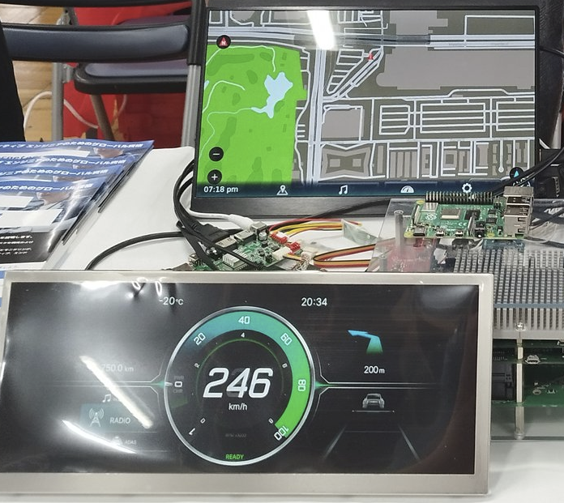
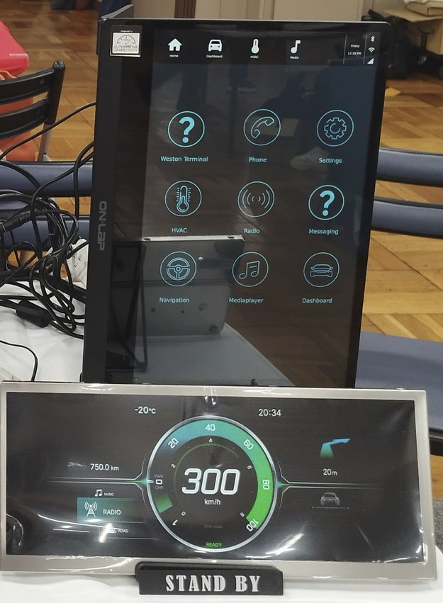
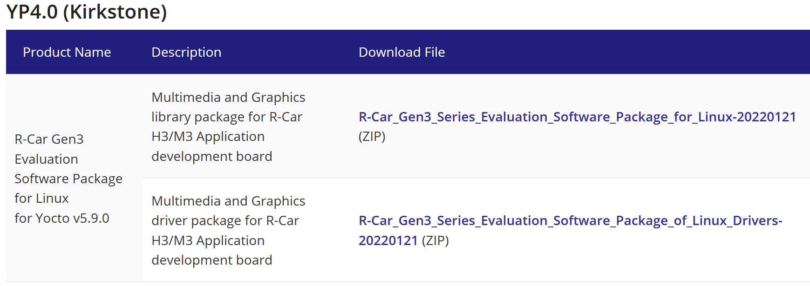
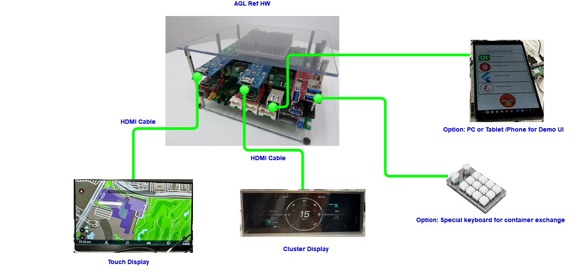
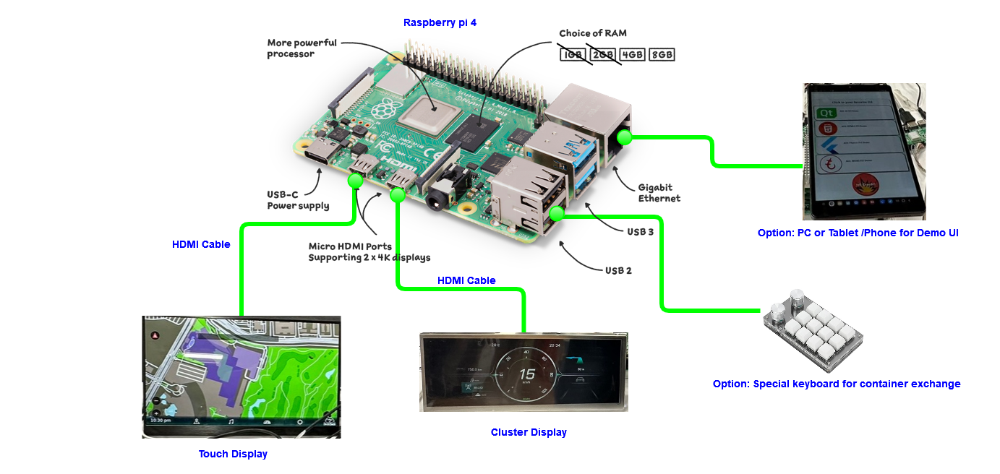
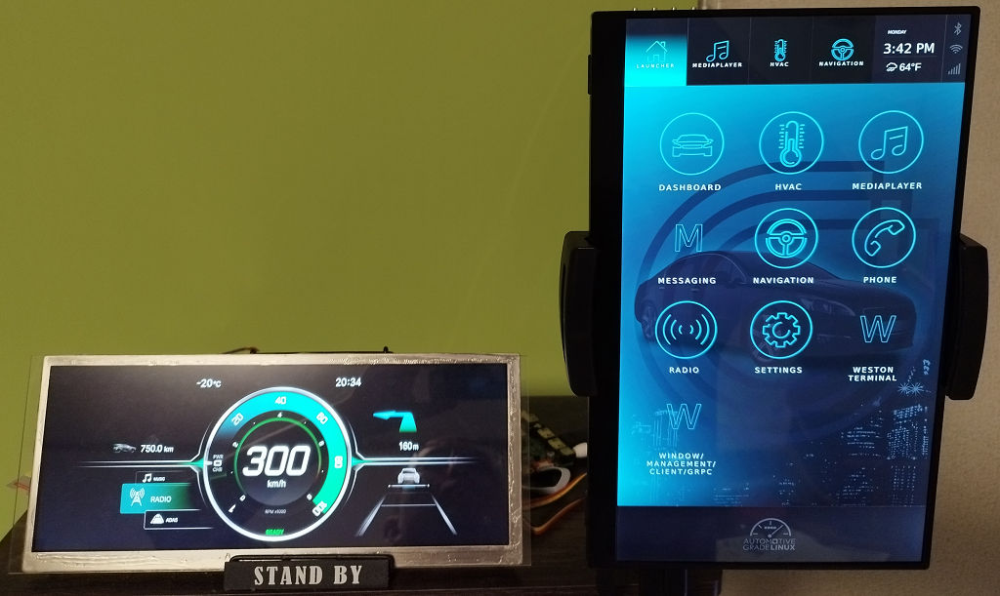
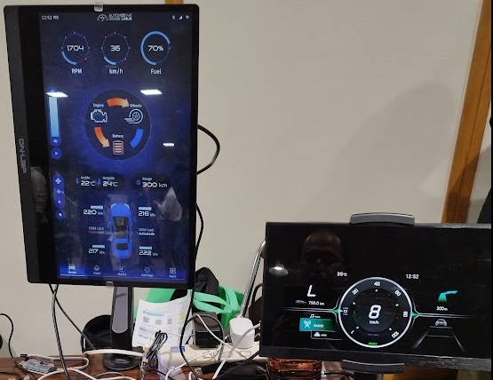
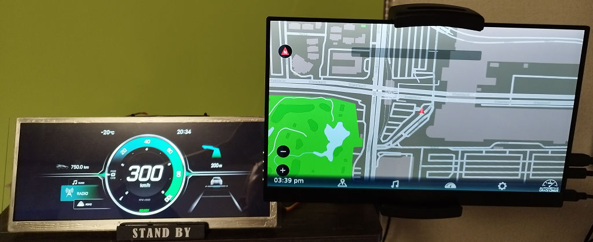
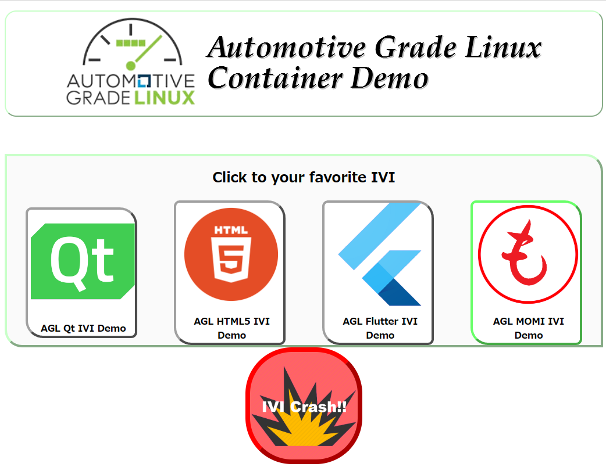
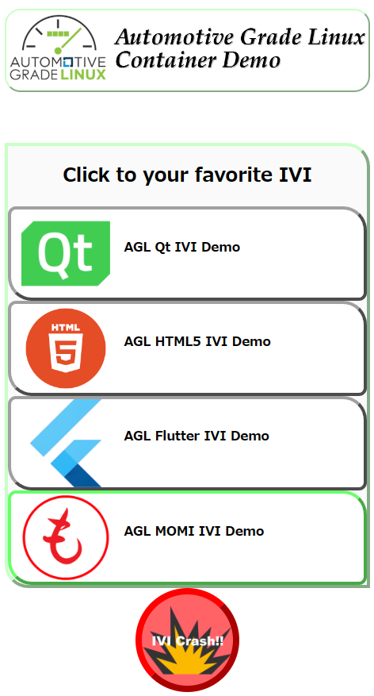

# Build and Boot AGL Instrument Cluster demo image (IC-IVI with Container isolation)


This document describe how to build AGL instrument cluster with
container integration.

## 1. Select Image type and target board

AGL IC container integration has various type.  Developer need to choice
which integration type.  Those type show in table1. 

**Table 1. Integration type.**

| No. | Type name | Detail of type | Required storage (SD card) size - board. | Build time AMD R9 5900HX /64GByte RAM | Required storage size-build. |  |
|:---:|:---:|:---:|:---:|:---:|:---:|:---:|
| 1 | Simple container host | This integration aim to core package definition for container host using LXC.  This integration is not include demo package. This integration aim to define starting point for downstream product development. | 1G Byte |  | 150GByte | Console only. |
| 2a | Instrument cluster with demo IVI install to one by one partition. | This integration aim to get simple integration with demo feature.  This container runtime and management is constructed with container management daemon with liblxc.  This integration will improve to support many embedded use case.  This integration support two demo guest run in one board (instrument cluster guest and momi IVI guest). This integration aim to learn and develop AGL IC container integration by developer. | 16GByte (Including pre-allocated partition for 2 guests.) | 2h | 300GByte |  |
| 2b | Instrument cluster with AGL demo IVI install to one by one partition. | This integration aim to get full demo integration with AGL demo IVI.  This integration is extend from 2a integration.  This integration support instrument cluster guest and four IVI guest (momi, qt, flutter).   This integration aim to use AGL demonstration in each event by developer. | 16GByte | 2a+6h | 600GByte |  |


AGL IC container integration supported two board.  Those board show in
table2.

**Table2. Supported board.**

| Board type | Support integration type | status |
|:---:|:---:|:---:|
| AGL RefHW | 1,2a,2b | Tested. |
| R-CarH3 Starter Kit with Kingfisher board | 1,2a,2b | Not tested. |
| NanoPC-T6 (4G or 8G or 16G) | 1,2a,2b | Tested by 16G board. |
| Raspberry Pi4/5 (4G or 8G) | 1,2a,2b | Tested. |

We recommend to choice AGL RefHW or Raspberry Pi4 (4G or 8G) or NanoPC-T6 (4G or 8G or 16G) . 

**Typical Hardware Set is shown in Appendix.1. **

## 2. Setup build environment

Build environment for AGL IC container integration is same as AGL other
profile build environment. 

### 1st step:
Please read [[Build Process Overview]](https://docs.automotivelinux.org/en/master/#01_Getting_Started/02_Building_AGL_Image/01_Build_Process_Overview/) in AGL doc.

### 2nd step:
Please read [[Preparing Your Build Host]](https://docs.automotivelinux.org/en/master/#01_Getting_Started/02_Building_AGL_Image/02_Preparing_Your_Build_Host/) in AGL doc.

### 3rd step: 
Define Your Top-Level Directory.

```bash
$ export AGL_TOP=$HOME/AGL
$ mkdir -p $AGL_TOP
```

### 4th step: Download the repo Tool and Set Permissions

If your environment already install google repo, please skip this step.

```bash
$ mkdir -p $HOME/bin
$ export PATH=$HOME/bin:$PATH
$ curl https://storage.googleapis.com/git-repo-downloads/repo > $HOME/bin/repo
$ chmod a+x $HOME/bin/repo
```

### 5th step: Setup git

If your environment already setup user information for git, please skip this step.

```bash
$ git config \--global user.email "you@example.com"
$ git config \--global user.name "Your Name"
```

### 6th step: Download the AGL Source Files

```bash
$ cd $AGL_TOP
$ mkdir master
$ export AGL_TOP=$HOME/AGL/master
$ cd $AGL_TOP
$ repo init -b master -u https://gerrit.automotivelinux.org/gerrit/AGL/AGL-repo
$ repo sync
```

### 7th step: Downloading Proprietary Drivers  (AGL RefHW and R-Car H3/M3 with Kingfisher board only procedure)

If your board is Raspberry Pi4, please skip this step.

#### 7-1: Downloading Proprietary Drivers from [Renesas-automotive-products](https://www.renesas.com/us/en/products/automotive-products/automotive-system-chips-socs/r-car-h3-m3-documents-software).

In case of master, please download this.

***Note.  Latest AGL use same binary as kirkstone.***



#### 7-2: To check the files to download.
```bash
$ grep -rn ZIP_.= $AGL_TOP/meta-agl/meta-agl-bsp/meta-rcar-gen3/scripts/setup_mm_packages.sh
$ export XDG_DOWNLOAD_DIR=$HOME/Downloads
```

#### 7-3: Download and copy Proprietary Drivers files (Run commands at downloaded files directory).

```bash
$ cp R-Car_Gen3_Series_Evaluation_Software_Package_* $XDG_DOWNLOAD_DIR/
$ chmod a+rw $XDG_DOWNLOAD_DIR/*.zip
```

## 3. Configure to target board and build.

### 1st step:  Run the aglsetup.sh Script.

```bash
$ cd $AGL_TOP
```

When your board is AGL RefHW.

```bash
$ source meta-agl/scripts/aglsetup.sh -f -m h3ulcb -b build-ic-refhw agl-ic-container agl-refhw-h3
```

When your board is R- CarH3 Starter Kit with Kingfisher board.

```bash
$ source meta-agl/scripts/aglsetup.sh -f -m h3ulcb-kf -b build-ic-h3kf agl-ic-container
```

When your board is NanoPC T6
```bash
$ source meta-agl/scripts/aglsetup.sh -f -m nanopc-t6 -b build-ic-nanopc-t6 agl-ic-container
```

When your board is Raspberry Pi 4
```bash
$ source meta-agl/scripts/aglsetup.sh -f -m raspberrypi4 -b build-ic-rpi4 agl-ic-container
```

When your board is Raspberry Pi 5
```bash
$ source meta-agl/scripts/aglsetup.sh -f -m raspberrypi5 -b build-ic-rpi5 agl-ic-container
```


### 2nd step: Build target image.

In this time, you can build 1 and 2a.  If you want to build 2b,
please do extra step in next section.

When you choice integration type 1.

```bash
$ bitbake lxc-host-image-minimal
```

When you choice integration type 2a.

```bash
$ bitbake agl-instrument-cluster-container-demo
```

## 4. Extra step for type 2b build.

This extra step can select 4.1 or 4.2.  When you want to build AGL demo
IVI container guest in myself, please select 4.1 work flow.  When you
want to create AGL IC container demo quicly, please select 4.2 work flow.

Typically 4.1 step require long build time about 6h.  When you want to
build AGL Ref HW/ SK+ Kinfgisher software, you can\'t select select 4.2
work flow that depend to Renesas propriety license limitation.

### 4.1. Extra step for type 2b build myself.

#### 1st step: Configure 2nd build tree.

We recommend to open new terminal to do this extra section.

```bash
$ export AGL_TOP=$HOME/AGL/master
$ cd $AGL_TOP
```

When your board is AGL RefHW.

```bash
$ source meta-agl/scripts/aglsetup.sh -f -m h3ulcb -b build-ivi-refhw agl-container-guest-demo agl-demo agl-refhw-h3
```

When your board is R- CarH3 Starter Kit with Kingfisher board.

```bash
$ source meta-agl/scripts/aglsetup.sh -f -m h3ulcb-kf -b build-ivi-h3kf agl-container-guest-demo agl-demo
```

When your board is NanoPC T6
```bash
$ source meta-agl/scripts/aglsetup.sh -f -m nanopc-t6 -b build-ivi-nanopc-t6 agl-container-guest-demo agl-demo
```

When your board is Raspberry Pi 4
```bash
$ source meta-agl/scripts/aglsetup.sh -f -m raspberrypi4 -b build-ivi-rpi4 agl-container-guest-demo agl-demo
```

When your board is Raspberry Pi 5
```bash
$ source meta-agl/scripts/aglsetup.sh -f -m raspberrypi5 -b build-ivi-rpi5 agl-container-guest-demo agl-demo
```

#### 2nd step: Build target images.

Type 2b integration need to build 3 image, these image are
agl-ivi-demo-qt and agl-ivi-demo-flutter.

```bash
$ bitbake agl-ivi-demo-qt
$ bitbake agl-ivi-demo-flutter
```

#### 3rd step: Set deploy path of AGL IVI Demo to IC side config.

Type 2b integration refer to IVI pre build image.  Please set IVI side
deploy directory in ic side local.conf (or site.conf).

At $AGL_TOP/build-ic-XXXX/conf/local.conf

Add to
```bash
OUT_OF_TREE_CONTAINER_IMAGE_DEPLOY_DIR = "/path/to/deploy/"
```

ex.  When your board is AGL RefHW and your home directory is "/home/user/".
```bash
OUT_OF_TREE_CONTAINER_IMAGE_DEPLOY_DIR = "/home/user/AGL/master/build-ivi-refhw/tmp/deploy"
```

ex.  When your board is R- CarH3 Starter Kit with Kingfisher board and your home directory is "/home/user/".

```bash
OUT_OF_TREE_CONTAINER_IMAGE_DEPLOY_DIR = "/home/user/AGL/master/build-ivi-h3kf/tmp/deploy"
```

ex.  When your board is NanoPC T6 board and your home directory is "/home/user/".

```bash
OUT_OF_TREE_CONTAINER_IMAGE_DEPLOY_DIR = "/home/user/AGL/master/build-ivi-nanopc-t6/tmp/deploy"
```

ex.  When your board is Raspberry Pi 4 and your home directory is "/home/user/".

```bash
OUT_OF_TREE_CONTAINER_IMAGE_DEPLOY_DIR = "/home/user/AGL/master/build-ivi-rpi4/tmp/deploy"
```

ex.  When your board is Raspberry Pi 5 and your home directory is "/home/user/".

```bash
OUT_OF_TREE_CONTAINER_IMAGE_DEPLOY_DIR = "/home/user/AGL/master/build-ivi-rpi5/tmp/deploy"
```

#### 4th step: Build all in one image (2b).

Back to terminal for ic build.

```bash
$ bitbake agl-instrument-cluster-container-demo
```

### 4.2. Extra step for type 2b using pre build image.

The 4.2 can select Raspberry Pi 4 board only, this limitation depend to
Renesas propriety license limitation.

#### 1st step: Download stable prebuild image from AGL site.

Download IVI guest images from this link.

[[Prebuild AGL Demo IVI container images for Raspberry Pi
4.]]()

Extract download tar.bz2 archive to any directory.

```bash
$ cd /path/to/directory/
$ tar xvJf /path/to/download/agl-demo-ivi-container-guest-raspberrypi4-64.tar.bz2
```

#### 2nd step: Set deploy path of AGL IVI Demo to IC side config.

Set extracted directory using OUT_OF_TREE_CONTAINER_IMAGE_DEPLOY_DIR in
local.conf (or site.conf).

```bash
OUT_OF_TREE_CONTAINER_IMAGE_DEPLOY_DIR="/path/to/directory/prebuild/"
```

#### 3rd step: Build all in one image (2b).

Back to terminal for ic build.

```bash
$ bitbake agl-instrument-cluster-container-demo
```

## 5. Write image to SD card.

The 2a and 2b image is constructed by wic image, that include partition
table and each partition data into one image file.

In default setting, that wic image is compressed xz.  When that wic
image write to SD card, you need to use xzcat ant dd command in build
PC.

```bash
$ sudo bash -c "xzcat /path/to/image/directory/agl-instrument-cluster-container-demo-XXXXX.rootfs.wic.xz | dd of=/dev/sdXXX bs=128M"
```

**If you are missing to set SD card device "/dev/sdXXX", it cause
SSD/HDD data break (only logical, not physical).**

For example;

A /dev/sda is SSD for your PC.  A /dev/sdb is SD card.  You should use
/dev/sdb, must not use /dev/sda.

When your PC has direct SD card interface not a use card reader, your SD
card device is /dev/mmcblkX may be.

## 6. Power on.

## 7. How to use container exchange UI.

IC container integration has three method for container exchange.

| No. | Method | Refer to |
|:---|:---|:---|
| 1 | Command line interface | Sub section 7a. |
| 2 | Web UI | Appendix 3. |
| 3 | Key board UI | Appendix 4. |


### 7a. How to change guest using command line interface

The cmcontrol is a command line interface for the container manager.  It supports container listing, shutdown, reboot, force reboot, and active guest change. 

```bash
$ cmcontrol
usage: [options]

 --help                   print help strings.
 --get-guest-list         get guest container list from container manager.
 --get-guest-list-json    get guest container list from container manager by json.
 --shutdown-guest-name=N  shutdown request to container manager. (N=guest name)
 --shutdown-guest-role=R  shutdown request to container manager. (R=guest role)
 --reboot-guest-name=N    reboot request to container manager. (N=guest name)
 --reboot-guest-role=R    shutdown request to container manager. (R=guest role)
 --force-reboot-guest-name=N    reboot request to container manager. (N=guest name)
 --force-reboot-guest-role=R    shutdown request to container manager. (R=guest role)
 --change-active-guest-name=N    change active guest request to container manager. (N=guest name)
```

You can get installed container guests in the system using --get-guest-list option.

```bash
$ cmcontrol --get-guest-list
HEADER:                             name,        role,      status
                            cluster-demo,     cluster,     started
                    agl-flutter-ivi-demo,         ivi,     disable
                       agl-momi-ivi-demo,         ivi,     started
                         agl-qt-ivi-demo,         ivi,     disable
```

The name is a guest name.  The role is a guest role (cluster or ivi).  The status is a status of guest.  Current inactive guest status is disable.


If you want to change guest from agl-momi-ivi-demo to agl-flutter-ivi-demo, it uses these command.

```bash
$ cmcontrol --change-active-guest-name=agl-flutter-ivi-demo
$ cmcontrol --shutdown-guest-role=ivi
```

If you want to reboot IVI guest with shutdown process, it uses these command.

```bash
$ cmcontrol --reboot-guest-role=ivi
```

If you want to force reboot IVI guest without shutdown process, it uses these command.

```bash
$ cmcontrol --force-reboot-guest-role=ivi
```

## Frequently Asked Questions

| Questions | Answer |
|:---|:---|
| Why not show map in default screen of Momi IVI. | When you want show map, you need extra step.  Please fallow [this page](../../06_Component_Documentation/Demo_Application/01_Momi_Navi.md).|


## Appendix.1.  Typical Hardware set.

### AGL Reference Hardware.




| **No** | **Name** | **num** | **Where to buy** |
|---|---|---|---|
| 1 | AGL Ref HW | 1 | Ask to Panasonic. [Contact about purchase](https://confluence.automotivelinux.org/display/RHSA/Contact+about+purchase) |
| 2 | Touch Display (Full HD) | 1 | [https://amzn.asia/d/7URb6r8](https://amzn.asia/d/7URb6r8) |
| 3 | Cluster Display (1920x720 or Full HD) | 1 | [https://amzn.asia/d/bGircST](https://amzn.asia/d/bGircST) |
| 4 | HDMI Cable (Need to check how to connect this cable to Touch/Cluster Display, that depend to display side connector) | 2 | [https://amzn.asia/d/auuhnTK](https://amzn.asia/d/auuhnTK) |
| 5 | Optional: Special Keyboard | 1 | [https://amzn.asia/d/dZdbp9X](https://amzn.asia/d/dZdbp9X) |

### Raspberry PI4



| **No** | **Name** | **num** | **Where to buy** |
|---|---|---|---|
| 1 | Raspberry PI 4(4G or 8G) with Power supply | 1 | [https://akizukidenshi.com/catalog/g/gM-14778/](https://akizukidenshi.com/catalog/g/gM-14778/) [https://akizukidenshi.com/catalog/g/gM-16293/](https://akizukidenshi.com/catalog/g/gM-16293/) |
| 2 | Touch Display (Full HD) | 1 | [https://amzn.asia/d/7URb6r8](https://amzn.asia/d/7URb6r8) |
| 3 | Cluster Display (1920x720 or Full HD) | 1 | [https://amzn.asia/d/bGircST](https://amzn.asia/d/bGircST) |
| 4 | HDMI Cable (Need to check how to connect this cable to Touch/Cluster Display, that depend to display side connector) | 2 | [https://akizukidenshi.com/catalog/g/gC-15002/](https://akizukidenshi.com/catalog/g/gC-15002/) |
| 5 | Optional: Special Keyboard | 1 | [https://amzn.asia/d/dZdbp9X](https://amzn.asia/d/dZdbp9X) |


## Appendix.2. Cluster with IVI Containers View.

### Qt IVI



### Flutter IVI



### Momi IVI



## Appendix 3. How to use Web UI (Momi Web).

The Momi web is a web interface for container exchange.  When you want
to use Momi web, you must connect network between board and
PC/Tablet/Phone.

**The Momi web is completely demo feature, that open many security hole.
 You shall not use out of standalone demo.**

### 1st step: Check IP address in your board.

After booting, you check IP address in your board.

```bash
root@raspberrypi4-64:\~# ifconfig\
eth0      Link encap:Ethernet  HWaddr E4:XX:YY:ZZ:WW:VV\
           inet addr:192.168.10.128  Bcast:192.168.10.255
  Mask:255.255.255.0
```

In this case, this board set IP address by 192.168.10.128.

### 2nd step: Connect to board using web browser.

Open "[http://a.b.c.d:8080](http://a.b.c.d:8080)".  When
a board is set IP address 192.168.10.128, you open
"[http://192.168.10.128:8080](http://192.168.10.128:8080)".

When you success to connect to board, your web browser show these web
UI.

### PC View



### Mobile View




## Appendix 4. How to configure Special Keyboard.

### How to get configuration tool.

This description is targeting to [this type of special
keyboard](https://amzn.asia/d/dUxGK5Q). 

The usb-12key-kbd-prog is unofficial community tool of this key board
that is possible to use linux.  Official windows tool is possible to get
official site.

Usage of usb-12key-kbd-prog is please refer to upstream site.

Upstream:
[https://github.com/NeoCat/usb-12key-kbd-prog](https://github.com/NeoCat/usb-12key-kbd-prog)

### Key Map.
| Key | Container |
|---|---|
| A | Momi IVI |
| C | Crash IVI guest |
| D | Qt IVI |
| G | Flutter IVI |

# Reference webpages
 1. [eLinux](https://elinux.org/R-Car/AGL)
 1. [Kingfisher Board](https://elinux.org/R-Car/Boards/Kingfisher)
 1. [R-Car M3SK](https://elinux.org/R-Car/Boards/M3SK#Flashing_firmware)
 1. [agl reference machines](https://docs.automotivelinux.org/en/master/#02_hardware_support/01_Supported_Hardware_Overview/)
 1. [AGL Tech Day Presenation](https://static.sched.com/hosted_files/agltechday2022/3b/agl-techday-202204.pdf)
 1. [Build AGL Image](https://docs.automotivelinux.org/en/master/#01_Getting_Started/02_Building_AGL_Image/0_Build_Process_Overview/)
 1. [Building for Supported Renesas Boards](https://docs.automotivelinux.org/en/master/#01_Getting_Started/02_Building_AGL_Image/09_Building_for_Supported_Renesas_Boards/)
