# How to send/receive CAN message using PC

## Overview

This document describe how to send CAN message to target device/view CAN message receive from target device.

We use DSD Tech [SH-C30A](https://www.deshide.com/product-details_SH-C30A.html) and [SH-C31A](https://www.deshide.com/product-details_SH-C31A.html) for reference USB-CAN adaptor.  Both adapter usage is same, this document mainly focus to SH-C30A.

## Hardware

### SH-C30A

Connect CANH connector to target CANH connector.  Connect CANL connector to target CANL connector. Typically, GND connector does not need to target.

R120 switch and Boot Switch set to these.

- Boot Switch : OFF(Work Mode)
- R120 : ON(If you do not connect terminator.)

### SH-C31A

Connect CANH connector to target CANH connector.  Connect CANL connector to target CANL connector. Typically, GND connector does not need to target.

R120 switch and Boot Switch set to these.

- Boot Switch : OFF(Work Mode)
- R120 : ON(If you do not connect terminator.)

## Software

### Install Device Driver

[SH-C30A Web page](https://www.deshide.com/product-details_SH-C30A.html)

[SH-C31A Web page](https://www.deshide.com/product-details_SH-C31A.html)

The device driver download link is described in this document.  Let's download and install driver to your windows PC.

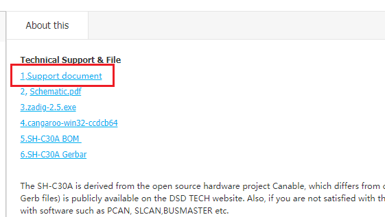
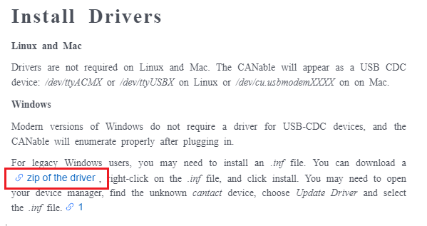

As a result, this device can see at device manager. When your device has SLCAN firmware, this device can see at device manager another name. 

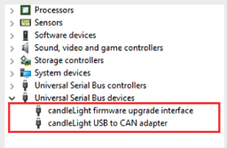

---
### Install Control Software

A Cangaroo is a control software for this device.  You can download this link at device page of DSD Tech.

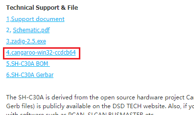

After the install and exec, it show follow window.

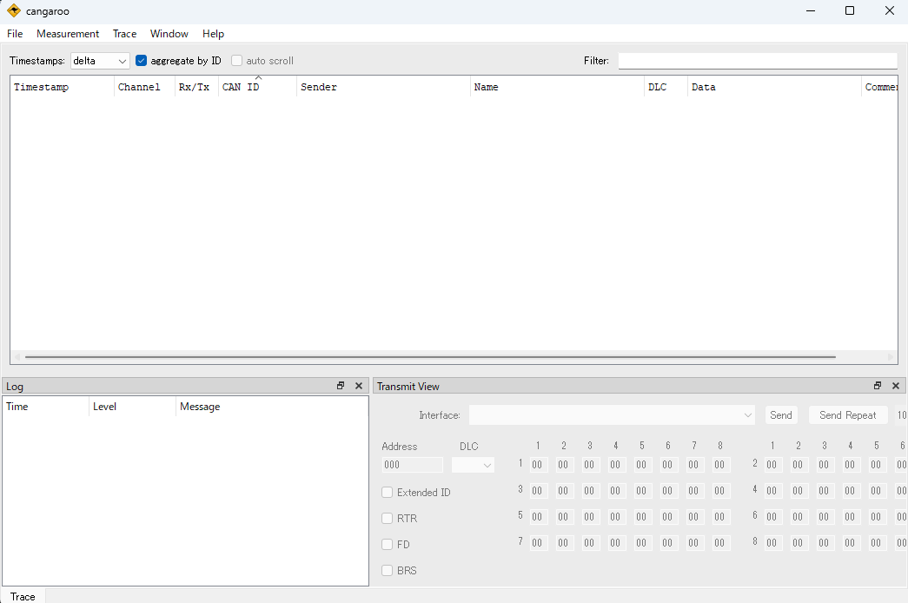

---
### How to view CAN message receive from target device.

You do follows step, it will receive CAN message from target.

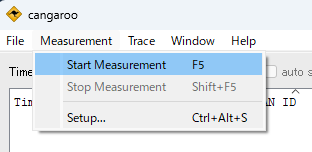

Select "Start Measurement".

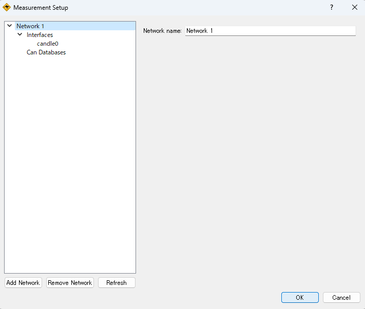

Push OK.

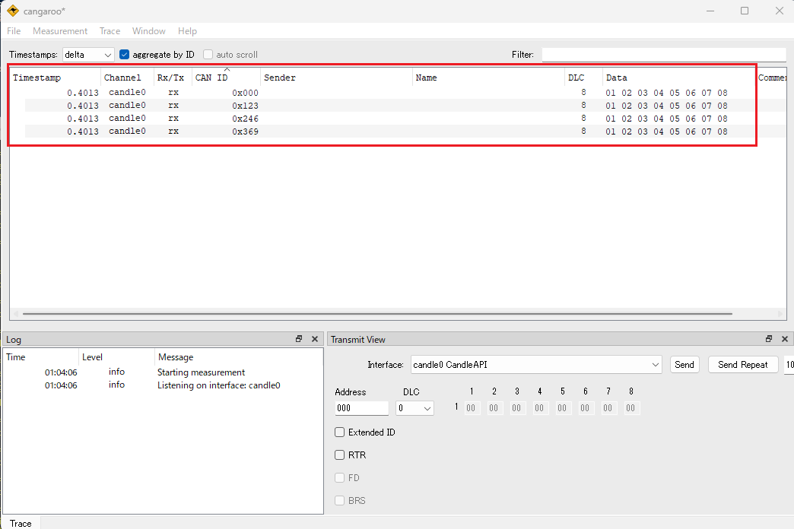

It show received CAN messages.

---
### How to send CAN message to target device

You do follows step, it will send CAN message to target.

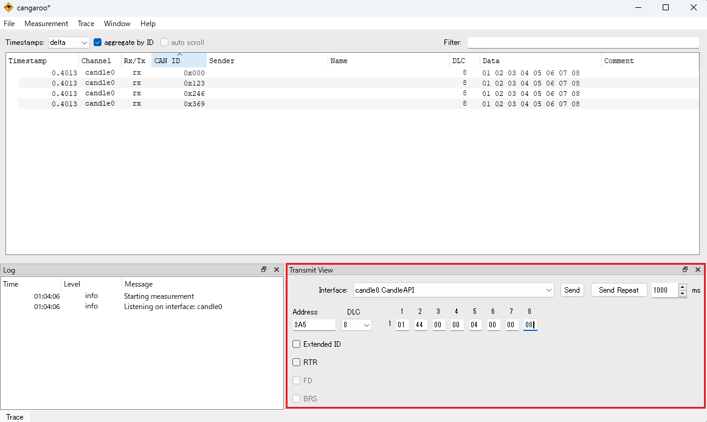

Set CAN message at Transmit View.

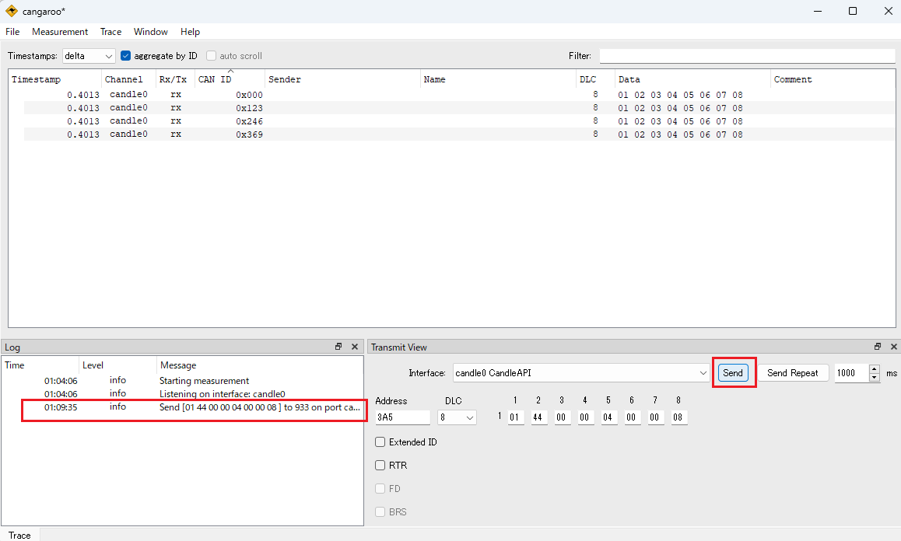

Push Send button, it send CAN message once.

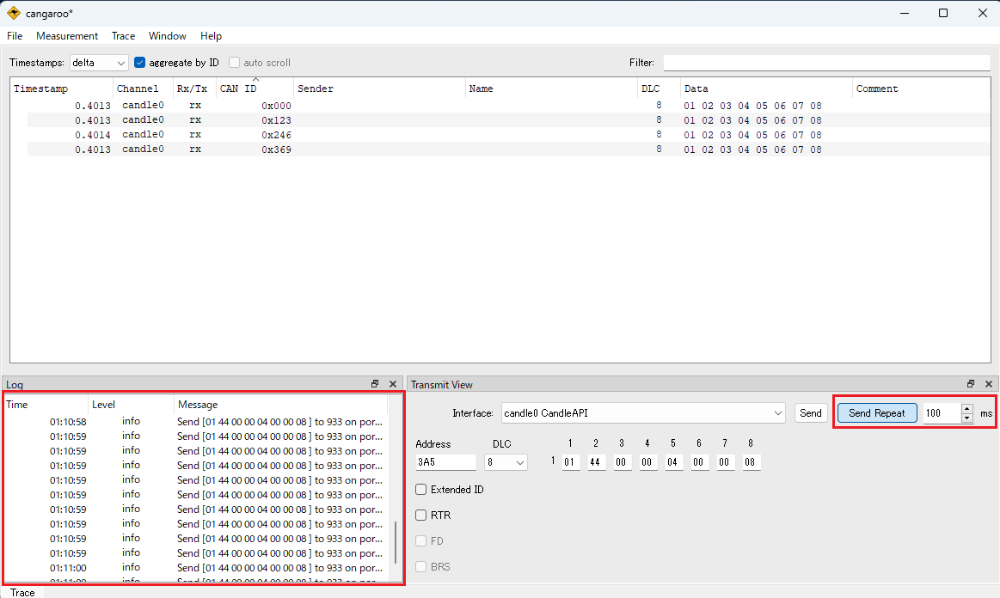

If you want to send cyclic, you push Send Repeat after interval setting.
