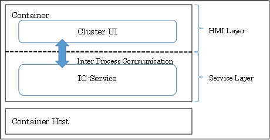
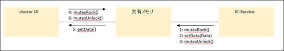
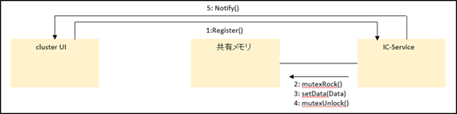

AGL Instrument Cluster API Specifications

Rev1.0 Last Update: 2026/2/4

| Revision | Date | |
|:---|:---|:---|
|0.1|2020/05/14|Initial creation|
|0.2|2020/08/06|Addressed IC-EG review comments|
|0.3|2020/08/07|Added getHoodDoor|
|0.4|2021/01/20|Added clusterInit, clusterTerm functions and fixed typos|
|1.0|2026/02/04|Official release|

# Purpose

This specification describes the interface for the Cluster UI in the HMI Layer to obtain signal information from the IC-Service.

# Overview
This defines the API between the Cluster UI in the HMI Layer, which performs screen rendering, and the IC-Service in the Service Layer, which performs functional processing.



The Cluster UI in the HMI Layer and the IC-Service in the Service Layer are isolated process boundaries.  That is communicated using an inter-process communication method.  It's realized for the pseudo shared memory.

There are two usage models for the pseudo shared memory: Polling and Event.

* Polling

  The IC-Service updates values in the pseudo shared memory when the value is changed.  The Cluster UI periodically calls 'get' functions to retrieve values from the pseudo shared memory regardless of whether values have changed.

  This diagram provides an overview of polling mode.

  

* Event

  The Cluster UI registers signals using the notification API if it needs to receive notifications of signal value changes from the IC-Service.  When the IC-Service updates the pseudo shared memory values, it accesses the value change.  If the registered signal value has changed, it notifies the Cluster UI via the `Notify` function.

  The Cluster UI gets the new signal value from the `Notify` function.

  This diagram provides an overview of event mode.

  

# API Details

This section describes the details of the API.  It defines using the C language ABI.  These API uses to obtain each signal.

Signal retrieval API details include six items:

* Prototype declaration
* API description
* Return type
* Return value details
* Argument details
* Notes

The details for Enum and Macro constant definitions are as follows.

Enum constant definitions include:

* API name
* API description
* Constant names, values and descriptions
* Notes

Macro constant definitions include:

* API name
* API description
* Value and description
* Notes

## Enum Definition
### IC_HMI_ON_OFF
#### Enum Name
IC_HMI_ON_OFF

#### Description
Telltale ON/OFF state

#### Constants and values

<dl>
  <dt>0: IC_HMI_OFF</dt>
    <dd>OFF state</dd>
  <dt>1: IC_HMI_ON</dt>
    <dd>ON state</dd>
</dl>

#### Notes
None

---
### IC_HMI_GEAR_AT_VAL
#### Enum Name
IC_HMI_GEAR_AT_VAL

#### Description
Gear state (AT)

#### Constants and values
<dl>
  <dt>0: IC_HMI_AT_OFF</dt>
    <dd>Gear not displayed</dd>
  <dt>1: IC_HMI_AT_PARKING</dt>
    <dd>Gear is in Parking</dd>
  <dt>2: IC_HMI_AT_REVERSE</dt>
    <dd>Gear is in Reverse</dd>
  <dt>3: IC_HMI_AT_NEUTRAL</dt>
    <dd>Gear is in Neutral</dd>
  <dt>4: IC_HMI_AT_DRIVE</dt>
    <dd>Gear is in Drive</dd>
  <dt>5: IC_HMI_AT_SECOND</dt>
    <dd>Gear is in Second</dd>
  <dt>6: IC_HMI_AT_LOW_GEAR</dt>
    <dd>Gear is in Low Gear</dd>
  <dt>7: IC_HMI_AT_FIRST</dt>
    <dd>Gear is in First</dd>
  <dt>8: IC_HMI_AT_MANUAL</dt>
    <dd>Gear is in Manual</dd>
  <dt>9: IC_HMI_AT_BRAKE</dt>
    <dd>Gear is in Brake</dd>
  <dt>10: IC_HMI_AT_ALL_ON</dt>
    <dd>All indicators ON</dd>
  <dt>11: IC_HMI_AT_ALL_OFF</dt>
    <dd>All indicators OFF</dd>
  <dt>12: IC_HMI_AT_UNUSED</dt>
    <dd>Gear unused</dd>
</dl>

#### Notes
None

---
### IC_HMI_GEAR_MT_VAL
#### Enum Name
IC_HMI_GEAR_MT_VAL

#### Description
Gear state (MT)

#### Constants and values
<dl>
  <dt>0: IC_HMI_MT_OFF</dt>
    <dd>Gear not displayed</dd>
  <dt>1: IC_HMI_MT_FIRST</dt>
    <dd>1st gear</dd>
  <dt>2: IC_HMI_MT_SECOND</dt>
    <dd>2nd gear</dd>
  <dt>3: IC_HMI_MT_THIRD</dt>
    <dd>3rd gear</dd>
  <dt>4: IC_HMI_MT_FOURTH</dt>
    <dd>4th gear</dd>
  <dt>5: IC_HMI_MT_FIFTH</dt>
    <dd>5th gear</dd>
  <dt>6: IC_HMI_MT_SIXTH</dt>
    <dd>6th gear</dd>
  <dt>7: IC_HMI_MT_SEVENTH</dt>
    <dd>7th gear</dd>
  <dt>8: IC_HMI_MT_EIGHTTH</dt>
    <dd>8th gear</dd>
</dl>

#### Notes
None

---
### IC_HMI_SP_UNIT_VAL
#### Enum Name
IC_HMI_SP_UNIT_VAL

#### Description
Speed unit

#### Constants and values
<dl>
  <dt>0: IC_HMI_SP_KM_H</dt>
    <dd>Speed unit is km/h</dd>
  <dt>1: IC_HMI_SP_MPH</dt>
    <dd>Speed unit is mph</dd>
</dl>

#### Notes
None

---
### IC_HMI_TRCOM_UNIT_VAL
#### Enum Name
IC_HMI_TRCOM_UNIT_VAL

#### Description
Trip computer unit
<dl>
  <dt>0: IC_HMI_TRCOM_KM</dt>
    <dd>Trip computer unit is km</dd>
  <dt>1: IC_HMI_TRCOM_MILE</dt>
    <dd>Trip computer unit is mile</dd>
</dl>

#### Notes
None

---
### IC_HMI_FUEL_ECONOMY_UNIT_VAL
#### Enum Name
IC_HMI_FUEL_ECONOMY_UNIT_VAL

#### Description
Fuel economy display units
* Instant fuel economy
* Average fuel economy A/B
* Instant electric consumption
* Instant electric consumption A/B

#### Constants and values
<dl>
  <dt>0: IC_HMI_FUEL_KM_L</dt>
    <dd>Fuel economy unit km/L</dd>
  <dt>1: IC_HMI_FUEL_MPG_US</dt>
    <dd>Fuel economy unit MPG (U.S. gallon)</dd>
  <dt>2: IC_HMI_FUEL_MPG_IG</dt>
    <dd>Fuel economy unit MPG (imperial gallon)</dd>
  <dt>3: IC_HMI_FUEL_L_100KM</dt>
    <dd>Fuel economy unit L/100km</dd>
  <dt>4: IC_HMI_FUEL_MILE_KWH</dt>
    <dd>Fuel economy unit mile/kWh</dd>
  <dt>5: IC_HMI_FUEL_KM_KWH</dt>
    <dd>Fuel economy unit km/kWh</dd>
  <dt>6: IC_HMI_FUEL_MILE_KG</dt>
    <dd>Fuel economy unit mile/kg</dd>
  <dt>7: IC_HMI_FUEL_KM_KG</dt>
    <dd>Fuel economy unit km/kg</dd>
  <dt>8: IC_HMI_FUEL_KWH_100KM</dt>
    <dd>Fuel economy unit kWh/100km</dd>
</dl>

#### Notes
None

---
### IC_HMI_OTEMP_UNIT_VAL
#### Enum Name
IC_HMI_OTEMP_UNIT_VAL

#### Description
Outside temperature unit

#### Constants and values
<dl>
  <dt>0: IC_HMI_OTEMP_UNIT_C</dt>
    <dd>Outside temperature unit Celsius</dd>
  <dt>1: IC_HMI_OTEMP_UNIT_K</dt>
    <dd>Outside temperature unit Fahrenheit</dd>
</dl>

#### Notes
None

## Macro Definition
### TellTale

---
#### IC_HMI_TT_TURN_R
##### Macro Name
IC_HMI_TT_TURN_R

##### Description
Bit flag for right turn signal state

##### Value
0x0000000000000001

##### Notes
None

---
#### IC_HMI_TT_TURN_L
##### Macro Name
IC_HMI_TT_TURN_L

##### Description
Bit flag for left turn signal state

##### Value
0x0000000000000002

##### Notes
None

---
#### IC_HMI_TT_BRAKE
##### Macro Name
IC_HMI_TT_BRAKE

##### Description
Bit flag for brake warning light state

##### Value
0x0000000000000004

##### Notes
None

---
#### IC_HMI_TT_SEATBELT
##### Macro Name
IC_HMI_TT_SEATBELT

##### Description
Bit flag for seatbelt warning light state

##### Value
0x0000000000000008

##### Notes
None

---
#### IC_HMI_TT_HIGHBEAM
##### Macro Name
IC_HMI_TT_HIGHBEAM

##### Description
Bit flag for beam passing indicator state

##### Value
0x0000000000000010

##### Notes
None

---
#### IC_HMI_TT_DOOR
##### Macro Name
IC_HMI_TT_DOOR

##### Description
Bit flag for half-door warning light state

##### Value
0x0000000000000020

##### Notes
None

---
#### IC_HMI_TT_EPS
##### Macro Name
IC_HMI_TT_EPS

##### Description
Bit flag for EPS warning light state

##### Value
0x0000000000000040

##### Notes
None

---
#### IC_HMI_TT_SRS_AIRBAG
##### Macro Name
IC_HMI_SRS_TT_AIRBAG

##### Description
Bit flag for SRS airbag warning light state

##### Value
0x0000000000000080

##### Notes
None

---
#### IC_HMI_TT_ABS
##### Macro Name
IC_HMI_TT_ABS

##### Description
Bit flag for ABS warning light state

##### Value
0x0000000000000100

##### Notes
None

---
#### IC_HMI_TT_LOW_BATTERY
##### Macro Name
IC_HMI_TT_LOW_BATTERY

##### Description
Bit flag for charge warning light state

##### Value
0x0000000000000200

##### Notes
None

---
#### IC_HMI_TT_OIL_PRESS
##### Macro Name
IC_HMI_TT_OIL_PRESS

##### Description
Bit flag for oil pressure warning light state

##### Value
0x0000000000000400

##### Notes
None

---
#### IC_HMI_TT_ENGINE
##### Macro Name
IC_HMI_TT_ENGINE

##### Description
Bit flag for engine warning light state

##### Value
0x0000000000000800

##### Notes
None

---
#### IC_HMI_TT_FUEL
##### Macro Name
IC_HMI_TT_FUEL

##### Description
Bit flag for low fuel warning light state

##### Value
0x0000000000001000

##### Notes
None

---
#### IC_HMI_TT_IMMOBI
##### Macro Name
IC_HMI_TT_IMMOBI

##### Description
Bit flag for immobilizer warning light state

##### Value
0x0000000000002000

##### Notes
None

---
#### IC_HMI_TT_TM_FAIL
##### Macro Name
IC_HMI_TT_TM_FAIL

##### Description
Bit flag for TM Failure warning light state

##### Value
0x0000000000004000

##### Notes
None

---
#### IC_HMI_TT_ESP_ACT
##### Macro Name
IC_HMI_TT_ESP_ACT

##### Description
Bit flag for ESP-ACT warning light state

##### Value
0x0000000000008000

##### Notes
None

---
#### IC_HMI_TT_ESP_OFF
##### Macro Name
IC_HMI_TT_ESP_OFF

##### Description
Bit flag for ESP-OFF warning light state

##### Value
0x0000000000010000

##### Notes
None

---
#### IC_HMI_TT_ADAPTING_LIGHTING
##### Macro Name
IC_HMI_TT_ADAPTING_LIGHTING

##### Description
Bit flag for Adapting Lighting warning light state

##### Value
0x0000000000020000

##### Notes
None

---
#### IC_HMI_TT_AUTO_STOP
##### Macro Name
IC_HMI_TT_AUTO_STOP

##### Description
Bit flag for Auto Stop warning light state

##### Value
0x0000000000040000

##### Notes
None

---
#### IC_HMI_TT_AUTO_STOP_FAIL
##### Macro Name
IC_HMI_TT_AUTO_STOP_FAIL

##### Description
Bit flag for Auto Stop Fail warning light state

##### Value
0x0000000000080000

##### Notes
None

---
#### IC_HMI_TT_PARKING_LIGHTS
##### Macro Name
IC_HMI_TT_PARKING_LIGHTS

##### Description
Bit flag for Parking Lights warning light state

##### Value
0x0000000000100000

##### Notes
None

---
#### IC_HMI_TT_FRONT_FOG
##### Macro Name
IC_HMI_TT_FRONT_FOG

##### Description
Bit flag for Front Fog warning light state

##### Value
0x0000000000200000

##### Notes
None

---
#### IC_HMI_TT_EXTERIOR_LIGHT_FAULT
##### Macro Name
IC_HMI_TT_EXTERIOR_LIGHT_FAULT

##### Description
Bit flag for Exterior Light Fault warning light state

##### Value
0x0000000000400000

##### Notes
None

---
#### IC_HMI_TT_ACC_FAIL
##### Macro Name
IC_HMI_TT_ACC_FAIL

##### Description
Bit flag for ACC-Failure warning light state

##### Value
0x0000000000800000

##### Notes
None

---
#### IC_HMI_TT_LDW_OFF
##### Macro Name
IC_HMI_TT_LDW_OFF

##### Description
Bit flag for Lane Departure Warning OFF state

##### Value
0x0000000001000000

##### Notes
None

---
#### IC_HMI_TT_HILL_DESCENT
##### Macro Name
IC_HMI_TT_HILL_DESCENT

##### Description
Bit flag for Hill-Descent warning light state

##### Value
0x0000000002000000

##### Notes
None

---
#### IC_HMI_TT_AUTO_HI_BEAM_GREEN
##### Macro Name
IC_HMI_TT_AUTO_HI_BEAM_GREEN

##### Description
Bit flag for AutoHiBeamGreen warning light state

##### Value
0x0000000004000000

##### Notes
None

---
#### IC_HMI_TT_AUTO_HI_BEAM_AMBER
##### Macro Name
IC_HMI_TT_AUTO_HI_BEAM_AMBER

##### Description
Bit flag for AutoHiBeamAmber warning light state

##### Value
0x0000000008000000

##### Notes
None

---
#### IC_HMI_TT_LDW_OPERATE
##### Macro Name
IC_HMI_TT_LDW_OPERATE

##### Description
Bit flag for Lane Departure Warning Operate state

##### Value
0x0000000010000000

##### Notes
None

---
#### IC_HMI_TT_GENERAL_WARN
##### Macro Name
IC_HMI_TT_GENERAL_WARN

##### Description
Bit flag for General Warn state

##### Value
0x0000000020000000

##### Notes
None

---
#### IC_HMI_TT_SPORTS_MODE
##### Macro Name
IC_HMI_TT_SPORTS_MODE

##### Description
Bit flag for Sports Mode state

##### Value
0x0000000040000000

##### Notes
None

---
#### IC_HMI_TT_DRIVING_POWER_MODE
##### Macro Name
IC_HMI_TT_DRIVING_POWER_MODE

##### Description
Bit flag for Driving Power Mode state

##### Value
0x0000000080000000

##### Notes
None

---
#### IC_HMI_TT_HOT_TEMP
##### Macro Name
IC_HMI_TT_HOT_TEMP

##### Description
Bit flag for Hot Temp state

##### Value
0x0000000100000000

##### Notes
None

---
#### IC_HMI_TT_LOW_TEMP
##### Macro Name
IC_HMI_TT_LOW_TEMP

##### Description
Bit flag for Low Temp state

##### Value
0x0000000200000000

##### Notes
None

---
#### IC_HMI_TT_ALL
##### Macro Name
IC_HMI_TT_ALL

##### Description
Bit flag to set all warning lights ON

##### Value
0xFFFFFFFFFFFFFFFF

##### Notes
None

## Callback Function
### IC_HMI_FUNC_NOTIFY_IC_HMI
#### Function prototype
**typedef void(* IC_HMI_FUNC_NOTIFY_IC_HMI)(unsigned long long arg_1, IC_HMI_ON_OFF arg_2)**

#### Description
Callback function type passed as an argument to `registerIcHmi` used in Event mode.

#### Return type
void

#### Return details
None

#### Argument details
<dl>
  <dt>unsigned long long arg_1</dt>
    <dd>Bit flags corresponding to signals to be retrieved. See the Telltale section for mapping of bits to signals.</dd>
  <dt>IC_HMI_ON_OFF arg_2</dt>
    <dd>Signal state after change detection. See Enum Definition for state meanings.</dd>
</dl>

#### Notes
None


## Telltale

### getTurnR
#### Prototype
**IC_HMI_ON_OFF getTurnR(void)**

#### Description
Gets the right turn signal state.

#### Return type
IC_HMI_ON_OFF

#### Return details
<dl>
  <dt>IC_HMI_OFF</dt>
    <dd>Off</dd>
  <dt>IC_HMI_ON</dt>
    <dd>On</dd>
</dl>

#### Arguments
None

#### Notes
Blink control is handled by IC-Service.

---
### getTurnL
#### Prototype
**IC_HMI_ON_OFF	getTurnL(void)**

#### Description
Gets the left turn signal state.

#### Return type
IC_HMI_ON_OFF

#### Return details
<dl>
  <dt>IC_HMI_OFF</dt>
    <dd>Off</dd>
  <dt>IC_HMI_ON</dt>
    <dd>On</dd>
</dl>

#### Arguments
None

#### Notes
Blink control is handled by IC-Service.

---
### getBrake
#### Prototype
**IC_HMI_ON_OFF	getBrake(void)**

#### Description
Gets the brake warning light state.

#### Return type
IC_HMI_ON_OFF

#### Return details
<dl>
  <dt>IC_HMI_OFF</dt>
    <dd>Off</dd>
  <dt>IC_HMI_ON</dt>
    <dd>On</dd>
</dl>

#### Arguments
None

#### Notes
None

---
### getSeatbelt
#### Prototype
**IC_HMI_ON_OFF	getSeatbelt(void)**

#### Description
Gets the seatbelt warning light state.

#### Return type
IC_HMI_ON_OFF

#### Return details
<dl>
  <dt>IC_HMI_OFF</dt>
    <dd>Off</dd>
  <dt>IC_HMI_ON</dt>
    <dd>On</dd>
</dl>

#### Arguments
None

#### Notes
Returns ON if any of `getFrontRightSeatbelt` through `getRearLeftSeatbelt` is OFF.

---
### getFrontRightSeatbelt
#### Prototype
**IC_HMI_ON_OFF	getFrontRightSeatbelt(void)**

#### Description
Gets the front-right seatbelt state.

#### Return type
IC_HMI_ON_OFF

#### Return details
<dl>
  <dt>IC_HMI_OFF</dt>
    <dd>Not fastened</dd>
  <dt>IC_HMI_ON</dt>
    <dd>Fastened</dd>
</dl>

#### Arguments
None

#### Notes
None

---
### getFrontCenterSeatbelt
#### Prototype
**IC_HMI_ON_OFF	getFrontCenterSeatbelt(void)**

#### Description
Gets the front-center seatbelt state.

#### Return type
IC_HMI_ON_OFF

#### Return details
<dl>
  <dt>IC_HMI_OFF</dt>
    <dd>Not fastened</dd>
  <dt>IC_HMI_ON</dt>
    <dd>Fastened</dd>
</dl>

#### Arguments
None

#### Notes
None

---
### getFrontLeftSeatbelt
#### Prototype
**IC_HMI_ON_OFF	getFrontLeftSeatbelt(void)**

#### Description
Gets the front-left seatbelt state.

#### Return type
IC_HMI_ON_OFF

#### Return details
<dl>
  <dt>IC_HMI_OFF</dt>
    <dd>Not fastened</dd>
  <dt>IC_HMI_ON</dt>
    <dd>Fastened</dd>
</dl>

#### Arguments
None

#### Notes
None

---
### getMid1RightSeatbelt
#### Prototype
**IC_HMI_ON_OFF	getMid1RightSeatbelt(void)**

#### Description
Gets the second-row right seatbelt state.

#### Return type
IC_HMI_ON_OFF

#### Return details
<dl>
  <dt>IC_HMI_OFF</dt>
    <dd>Not fastened</dd>
  <dt>IC_HMI_ON</dt>
    <dd>Fastened</dd>
</dl>

#### Arguments
None

#### Notes
Returns seatbelt information for the second row in vehicles with three or more rows. Not used for vehicles with less than three rows.

---
### getMid1CenterSeatbelt
#### Prototype
**IC_HMI_ON_OFF	getMid1CenterSeatbelt(void)**

#### Description
Gets the second-row center seatbelt state.

#### Return type
IC_HMI_ON_OFF

#### Return details
<dl>
  <dt>IC_HMI_OFF</dt>
    <dd>Not fastened</dd>
  <dt>IC_HMI_ON</dt>
    <dd>Fastened</dd>
</dl>

#### Arguments
None

#### Notes
Returns seatbelt information for the second row in vehicles with three or more rows. Not used for vehicles with less than three rows.

---
### getMid1LeftSeatbelt
#### Prototype
**IC_HMI_ON_OFF	getMid1LeftSeatbelt(void)**

#### Description
Gets the second-row left seatbelt state.

#### Return type
IC_HMI_ON_OFF

#### Return details
<dl>
  <dt>IC_HMI_OFF</dt>
    <dd>Not fastened</dd>
  <dt>IC_HMI_ON</dt>
    <dd>Fastened</dd>
</dl>

#### Arguments
None

#### Notes
Returns seatbelt information for the second row in vehicles with three or more rows. Not used for vehicles with less than three rows.

---
### getMid2RightSeatbelt
#### Prototype
**IC_HMI_ON_OFF	getMid2RightSeatbelt(void)**

#### Description
Gets the third-row right seatbelt state.

#### Return type
IC_HMI_ON_OFF

#### Return details
<dl>
  <dt>IC_HMI_OFF</dt>
    <dd>Not fastened</dd>
  <dt>IC_HMI_ON</dt>
    <dd>Fastened</dd>
</dl>

#### Arguments
None

#### Notes
Returns seatbelt information for the third row in vehicles with four or more rows. Not used for vehicles with less than four rows.

---
### getMid2CenterSeatbelt
#### Prototype
**IC_HMI_ON_OFF	getMid2CenterSeatbelt(void)**

#### Description
Gets the third-row center seatbelt state.

#### Return type
IC_HMI_ON_OFF

#### Return details
<dl>
  <dt>IC_HMI_OFF</dt>
    <dd>Not fastened</dd>
  <dt>IC_HMI_ON</dt>
    <dd>Fastened</dd>
</dl>

#### Arguments
None

#### Notes
Returns seatbelt information for the third row in vehicles with four or more rows. Not used for vehicles with less than four rows.

---
### getMid2LeftSeatbelt
#### Prototype
**IC_HMI_ON_OFF	getMid2LeftSeatbelt(void)**

#### Description
Gets the third-row left seatbelt state.

#### Return type
IC_HMI_ON_OFF

#### Return details
<dl>
  <dt>IC_HMI_OFF</dt>
    <dd>Not fastened</dd>
  <dt>IC_HMI_ON</dt>
    <dd>Fastened</dd>
</dl>

#### Arguments
None

#### Notes
Returns seatbelt information for the third row in vehicles with four or more rows. Not used for vehicles with less than four rows.

---
### getRearRightSeatbelt
#### Prototype
**IC_HMI_ON_OFF	getRearRightSeatbelt(void)**

#### Description
Gets the rear-right seatbelt state.

#### Return type
IC_HMI_ON_OFF

#### Return details
<dl>
  <dt>IC_HMI_OFF</dt>
    <dd>Not fastened</dd>
  <dt>IC_HMI_ON</dt>
    <dd>Fastened</dd>
</dl>

#### Arguments
None

#### Notes
None

---
### getRearCenterSeatbelt
#### Prototype
**IC_HMI_ON_OFF	getRearCenterSeatbelt(void)**

#### Description
Gets the rear-center seatbelt state.

#### Return type
IC_HMI_ON_OFF

#### Return details
<dl>
  <dt>IC_HMI_OFF</dt>
    <dd>Not fastened</dd>
  <dt>IC_HMI_ON</dt>
    <dd>Fastened</dd>
</dl>

#### Arguments
None

#### Notes
None

---
### getRearLeftSeatbelt
#### Prototype
**IC_HMI_ON_OFF	getRearLeftSeatbelt(void)**

#### Description
Gets the rear-left seatbelt state.

#### Return type
IC_HMI_ON_OFF

#### Return details
<dl>
  <dt>IC_HMI_OFF</dt>
    <dd>Not fastened</dd>
  <dt>IC_HMI_ON</dt>
    <dd>Fastened</dd>
</dl>

#### Arguments
None

#### Notes
None

---
### getHighbeam
#### Prototype
**IC_HMI_ON_OFF	getHighbeam(void)**

#### Description
Gets the beam passing indicator state.

#### Return type
IC_HMI_ON_OFF

#### Return details
<dl>
  <dt>IC_HMI_OFF</dt>
    <dd>Off</dd>
  <dt>IC_HMI_ON</dt>
    <dd>On</dd>
</dl>

#### Arguments
None

#### Notes
None

---
### getDoor
#### Prototype
**IC_HMI_ON_OFF	getDoor(void)**

#### Description
Gets the half-door warning state.

#### Return type
IC_HMI_ON_OFF

#### Return details
<dl>
  <dt>IC_HMI_OFF</dt>
    <dd>Off</dd>
  <dt>IC_HMI_ON</dt>
    <dd>On</dd>
</dl>

#### Arguments
None

#### Notes
Returns ON if any of `getFrontRightDoor` through `getHoodDoor` is ON.

---
### getFrontRightDoor
#### Prototype
**IC_HMI_ON_OFF	getFrontRightDoor(void)**

#### Description
Gets the front-right door open/close state.

#### Return type
IC_HMI_ON_OFF

#### Return details
<dl>
  <dt>IC_HMI_OFF</dt>
    <dd>Closed</dd>
  <dt>IC_HMI_ON</dt>
    <dd>Open</dd>
</dl>

#### Arguments
None

#### Notes
None

---
### getFrontLeftDoor
#### Prototype
**IC_HMI_ON_OFF	getFrontLeftDoor(void)**

#### Description
Gets the front-left door open/close state.

#### Return type
IC_HMI_ON_OFF

#### Return details
<dl>
  <dt>IC_HMI_OFF</dt>
    <dd>Closed</dd>
  <dt>IC_HMI_ON</dt>
    <dd>Open</dd>
</dl>

#### Arguments
None

#### Notes
None

---
### getRearRightDoor
#### Prototype
**IC_HMI_ON_OFF	getRearRightDoor(void)**

#### Description
Gets the rear-right door open/close state.

#### Return type
IC_HMI_ON_OFF

#### Return details
<dl>
  <dt>IC_HMI_OFF</dt>
    <dd>Closed</dd>
  <dt>IC_HMI_ON</dt>
    <dd>Open</dd>
</dl>

#### Arguments
None

#### Notes
None

---
### getRearLeftDoor
#### Prototype
**IC_HMI_ON_OFF	getRearLeftDoor(void)**

#### Description
Gets the rear-left door open/close state.

#### Return type
IC_HMI_ON_OFF

#### Return details
<dl>
  <dt>IC_HMI_OFF</dt>
    <dd>Closed</dd>
  <dt>IC_HMI_ON</dt>
    <dd>Open</dd>
</dl>

#### Arguments
None

#### Notes
None

---
### getTrunkDoor
#### Prototype
**IC_HMI_ON_OFF	getTrunkDoor(void)**

#### Description
Gets the trunk door open/close state.

#### Return type
IC_HMI_ON_OFF

#### Return details
<dl>
  <dt>IC_HMI_OFF</dt>
    <dd>Closed</dd>
  <dt>IC_HMI_ON</dt>
    <dd>Open</dd>
</dl>

#### Arguments
None

#### Notes
None

---
### getHoodDoor
#### Prototype
**IC_HMI_ON_OFF	getHoodDoor(void)**

#### Description
Gets the hood (bonnet) open/close state.

#### Return type
IC_HMI_ON_OFF

#### Return details
<dl>
  <dt>IC_HMI_OFF</dt>
    <dd>Closed</dd>
  <dt>IC_HMI_ON</dt>
    <dd>Open</dd>
</dl>

#### Arguments
None

#### Notes
None

---
### getEps
#### Prototype
**IC_HMI_ON_OFF	getEps(void)**

#### Description
Gets the EPS warning light state.

#### Return type
IC_HMI_ON_OFF

#### Return details
<dl>
  <dt>IC_HMI_OFF</dt>
    <dd>Off</dd>
  <dt>IC_HMI_ON</dt>
    <dd>On</dd>
</dl>

#### Arguments
None

#### Notes
None

---
### getSrsAirbag
#### Prototype
**IC_HMI_ON_OFF	getSrsAirbag(void)**

#### Description
Gets the SRS airbag warning light state.

#### Return type
IC_HMI_ON_OFF

#### Return details
<dl>
  <dt>IC_HMI_OFF</dt>
    <dd>Off</dd>
  <dt>IC_HMI_ON</dt>
    <dd>On</dd>
</dl>

#### Arguments
None

#### Notes
None

---
### getAbs
#### Prototype
**IC_HMI_ON_OFF	getAbs(void)**

#### Description
Gets the ABS warning light state.

#### Return type
IC_HMI_ON_OFF

#### Return details
<dl>
  <dt>IC_HMI_OFF</dt>
    <dd>Off</dd>
  <dt>IC_HMI_ON</dt>
    <dd>On</dd>
</dl>

#### Arguments
None

#### Notes
None

---
### getLowBattery
#### Prototype
**IC_HMI_ON_OFF	getLowBattery(void)**

#### Description
Gets the charge warning light state.

#### Return type
IC_HMI_ON_OFF

#### Return details
<dl>
  <dt>IC_HMI_OFF</dt>
    <dd>Off</dd>
  <dt>IC_HMI_ON</dt>
    <dd>On</dd>
</dl>

#### Arguments
None

#### Notes
None

---
### getOilPress
#### Prototype
**IC_HMI_ON_OFF	getOilPress(void)**

#### Description
Gets the oil pressure warning light state.

#### Return type
IC_HMI_ON_OFF

#### Return details
<dl>
  <dt>IC_HMI_OFF</dt>
    <dd>Off</dd>
  <dt>IC_HMI_ON</dt>
    <dd>On</dd>
</dl>

#### Arguments
None

#### Notes
None

---
### getEngine
#### Prototype
**IC_HMI_ON_OFF	getEngine(void)**

#### Description
Gets the engine warning light state.

#### Return type
IC_HMI_ON_OFF

#### Return details
<dl>
  <dt>IC_HMI_OFF</dt>
    <dd>Off</dd>
  <dt>IC_HMI_ON</dt>
    <dd>On</dd>
</dl>

#### Arguments
None

#### Notes
None

---
### getFuel
#### Prototype
**IC_HMI_ON_OFF	getFuel(void)**

#### Description
Gets the low fuel warning light state.

#### Return type
IC_HMI_ON_OFF

#### Return details
<dl>
  <dt>IC_HMI_OFF</dt>
    <dd>Off</dd>
  <dt>IC_HMI_ON</dt>
    <dd>On</dd>
</dl>

#### Arguments
None

#### Notes
None

---
### getImmobi
#### Prototype
**IC_HMI_ON_OFF	getImmobi(void)**

#### Description
Gets the immobilizer warning light state.

#### Return type
IC_HMI_ON_OFF

#### Return details
<dl>
  <dt>IC_HMI_OFF</dt>
    <dd>Off</dd>
  <dt>IC_HMI_ON</dt>
    <dd>On</dd>
</dl>

#### Arguments
None

#### Notes
None

---
### getTMFail
#### Prototype
**IC_HMI_ON_OFF	getTMFail(void)**

#### Description
Gets the TM Failure warning light state.

#### Return type
IC_HMI_ON_OFF

#### Return details
<dl>
  <dt>IC_HMI_OFF</dt>
    <dd>Off</dd>
  <dt>IC_HMI_ON</dt>
    <dd>On</dd>
</dl>

#### Arguments
None

#### Notes
None

---
### getEspAct
#### Prototype
**IC_HMI_ON_OFF	getEspAct(void)**

#### Description
Gets the ESP-ACT warning light state.

#### Return type
IC_HMI_ON_OFF

#### Return details
<dl>
  <dt>IC_HMI_OFF</dt>
    <dd>Off</dd>
  <dt>IC_HMI_ON</dt>
    <dd>On</dd>
</dl>

#### Arguments
None

#### Notes
None

---
### getEspOff
#### Prototype
**IC_HMI_ON_OFF	getEspOff(void)**

#### Description
Gets the ESP-OFF warning light state.

#### Return type
IC_HMI_ON_OFF

#### Return details
<dl>
  <dt>IC_HMI_OFF</dt>
    <dd>Off</dd>
  <dt>IC_HMI_ON</dt>
    <dd>On</dd>
</dl>

#### Arguments
None

#### Notes
None

---
### getAdaptingLighting
#### Prototype
**IC_HMI_ON_OFF	getAdaptingLighting(void)**

#### Description
Gets the Adapting Lighting warning light state.

#### Return type
IC_HMI_ON_OFF

#### Return details
<dl>
  <dt>IC_HMI_OFF</dt>
    <dd>Off</dd>
  <dt>IC_HMI_ON</dt>
    <dd>On</dd>
</dl>

#### Arguments
None

#### Notes
None

---
### getAutoStop
#### Prototype
**IC_HMI_ON_OFF	getAutoStop(void)**

#### Description
Gets the Auto Stop warning light state.

#### Return type
IC_HMI_ON_OFF

#### Return details
<dl>
  <dt>IC_HMI_OFF</dt>
    <dd>Off</dd>
  <dt>IC_HMI_ON</dt>
    <dd>On</dd>
</dl>

#### Arguments
None

#### Notes
None

---
### getAutoStopFail
#### Prototype
**IC_HMI_ON_OFF	getAutoStopFail(void)**

#### Description
Gets the Auto Stop Fail warning light state.

#### Return type
IC_HMI_ON_OFF

#### Return details
<dl>
  <dt>IC_HMI_OFF</dt>
    <dd>Off</dd>
  <dt>IC_HMI_ON</dt>
    <dd>On</dd>
</dl>

#### Arguments
None

#### Notes
None

---
### getParkingLights
#### Prototype
**IC_HMI_ON_OFF	getParkingLights(void)**

#### Description
Gets the Parking Lights warning light state.

#### Return type
IC_HMI_ON_OFF

#### Return details
<dl>
  <dt>IC_HMI_OFF</dt>
    <dd>Off</dd>
  <dt>IC_HMI_ON</dt>
    <dd>On</dd>
</dl>

#### Arguments
None

#### Notes
None

---
### getFrontFog
#### Prototype
**IC_HMI_ON_OFF	getFrontFog(void)**

#### Description
Gets the Front Fog warning light state.

#### Return type
IC_HMI_ON_OFF

#### Return details
<dl>
  <dt>IC_HMI_OFF</dt>
    <dd>Off</dd>
  <dt>IC_HMI_ON</dt>
    <dd>On</dd>
</dl>

#### Arguments
None

#### Notes
None

---
### getExteriorLightFault
#### Prototype
**IC_HMI_ON_OFF	getExteriorLightFault(void)**

#### Description
Gets the Exterior Light Fault warning light state.

#### Return type
IC_HMI_ON_OFF

#### Return details
<dl>
  <dt>IC_HMI_OFF</dt>
    <dd>Off</dd>
  <dt>IC_HMI_ON</dt>
    <dd>On</dd>
</dl>

#### Arguments
None

#### Notes
None

---
### getAccFail
#### Prototype
**IC_HMI_ON_OFF	getAccFail(void)**

#### Description
Gets the ACC-Failure warning light state.

#### Return type
IC_HMI_ON_OFF

#### Return details
<dl>
  <dt>IC_HMI_OFF</dt>
    <dd>Off</dd>
  <dt>IC_HMI_ON</dt>
    <dd>On</dd>
</dl>

#### Arguments
None

#### Notes
None

---
### getLdwOff
#### Prototype
**IC_HMI_ON_OFF	getLdwOff(void)**

#### Description
Gets the Lane Departure Warning OFF state.

#### Return type
IC_HMI_ON_OFF

#### Return details
<dl>
  <dt>IC_HMI_OFF</dt>
    <dd>Off</dd>
  <dt>IC_HMI_ON</dt>
    <dd>On</dd>
</dl>

#### Arguments
None

#### Notes
None

---
### getHillDescent
#### Prototype
**IC_HMI_ON_OFF	getHillDescent(void)**

#### Description
Gets the Hill-Descent warning light state.

#### Return type
IC_HMI_ON_OFF

#### Return details
<dl>
  <dt>IC_HMI_OFF</dt>
    <dd>Off</dd>
  <dt>IC_HMI_ON</dt>
    <dd>On</dd>
</dl>

#### Arguments
None

#### Notes
None

---
### getAutoHiBeamGreen
#### Prototype
**IC_HMI_ON_OFF	getAutoHiBeamGreen(void)**

#### Description
Gets the AutoHiBeamGreen warning light state.

#### Return type
IC_HMI_ON_OFF

#### Return details
<dl>
  <dt>IC_HMI_OFF</dt>
    <dd>Off</dd>
  <dt>IC_HMI_ON</dt>
    <dd>On</dd>
</dl>

#### Arguments
None

#### Notes
None

---
### getAutoHiBeamAmber
#### Prototype
**IC_HMI_ON_OFF	getAutoHiBeamAmber(void)**

#### Description
Gets the AutoHiBeamAmber warning light state.

#### Return type
IC_HMI_ON_OFF

#### Return details
<dl>
  <dt>IC_HMI_OFF</dt>
    <dd>Off</dd>
  <dt>IC_HMI_ON</dt>
    <dd>On</dd>
</dl>

#### Arguments
None

#### Notes
None

---
### getSportsMode
#### Prototype
**IC_HMI_ON_OFF	getSportsMode(void)**

#### Description
Gets the Sports Mode warning light state.

#### Return type
IC_HMI_ON_OFF

#### Return details
<dl>
  <dt>IC_HMI_OFF</dt>
    <dd>Off</dd>
  <dt>IC_HMI_ON</dt>
    <dd>On</dd>
</dl>

#### Arguments
None

#### Notes
None

---
### getLdwOperate
#### Prototype
**IC_HMI_ON_OFF	getLdwOperate(void)**

#### Description
Gets the Lane Departure Warning Operate state.

#### Return type
IC_HMI_ON_OFF

#### Return details
<dl>
  <dt>IC_HMI_OFF</dt>
    <dd>Off</dd>
  <dt>IC_HMI_ON</dt>
    <dd>On</dd>
</dl>

#### Arguments
None

#### Notes
None

---
### getGeneralWarn
#### Prototype
**IC_HMI_ON_OFF	getGeneralWarn(void)**

#### Description
Gets the General Warn state.

#### Return type
IC_HMI_ON_OFF

#### Return details
<dl>
  <dt>IC_HMI_OFF</dt>
    <dd>Off</dd>
  <dt>IC_HMI_ON</dt>
    <dd>On</dd>
</dl>

#### Arguments
None

#### Notes
None

---
### getDrivingPowerMode
#### Prototype
**IC_HMI_ON_OFF	getDrivingPowerMode(void)**

#### Description
Gets the Driving Power Mode state.

#### Return type
IC_HMI_ON_OFF

#### Return details
<dl>
  <dt>IC_HMI_OFF</dt>
    <dd>Off</dd>
  <dt>IC_HMI_ON</dt>
    <dd>On</dd>
</dl>

#### Arguments
None

#### Notes
None

---
### getHotTemp
#### Prototype
**IC_HMI_ON_OFF	getHotTemp(void)**

#### Description
Gets the Hot Temp warning light state.

#### Return type
IC_HMI_ON_OFF

#### Return details
<dl>
  <dt>IC_HMI_OFF</dt>
    <dd>Off</dd>
  <dt>IC_HMI_ON</dt>
    <dd>On</dd>
</dl>

#### Arguments
None

#### Notes
None

---
### getLowTemp
#### Prototype
**IC_HMI_ON_OFF	getLowTemp(void)**

#### Description
Gets the Low Temp warning light state.

#### Return type
IC_HMI_ON_OFF

#### Return details
<dl>
  <dt>IC_HMI_OFF</dt>
    <dd>Off</dd>
  <dt>IC_HMI_ON</dt>
    <dd>On</dd>
</dl>

#### Arguments
None

#### Notes
None


## ShiftPosition

### getGearAtVal
#### Prototype
**IC_HMI_GEAR_AT_VAL	getGearAtVal(void)**

#### Description
Gets the gear state value.

#### Return type
IC_HMI_GEAR_AT_VAL

#### Return details
<dl>
  <dt>0: IC_HMI_AT_OFF</dt>
    <dd>Indicates gear not displayed.</dd>
  <dt>1: IC_HMI_AT_PARKING</dt>
    <dd>Indicates Parking.</dd>
  <dt>2: IC_HMI_AT_REVERSE</dt>
    <dd>Indicates Reverse.</dd>
  <dt>3: IC_HMI_AT_NEUTRAL</dt>
    <dd>Indicates Neutral.</dd>
  <dt>4: IC_HMI_AT_DRIVE</dt>
    <dd>Indicates Drive.</dd>
  <dt>5: IC_HMI_AT_SECOND</dt>
    <dd>Indicates Second.</dd>
  <dt>6: IC_HMI_AT_LOW_GEAR</dt>
    <dd>Indicates Low Gear.</dd>
  <dt>7: IC_HMI_AT_FIRST</dt>
    <dd>Indicates First.</dd>
  <dt>8: IC_HMI_AT_MANUAL</dt>
    <dd>Indicates Manual.</dd>
  <dt>9: IC_HMI_AT_BRAKE</dt>
    <dd>Indicates Brake.</dd>
  <dt>10: IC_HMI_AT_ALL_ON</dt>
    <dd>Indicates fault: all ON.</dd>
  <dt>11: IC_HMI_AT_ALL_OFF</dt>
    <dd>Indicates fault: all OFF.</dd>
  <dt>12: IC_HMI_AT_UNUSED</dt>
    <dd>Indicates gear unused.</dd>
</dl>

#### Arguments
None

#### Notes
None

---
### getGearMtVal
#### Prototype
**IC_HMI_GEAR_MT_VAL	getGearMtVal(void)**

#### Description
Gets the gear state value.

#### Return type
IC_HMI_GEAR_MT_VAL

#### Return details
<dl>
  <dt>0: IC_HMI_MT_OFF</dt>
    <dd>Indicates gear not displayed.</dd>
  <dt>1: IC_HMI_MT_FIRST</dt>
    <dd>Indicates 1st gear.</dd>
  <dt>2: IC_HMI_MT_SECOND</dt>
    <dd>Indicates 2nd gear.</dd>
  <dt>3: IC_HMI_MT_THIRD</dt>
    <dd>Indicates 3rd gear.</dd>
  <dt>4: IC_HMI_MT_FOURTH</dt>
    <dd>Indicates 4th gear.</dd>
  <dt>5: IC_HMI_MT_FIFTH</dt>
    <dd>Indicates 5th gear.</dd>
  <dt>6: IC_HMI_MT_SIXTH</dt>
    <dd>Indicates 6th gear.</dd>
  <dt>7: IC_HMI_MT_SEVENTH</dt>
    <dd>Indicates 7th gear.</dd>
  <dt>8: IC_HMI_MT_EIGHTH</dt>
    <dd>Indicates 8th gear.</dd>
</dl>

#### Arguments
None

#### Notes
None


## Speed

### getSpAnalogVal
#### Prototype
**unsigned long	getSpAnalogVal(void)**

#### Description
Gets the speed analog value (resolution: 0.01 after smoothing).

#### Return type
unsigned long

#### Return details
| Value | Meaning |
|------:|:----------|
|0x00000000|Min Speed (0.00)|
|0x00007530|Max Speed (300.00)|
|0x00007531-0xFFFFFFFF|Unused (300.01~42949672.95)|

#### Arguments
None

#### Notes
Unit depends on destination market.

---
### getSpAnaDigUnitVal
#### Prototype
**IC_HMI_SP_UNIT_VAL	getSpAnaDigUnitVal(void)**

#### Description
Gets the speed unit.

#### Return type
IC_HMI_SP_UNIT_VAL

#### Return details
<dl>
  <dt>0: IC_HMI_SP_KM_H</dt>
    <dd>Display speed in km/h.</dd>
  <dt>1: IC_HMI_SP_MPH</dt>
    <dd>Display speed in mph.</dd>
</dl>

#### Arguments
None

#### Notes
None


## Tacho

### getTaAnalogVal
#### Prototype
**unsigned long	getTaAnalogVal(void)**

#### Description
Gets the tacho analog value (resolution: 1 after smoothing). Unit: rpm.

#### Return type
unsigned long

#### Return details
| Value | Meaning |
|------:|:----------|
|0x00000000|Min rpm (0)|
|0x00004E20|Max rpm (20000)|
|0x00004E21-0xFFFFFFFF|Unused (20001~4294967295)|

#### Arguments
None

#### Notes
None

## TripComputer

### getTrcomTripAVal
#### Prototype
**unsigned long getTrcomTripAVal(void)**

#### Description
Gets Trip A value (resolution: 0.1).

#### Return type
unsigned long

#### Return details
| Value | Meaning |
|------:|:----------|
|0x00000000|TripA Min(0.0)|
|0x0001869F|TripA Max(9999.9)|
|0x00018670-0xFFFFFFFD|Unused(10000.0~429496729.5)|
|0xFFFFFFFE|"—" display|
|0xFFFFFFFF|Hidden|

#### Arguments
None

#### Notes
Number of display digits depends on model.

---
### getTrcomTripBVal
#### Prototype
**unsigned long getTrcomTripBVal(void)**

#### Description
Gets Trip B value (resolution: 0.1).

#### Return type
unsigned long

#### Return details
| Value | Meaning |
|------:|:----------|
|0x00000000|TripB Min(0.0)|
|0x0001869F|TripB Max(9999.9)|
|0x00018670-0xFFFFFFFD|Unused(10000.0~429496729.5)|
|0xFFFFFFFE|"—" display|
|0xFFFFFFFF|Hidden|

#### Arguments
None

#### Notes
Number of display digits depends on model.

---
### getTrcomOdoVal
#### Prototype
**unsigned long getTrcomOdoVal(void)**

#### Description
Gets ODO value (resolution: 1).

#### Return type
unsigned long

#### Return details
| Value | Meaning |
|------:|:----------|
|0x00000000|ODO Min(0)|
|0x000F423F|ODO Max(999999)|
|0x000F4240-0xFFFFFFFD|Unused(1000000~4294967295)|
|0xFFFFFFFE|"—" display|
|0xFFFFFFFF|Hidden|

#### Arguments
None

#### Notes
Number of display digits depends on model.

---
### getTrcomUnitVal
#### Prototype
**IC_HMI_TRCOM_UNIT_VAL	getTrcomUnitVal(void)**

#### Description
Gets the trip computer unit.

#### Return type
IC_HMI_TRCOM_UNIT_VAL

#### Return details
<dl>
  <dt>IC_HMI_TRCOM_KM</dt>
    <dd>Display trip computer unit in km.</dd>
  <dt>IC_HMI_TRCOM_MILE</dt>
    <dd>Display trip computer unit in mile.</dd>
</dl>

#### Arguments
Used to get units for Trip A/B and ODO values.

---
### getAvgSpeedAVal
#### Prototype
**unsigned short	getAvgSpeedAVal(void)**

#### Description
Gets average speed value associated with Trip A (resolution: 1).

#### Return type
unsigned short

#### Return details
| Value | Meaning |
|------:|:----------|
|0x0000|Average Speed A Min(0)|
|0x012C|Average Speed A Max(300)|
|0x012D-0xFFFD|Unused(300~65533)|
|0xFFFE|"—" display|
|0xFFFF|Hidden|

#### Arguments
None

#### Notes
Display range depends on model.

---
### getAvgSpeedBVal
#### Prototype
**unsigned short	getAvgSpeedBVal(void)**

#### Description
Gets average speed value associated with Trip B (resolution: 1).

#### Return type
unsigned short

#### Return details
| Value | Meaning |
|------:|:----------|
|0x0000|Average Speed B Min(0)|
|0x012C|Average Speed B Max(300)|
|0x012D-0xFFFD|Unused(300~65533)|
|0xFFFE|"—" display|
|0xFFFF|Hidden|

#### Arguments
None

#### Notes
Display range depends on model.

---
### getHourAVal
#### Prototype
**unsigned short	getHourAVal(void)**

#### Description
Gets elapsed hours associated with Trip A (resolution: 1).

#### Return type
unsigned short

#### Return details
| Value | Meaning |
|------:|:----------|
|0x0000|Hour A Min(0)|
|0x03E7|Hour A Max(999)|
|0x03E8-0xFFFD|Unused(1000~65533)|
|0xFFFE|"—" display|
|0xFFFF|Hidden|

#### Arguments
None

#### Notes
Display range depends on model.

---
### getHourBVal
#### Prototype
**unsigned short	getHourBVal(void)**

#### Description
Gets elapsed hours associated with Trip B (resolution: 1).

#### Return type
unsigned short

#### Return details
| Value | Meaning |
|------:|:----------|
|0x0000|Hour B Min(0)|
|0x03E7|Hour B Max(999)|
|0x03E8-0xFFFD|Unused(1000~65533)|
|0xFFFE|"—" display|
|0xFFFF|Hidden|

#### Arguments
None

#### Notes
Display range depends on model.

---
### getMinuteAVal
#### Prototype
**unsigned char	getMinuteAVal(void)**

#### Description
Gets elapsed minutes associated with Trip A (resolution: 1).

#### Return type
unsigned char

#### Return details
| Value | Meaning |
|------:|:----------|
|0x00|Minute A Min (0)|
|0x3B|Minute A Max (59)|
|0x3C-0xFD|Unused (60~253)|
|0xFE|"—" display|
|0xFF|Hidden|

#### Arguments
None

#### Notes
Display range depends on model.

---
### getMinuteBVal
#### Prototype
**unsigned char	getMinuteBVal(void)**

#### Description
Gets elapsed minutes associated with Trip B (resolution: 1).

#### Return type
unsigned char

#### Return details
| Value | Meaning |
|------:|:----------|
|0x00|Minute B Min (0)|
|0x3B|Minute B Max (59)|
|0x3C-0xFD|Unused (60~253)|
|0xFE|"—" display|
|0xFF|Hidden|

#### Arguments
None

#### Notes
Display range depends on model.

---
### getSecondAVal
#### Prototype
**unsigned char	getSecondAVal(void)**

#### Description
Gets elapsed seconds associated with Trip A (resolution: 1).

#### Return type
unsigned char

#### Return details
| Value | Meaning |
|------:|:----------|
|0x00|Second A Min (0)|
|0x3B|Second A Max (59)|
|0x3C-0xFD|Unused (60~253)|
|0xFE|"—" display|
|0xFF|Hidden|

#### Arguments
None

#### Notes
Display range depends on model.

---
### getSecondBVal
#### Prototype
**unsigned char	getSecondBVal(void)**

#### Description
Gets elapsed seconds associated with Trip B (resolution: 1).

#### Return type
unsigned char

#### Return details
| Value | Meaning |
|------:|:----------|
|0x00|Second B Min (0)|
|0x3B|Second B Max (59)|
|0x3C-0xFD|Unused (60~253)|
|0xFE|"—" display|
|0xFF|Hidden|

#### Arguments
None

#### Notes
Display range depends on model.

---
### getOTempVal
#### Prototype
**signed short	getOTempVal(void)**

#### Description
Gets the outside temperature display value (resolution: 1).

#### Return type
signed short

#### Return details
| Value | Meaning |
|------:|:----------|
|0x8001-0xFFD7|Unused(-32767 ~ -41)|
|0xFFD8|Outside Temp Min(-40)|
|0x0083|Outside Temp Max(131)|
|0x0084-0x7FFE|Unused(132~32765)|
|0x7FFE|"—" display(32766)|
|0x7FFF|Hidden(32767)|

#### Arguments
None

#### Notes
Display range depends on model.

---
### getOTempUnitVal
#### Prototype
**IC_HMI_OTEMP_UNIT_VAL	getOTempUnitVal(void)**

#### Description
Gets the unit used for the outside temperature display.

#### Return type
IC_HMI_OTEMP_UNIT_VAL

#### Return details
<dl>
  <dt>IC_HMI_OTEMP_UNIT_C</dt>
    <dd>Display outside temperature in Celsius.</dd>
  <dt>IC_HMI_OTEMP_UNIT_K</dt>
    <dd>Display outside temperature in Fahrenheit.</dd>
</dl>

#### Arguments
None

#### Notes
None

---
### getCruRangeVal
#### Prototype
**unsigned short	getCruRangeVal(void)**

#### Description
Gets the cruise range display value (resolution: 1).

#### Return type
unsigned short

#### Return details
| Value | Meaning |
|------:|:----------|
|0x0000|Cruise Range Min(0)|
|0x064A|Cruise Range Max(1610)|
|0x064B-0xFFFD|Unused(1611~65533)|
|0xFFFE|"—" display|
|0xFFFF|Hidden|

#### Arguments
None

#### Notes
Display range depends on model.

---
### getAvgFuelAVal
#### Prototype
**unsigned short	getAvgFuelAVal(void)**

#### Description
Gets average fuel consumption associated with Trip A (resolution: 0.1).

#### Return type
unsigned short

#### Return details
| Value | Meaning |
|------:|:----------|
|0x0000|Average Fuel TripA Min(0.0)|
|0x07CF|Average Fuel TripA Max(199.9)|
|0x07D0-0xFFFD|Unused(200.0~6553.3)|
|0xFFFE|"—" display|
|0xFFFF|Hidden|

#### Arguments
None

#### Notes
Display range depends on model.

---
### getAvgFuelBVal
#### Prototype
**unsigned short	getAvgFuelBVal(void)**

#### Description
Gets average fuel consumption associated with Trip B (resolution: 0.1).

#### Return type
unsigned short

#### Return details
| Value | Meaning |
|------:|:----------|
|0x0000|Average Fuel TripB Min(0.0)|
|0x07CF|Average Fuel TripB Max(199.9)|
|0x07D0-0xFFFD|Unused(200.0~6553.3)|
|0xFFFE|"—" display|
|0xFFFF|Hidden|

#### Arguments
None

#### Notes
Display range depends on model.

---
### getInsFuelAVal
#### Prototype
**unsigned short	getInsFuelAVal(void)**

#### Description
Gets instantaneous fuel consumption associated with Trip A (resolution: 0.1).

#### Return type
unsigned short

#### Return details
| Value | Meaning |
|------:|:----------|
|0x0000|Instant Fuel TripA Min(0.0)|
|0x07CF|Instant Fuel TripA Max(199.9)|
|0x07D0-0xFFFD|Unused(200.0~6553.3)|
|0xFFFE|"—" display|
|0xFFFF|Hidden|

#### Arguments
None

#### Notes
Display range depends on model.

---
### getInsFuelBVal
#### Prototype
**unsigned short	getInsFuelBVal(void)**

#### Description
Gets instantaneous fuel consumption associated with Trip B (resolution: 0.1).

#### Return type
unsigned short

#### Return details
| Value | Meaning |
|------:|:----------|
|0x0000|Instant Fuel TripB Min(0.0)|
|0x07CF|Instant Fuel TripB Max(199.9)|
|0x07D0-0xFFFD|Unused(200.0~6553.3)|
|0xFFFE|"—" display|
|0xFFFF|Hidden|

#### Arguments
None

#### Notes
Display range depends on model.

---
### getFuelEconomyUnitVal
#### Prototype
**IC_HMI_FUEL_ECONOMY_UNIT_VAL	getFuelEconomyUnitVal(void)**

#### Description
Gets the fuel economy display unit.

#### Return type
IC_HMI_FUEL_ECONOMY_UNIT_VAL

#### Return details
<dl>
  <dt>IC_HMI_FUEL_KM_L</dt>
    <dd>Display fuel economy in km/L.</dd>
  <dt>IC_HMI_FUEL_MPG_US</dt>
    <dd>Display fuel economy in MPG (U.S. gallon).</dd>
  <dt>IC_HMI_FUEL_MPG_IG</dt>
    <dd>Display fuel economy in MPG (imperial gallon).</dd>
  <dt>IC_HMI_FUEL_L_100KM</dt>
    <dd>Display fuel economy in L/100km.</dd>
  <dt>IC_HMI_FUEL_MILE_KWH</dt>
    <dd>Display fuel economy in mile/kWh.</dd>
  <dt>IC_HMI_FUEL_KM_KWH</dt>
    <dd>Display fuel economy in km/kWh.</dd>
  <dt>IC_HMI_FUEL_MILE_KG</dt>
    <dd>Display fuel economy in mile/kg.</dd>
  <dt>IC_HMI_FUEL_KM_KG</dt>
    <dd>Display fuel economy in km/kg.</dd>
  <dt>IC_HMI_FUEL_KWH_100KM</dt>
    <dd>Display fuel economy in kWh/100km.</dd>
</dl>

#### Arguments
Used to retrieve units for average and instantaneous fuel consumption.

#### Notes
None


## Register/Notify

### registerIcHmi
#### Prototype
**bool registerIcHmi(unsigned long long arg_1,
IC_HMI_FUNC_NOTIFY_IC_HMI addr)**

#### Description
Used by the Cluster UI in Event mode to specify which signals it wants to receive. See Chapter 2 for communication modes.
Specify mask bits in the first argument to select the signals to receive. The second argument is the address of the application-created callback function.

#### Return type
bool

#### Return details
<dl>
  <dt>true</dt>
    <dd>Registration succeeded</dd>
  <dt>false</dt>
    <dd>Registration failed</dd>
</dl>

#### Arguments
unsigned long long arg_1: Bit flags for signals to retrieve. See the Telltale section for mapping of bits to signals. Unused flags are ignored.

IC_HMI_FUNC_NOTIFY_IC_HMI addr: Address of the defined callback function. See the Callback Function section for details.

If `addr` is set to null, registration fails.

#### Notes
Example implementation registering TurnR and TurnL signals:

`registerIcHmi((IC_HMI_TT_TURN_R||IC_HMI_TT_TURN_L ), IC_HMI_FUNC_NOTIFY_IC_HMI addr)`

The callback specified by `addr` is called when the corresponding signal changes.

---
### notifyIcHmi
#### Prototype
**void	notifyIcHmi(unsigned long long arg_1, IC_HMI_ON_OFF arg_2)**

#### Description
Called by the IC-Service to notify the Cluster UI that a registered signal has changed. This function is invoked at the time of change detection. The first argument is the bit flag indicating which signal changed, and the second argument is the post-change value.

#### Return type
void

#### Return details
None

#### Arguments
unsigned long long arg_1: Bit flags corresponding to the signal(s). See the bit flag section for each signal.

IC_HMI_ON_OFF arg_2: Signal state after change detection. See Enum Definition for details.

#### Notes
When a registered signal changes, the callback specified in `registerIcHmi` is invoked.

```
void notifyIcHmi(unsigned long long arg_1, IC_HMI_ON_OFF arg_2) {
    if(arg_1 == TRUN_R){
        // Processing when TurnR changes
        if(arg_2 == IC_HMI_ON){
            // ON processing
        } else {
            // OFF processing
        }
    }
}
```

## Initialize
### clusterInit
#### Prototype
**bool	clusterInit(void)**

#### Description
Initializes the Cluster API for using the IC-Service.

#### Return type
bool

#### Return details
<dl>
  <dt>true</dt>
    <dd>Initialization succeeded</dd>
  <dt>false</dt>
    <dd>Initialization failed</dd>
</dl>

#### Arguments
None

#### Notes
Behavior is undefined if other APIs are called without calling this API first. Calling this API twice in a row without `clusterTerm()` will cause an error. If the IC-Service is not running, initialization will fail.

---
### clusterTerm
#### Prototype
**bool	clusterTerm(void)**

#### Description
Terminates the Cluster API and releases resources used by the Cluster API.

#### Return type
bool

#### Return details
<dl>
  <dt>true</dt>
    <dd>Termination succeeded</dd>
  <dt>false</dt>
    <dd>Termination failed</dd>
</dl>

#### Arguments
None

#### Notes
Calling this API without first calling `clusterInit()` results in an error. Calling this API twice in a row will cause an error.

