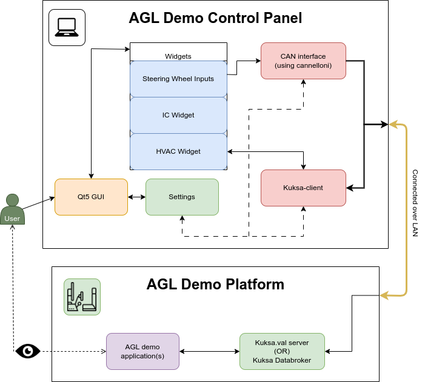
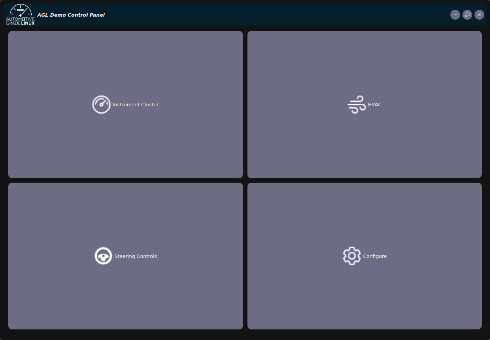
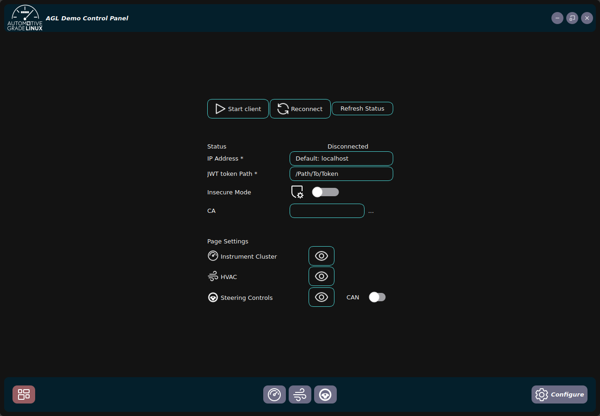
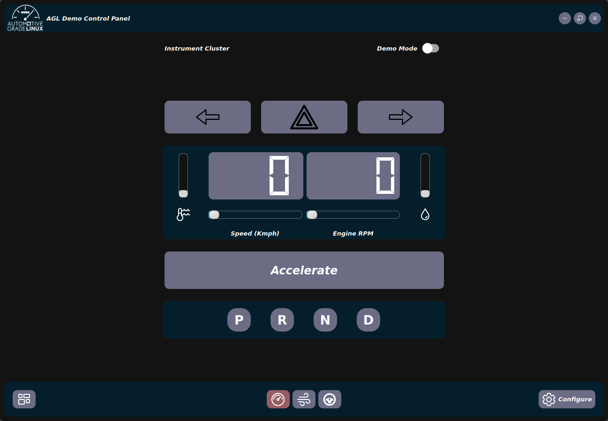
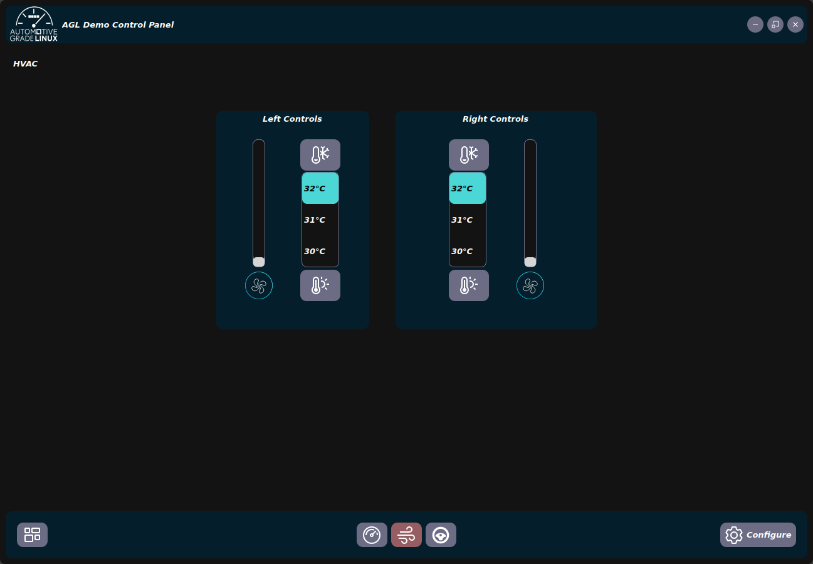
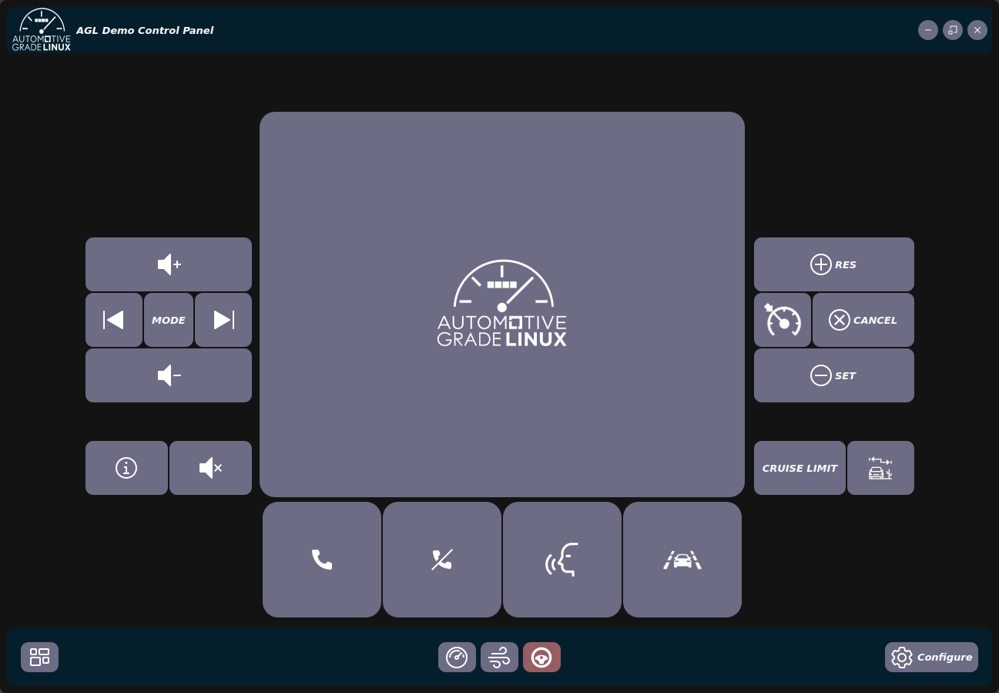

# AGL Demo Control Panel

## Introduction

This document describes the design and usage of the **AGL Demo Control Panel**, a **Qt5-based** tool that allows you to control and interact with various **Automotive Grade Linux (AGL)** demo applications. The tool uses **Kuksa.val** and **CAN frame messages** to communicate with the target machine that runs the AGL image(s). You can use the tool to perform tasks such as starting and stopping scripts, changing the vehicle speed and engine RPM, adjusting the HVAC settings, and providing Steering Inputs. The tool is designed to **demonstrate** the capabilities and features of AGL in a **user-friendly** and **interactive** way.
### Application Overview

To use the control panel, you need to connect the main machine that runs the control panel to the target machine that runs the AGL image(s) using a **LAN/ethernet cable**. You also need to configure the IP address of the Kuksa server and set your preferences in the tool’s settings menu.



## # Installation  

Clone the repository

```bash
git clone "https://gerrit.automotivelinux.org/gerrit/src/agl-demo-control-panel" && cd ./AGL_Demo_Control_Panel
```

Install the Python dependencies

```
pip install -r requirements.txt
```

## # Setup

Before using the  `AGL Demo Control Panel`, we need to make sure to run the Kuksa.val server  and also have our `can0` interface set up (Optional).

### 1. Connect the Machines

First, we need to connect the machines, i.e. the host machine (Running the control panel) and the target machine (running the AGL image) via LAN or a bridged network (QEMU or VM) 
### 2. CAN interface (WIP)

To set up the CAN interface between the Host system and the target machine(s) we use [cannelloni](https://github.com/mguentner/cannelloni),

1. Create the virtual CAN interface with the command:

	```bash
	$ sudo ip link add dev can0 type vcan
	```

2. On both machines, bring the virtual CAN interface online with the command: 

	```bash
	$ sudo ip link set up can0
	```

3. Install cannelloni from its [GitHub repository](https://github.com/mguentner/cannelloni) and run cannelloni with the following commands. 

	_Note_: `cannelloni` is available in AGL, just add `IMAGE_INSTALL:append = " cannelloni"`	to your `conf/local.conf`

	Host Machine (Running `AGL Demo Control Panel`)
	```bash
	cannelloni -I can0 -R <target-ip> -r 20000 -l 20000
	```
	 Target Machine (Running AGL image)
	```bash
	cannelloni -I can0 -R <host-ip> -r 20000 -l 20000 -p
	```

	You should now be able to send and receive CAN messages between the two machines using the vcan interface and cannelloni.

### 3. Kuksa-val-server

Restart AGL's `kuksa-val-server`

```bash
$ pkill kuksa
$ kuksa-val-server --address 0.0.0.0
```

_Note_: if you are testing on a local build (or) docker image of kuksa.val server, make sure to remove  `cacertificate` and `tls_server_name` arguments from `extras/config.py`.
	
```python
KUKSA_CONFIG = {
"ip": '<default-kuksa-ip>',
"port": "8090",
'protocol': 'ws',
'insecure': False,
}
```

### 4. Start AGL Demo Control Panel

1. To use the control panel
	```
	cd /Path/to/agl-demo-control-panel
	python -u main.py
	```



2. Go to settings
	- Start (load default config)
	-  Configure
		- Ip-Address ("local" if running kuksa server on host)
		- JWT Token path 
		- CA certificate path
		- Insecure mode (default off)
	- Reconnect (Status will be updated accordingly)
	- Page settings: Configure the visibility of pages and switch between CAN and Kuksa messages by using the toggle for the same.



3. Navigate to the desired page using the provided buttons at the bottom

|  |
|---|
|  |

|  |  |
|---|---|
|  |  |


