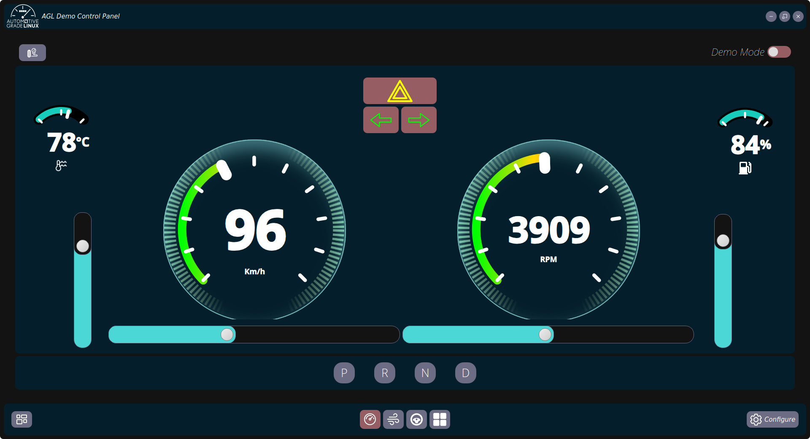
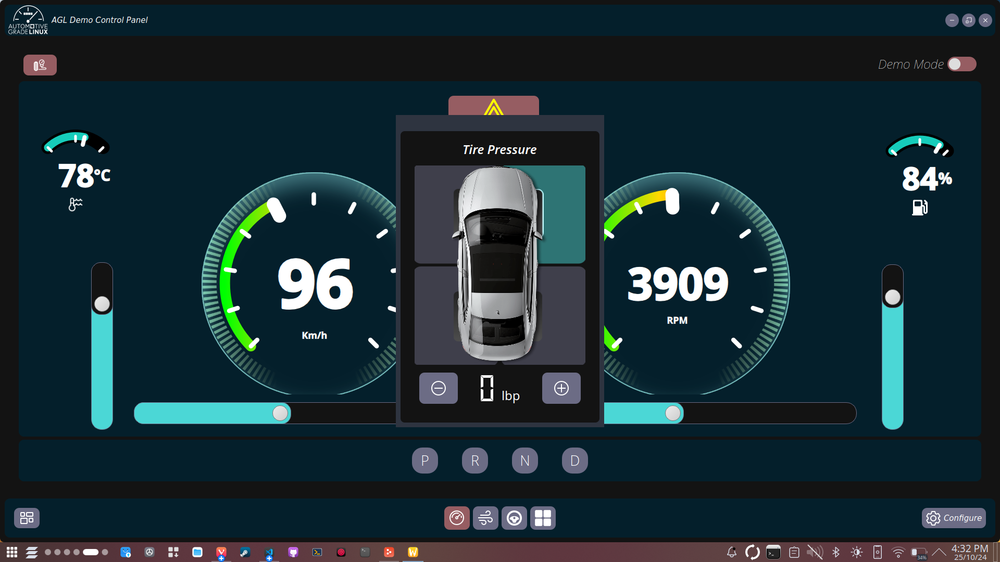
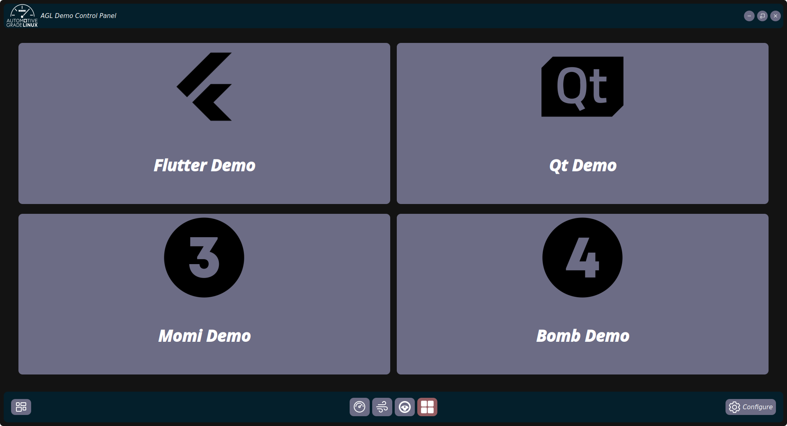

# AGL Demo Control Panel

## Introduction

This document describes the design and usage of the **AGL Demo Control Panel**, a **Qt6-based** tool that allows you to control and interact with various **Automotive Grade Linux (AGL)** demo applications. The tool uses **Kuksa.val** and **CAN frame messages** to communicate with the target machine that runs the AGL image(s). You can use the tool to perform tasks such as starting and stopping scripts, changing the vehicle speed and engine RPM, adjusting the HVAC settings, and providing Steering Inputs. The tool is designed to **demonstrate** the capabilities and features of AGL in a **user-friendly** and **interactive** way.

It also supports file playback from CARLA based CAN messages. Refer to the [CARLA with AGL](13_CARLA_with_AGL.md) for more information.

### Application Overview

To use the control panel, you need to connect the main machine that runs the control panel to the target machine that runs the AGL image(s) using a **LAN/ethernet cable**. You also need to configure the IP address of the Kuksa server and set your preferences in the tool’s settings menu.


## Installation  

- Step 1
```bash
$ python3 -m venv control-panel
$ source control-panel/bin/activate
```

- Step 2
```bash
$ pip3 install -r requirements.txt
$ /usr/lib64/qt6/libexec/rcc -g python assets/res.qrc | sed '0,/PySide6/s//PyQt6/' > res_rc.py
# OR
$ pyside6-rcc assets/res.qrc -o res_rc.py
```
## Setup

Before using the  `AGL Demo Control Panel`, we need to make sure to run the Kuksa.val server  and also have our `can0` interface set up (Optional).

### 1. Connect the Machines

First, we need to connect the machines, i.e. the host machine (Running the control panel) and the target machine (running the AGL image) via LAN or a bridged network (QEMU or VM).

### 2. CAN interface

To set up the CAN interface between the Host system and the target machine(s) we use [cannelloni](https://github.com/mguentner/cannelloni),

1. Create the virtual CAN interface with the command:

	```bash
	$ sudo ip link add dev can0 type vcan
	```

2. On both machines, bring the virtual CAN interface online with the command: 

	```bash
	$ sudo ip link set up can0
	```

3. Install cannelloni from its [GitHub repository](https://github.com/mguentner/cannelloni) and run cannelloni with the following commands. 

	_Note_: `cannelloni` is available in AGL, just add `IMAGE_INSTALL:append = " cannelloni"`	to your `conf/local.conf`

	Host Machine (Running `AGL Demo Control Panel`)
	```bash
	cannelloni -I can0 -R <target-ip> -r 20000 -l 20000
	```
	 Target Machine (Running AGL image)
	```bash
	cannelloni -I can0 -R <host-ip> -r 20000 -l 20000 -p
	```

	You should now be able to send and receive CAN messages between the two machines using the vcan interface and cannelloni.

### 3. Configuring the Demo Control Panel

Run the `kuksa-val-server`/`databroker` on `0.0.0.0` by either restarting the server, editing `/etc/default/kuksa-databroker` or add the `agl-demo-preload` as a feature to your build of AGL.  The server should be started using the `--address 0.0.0.0` argument.

Now, you can create a custom configuration to save your specific preferences for the settings page by creating the `*.ini*` files in the,
-  `/etc/agl-demo-control-panel.ini`
- `$HOME/.local/share/agl-demo-control-panel/config.ini`
	
```python
[default]
fullscreen-mode = true			# launches app in fullscreen mode
hvac-enabled = true
steering-wheel-enabled = true
file-playback-enabled = true	# if not, vcar simulator will be used instead
file-playback-path =			# Add path to can_messages.txt file generated (Refer Step 4. Playback)
dbc-file-path =
can-interface =

[keypad-feature]
enabled = true					# If false, keypad UI is not shown
keypad-only = false				# only Keypad page is shown
ip =
port =
keys-to-hide = 3				# hide keys by specifying 1,2,3,4

[vss-server]
ip = localhost
port = 55555
protocol = grpc
insecure = False
token = default
cacert = default
tls_server_name = Server
```

### 4. Playback (Demo mode)

This mode is configured via the `config.ini` file as shown above, using the `file-playback-enabled` and `file-playback-enabled` fields.


The playback Mode runs in two ways:

1. CARLA File Playback: In this mode, a pre-recorded sequence of CAN messages is used to feed values into the Demo apps.

Follow the [CARLA with AGL](13_CARLA_with_AGL.md) steps to generate the **can_messages.txt** file, which is populated during a CARLA session.

_Note_: While generating the playback file, it is recommended to run both **record_playback** and **carla_to_CAN** scripts with a python version supported by CARLA.

### 5. Start AGL Demo Control Panel

1. To start the control panel
	```
	$ cd /Path/to/agl-demo-control-panel
	$ source control-panel/bin/activate
	$ python -u main.py
	```


2. Go to settings
	- Start (load default config from drop-down menu)
	-  Configure: make changes as required
		- IP-Address
		- Port
		- Secure Mode: if toggled **"on"**, specify the `CA.pem File`
		- Protocol: websocket ← ? → gRPC
		- TLS Server Name
		- JWT/Auth Token path 
		- CA.pem certificate path
	- Start/Stop
	- Reconnect
	- Page settings: Configure the visibility of pages and switch between CAN and Kuksa messages by using the toggle for the same.

1. Navigate to the desired page using the provided buttons at the bottom

|  |  |
|---|---|
|  |  |
|  |  |
|  |  |