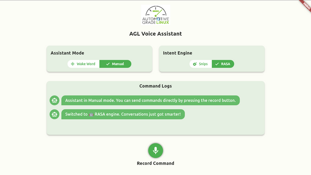
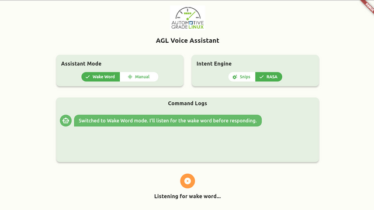

# AGL Voice Agent / Assistant

# Introduction
A gRPC-based voice agent designed for Automotive Grade Linux (AGL). This service leverages GStreamer, Vosk, Snips, and RASA to seamlessly process user voice commands. It converts spoken words into text, extracts intents from these commands, and performs actions through the Kuksa interface. The voice agent is designed to be modular and extensible, allowing for the addition of new speech recognition and intent extraction models.

# Installation and Usage
Before we dive into the detailed components documentation, let's first take a look at how to install and use the voice agent service. All of the features of the voice agent service are encapsulated in the `meta-offline-voice-agent` sub-layer which can be found under `meta-agl-devel` layer. These features are currently part of the `master` branch only. This sub-layer can be built into the final image by using following commands:

```shell
$ source master/meta-agl/scripts/aglsetup.sh -m qemux86-64 -b build-master agl-demo agl-devel agl-offline-voice-agent
$ source agl-init-build-env
$ bitbake agl-ivi-demo-platform-flutter
```

After the build is complete, you can run the final image using QEMU. Once the image is running, you can start the voice agent service by running the following command:
```shell
$ voiceagent-service run-server --default
```

The `--default` flag loads the voice agent service with default configuration. The default configuration file looks like this:
```ini
[General]
base_audio_dir = /usr/share/nlu/commands/
stt_model_path = /usr/share/vosk/vosk-model-small-en-us-0.15/
wake_word_model_path = /usr/share/vosk/vosk-model-small-en-us-0.15/
snips_model_path = /usr/share/nlu/snips/model/
channels = 1
sample_rate = 16000
bits_per_sample = 16
wake_word = hello auto
server_port = 51053
server_address = 127.0.0.1
rasa_model_path = /usr/share/nlu/rasa/models/
rasa_server_port = 51054
rasa_detached_mode = 0
base_log_dir = /usr/share/nlu/logs/
store_voice_commands = 0

[Kuksa]
ip = 127.0.0.1
port = 8090
protocol = ws
insecure = True
token = /usr/lib/python3.10/site-packages/kuksa_certificates/jwt/super-admin.json.token

[Mapper]
intents_vss_map = /usr/share/nlu/mappings/intents_vss_map.json
vss_signals_spec = /usr/share/nlu/mappings/vss_signals_spec.json
```

Most of the above configuration variable are self explanatory, however, I'll dive deeper into the ones that might need some explanation.

- **`store_voice_commands`**: This variable is used to enable/disable the storage of voice commands. If this variable is set to `1`, then the voice commands will be stored in the `base_audio_dir` directory. The voice commands are stored in the following format: `base_audio_dir/<timestamp>.wav`. The `timestamp` is the time at which the voice command was received by the voice agent service.

- **`rasa_detached_mode`**: This variable is used to enable/disable the detached mode for the RASA NLU engine. If this variable is set to `1`, then the RASA NLU engine will be run in detached mode, i.e. the voice agent service won't run it and will assume that RASA is already running. This is useful when you want to run the RASA NLU engine on a separate machine. If this variable is set to `0`, then the RASA NLU engine will be run as a sub process of the voice agent service.

- **`intents_vss_map`**: This is the path to the file that actually maps the intent output from our intent engine to the VSS signal specification. This file is in JSON format and contains the mapping for all the intents that we want to support. The default file looks like this:

    ```json
    {
    "intents": {
        "VolumeControl": {
            "signals": [
                "Vehicle.Cabin.Infotainment.Media.Volume"
            ]
        },
        "HVACFanSpeed": {
            "signals": [
                "Vehicle.Cabin.HVAC.Station.Row1.Left.FanSpeed",
                "Vehicle.Cabin.HVAC.Station.Row1.Right.FanSpeed",
                "Vehicle.Cabin.HVAC.Station.Row2.Left.FanSpeed",
                "Vehicle.Cabin.HVAC.Station.Row2.Right.FanSpeed"
            ]
        },
        "HVACTemperature": {
            "signals": [
                "Vehicle.Cabin.HVAC.Station.Row1.Left.Temperature",
                "Vehicle.Cabin.HVAC.Station.Row1.Right.Temperature",
                "Vehicle.Cabin.HVAC.Station.Row2.Left.Temperature",
                "Vehicle.Cabin.HVAC.Station.Row2.Right.Temperature"
            ]
        }
    }
    }
    ```
    Notice that `VolumeControl`, `HVACFanSpeed`, and `HVACTemperature` are the intents that we want to support. The `signals` array contains the VSS signals that we want to change when the user issues a command for that intent. For example, if the user says "Set the volume to 50", then the voice agent service will extract the `VolumeControl` intent from the user's command and then change the `Vehicle.Cabin.Infotainment.Media.Volume` signal to 50.

- **`vss_signal_spec`**: This is path to the file that defines the specs and values that can be mapped onto a VSS signal. This file is in JSON format and contains specs for all the VSS signal that we want to support. A sample VSS spec definition looks like this:

    ```json
    {
    "signals": {
        "Vehicle.Cabin.Infotainment.Media.Volume": {
            "default_value": 15,
            "default_change_factor": 5,
            "actions": {
                "set": {
                    "intents": ["volume_control_action"],
                    "synonyms": ["set", "change", "adjust"]
                },
                "increase": {
                    "intents":["volume_control_action"],
                    "synonyms": ["increase", "up", "raise", "louder"],
                    "modifier_intents": ["to_or_by"]
                }, 
                "decrease": {
                    "intents": ["volume_control_action"],
                    "synonyms": ["decrease", "lower", "down", "quieter", "reduce"],
                    "modifier_intents": ["to_or_by"]
                }
            },
            "values": {
                "ranged": true,
                "start": 1,
                "end": 100,
                "ignore": [],
                "additional": []
            },
            "default_fallback": true,
            "value_set_intents": {
                "numeric_value": {
                    "datatype": "number",
                    "unit": "percent"
                }
            }
        }
    }
    }
    ```
    Notice that `Vehicle.Cabin.Infotainment.Media.Volume` is the VSS signal that whose specification we want to define. The `default_value` is the default value of the signal to use if the user doesn't specify a value in their command. The `default_change_factor` is the default change factor of the signal, i.e the value to increment or decrement the current value with if user didn't specify any specific change factor. The `actions` object defines the actions that can be performed on the signal, currently, only "increase", "decrease", and "set" are supported. The `values` object defines the range of values that can be mapped onto the signal. The `value_set_intents` object defines the intent (or the `slot` to be more precise) that contains the specific value of the signal defined by the user in their command. Here `numeric_value` is the slot that contains the value of the signal as defined during the training of the intent engine. The `datatype` is the type of the value, i.e. `number`, `string`, `boolean`, etc. The `unit` is the unit of the value, i.e. `percent`, `degree`, `celsius`, etc.


If you want to change the default configuration, you can do so by creating a new configuration file and then passing it to the voice agent service using the `--config` flag. For example:
```shell
$ voiceagent-service run-server --config path/to/config.ini
```

One thing to note here is that all the directory paths in the configuration file should be absolute and always end with a `/`.

# High Level Architecture
.png)

# Components
- Voice Agent Service
    - Vosk Kaldi
    - Snips
    - RASA
- Voice Assistant App

# Voice Agent Service
The voice agent service is a gRPC-based service that is responsible for converting spoken words into text, extracting intents from these commands, and performing actions through the Kuksa interface. The service is composed of three main components: Vosk Kaldi, RASA, and Snips.

## Vosk Kaldi
Vosk Kaldi is a speech recognition toolkit that is based on Kaldi and Vosk. It is used to convert spoken words into text. It provides us with some official pre-trained models for various popular languages. We can also train our own models using the Vosk Kaldi toolkit. The current voice agent service requires two different models to run, one for **wake-word detection** and one for **speech recognition**. The wake word detection model is used to detect when the user says the wake word, which is "Hey Automotive" by default, we can easily change the default wake word by modifying the config file. The speech recognition model is used to convert the user's spoken words into text.

## Snips
Snips NLU (Natural Language Understanding) is a Python based Intent Engine that allows to extract structured information from sentences written in natural language. The NLU engine first detects what the intention of the user is (a.k.a. intent), then extracts the parameters (called slots) of the query. The developer can then use this to determine the appropriate action or response. Our voice agent service uses either Snips or RASA to extract intents from the user's spoken commands.

It is recommended to take a brief look at [Snips Official Documentation](https://snips-nlu.readthedocs.io/en/latest/) to get a better understanding of how Snips works.

### Dataset Format
The Snips NLU engine uses a dataset to understand and recognize user intents. The dataset is structured into two files:

- `intents.yaml`: Contains the intent definitions, slots, and sample utterances for each intent.
- `entities.yaml`: Defines the entities used in the intents, including their values, synonyms, and matching strictness.

To train the NLU Intent Engine model, a pre-processing step is required to convert the dataset into a format compatible with the Snips NLU engine. Once the model is trained, it can be used to parse user queries and extract the intent and relevant slots for further processing.

### Training
To train the NLU Intent Engine for your specific use case, you can modify the dataset files `intents.yaml` and `entities.yaml` to add new intents, slots, or entity values. You need to re-generate the dataset if you modify `intent.yaml` or `entities.yaml`, for this purpose you need to install [`snips-sdk-agl`](https://github.com/malik727/snips-sdk-agl) module. This module is an extension of the original Snips NLU with upgraded Python support and is specifically designed for data pre-processing and training purposes only. 

After installation run the following command to generate the updated `dataset.json` file:
```shell
$ snips-sdk generate-dataset en entities.yaml intents.yaml > dataset.json
```

Then run the following command to re-train the model:
```shell
$ snips-sdk train path/to/dataset.json path/to/model
```

Finally, you can use the [`snips-inference-agl`](https://gerrit.automotivelinux.org/gerrit/gitweb?p=src/snips-inference-agl.git;a=summary) module to process commands and extract the associated intents.

### Usage
To set up and run the Snips NLU Intent Engine, follow these steps:

1. Train your model by following the steps laid earlier or just clone a pre-existing model from [here](https://gerrit.automotivelinux.org/gerrit/gitweb?p=src/snips-model-agl.git;a=summary).

2. Install and set up the [`snips-inference-agl`](https://gerrit.automotivelinux.org/gerrit/gitweb?p=src/snips-inference-agl.git;a=summary) module on your local machine. This module is an extension of the original Snips NLU with upgraded Python support and is specifically designed for inference purposes only.

3. Once you have the [`snips-inference-agl`](https://gerrit.automotivelinux.org/gerrit/gitweb?p=src/snips-inference-agl.git;a=summary) module installed, you can load the pre-trained model located in the model/ folder. This model contains the trained data and parameters necessary for intent extraction. You can use the following command to process commands and extract the associated intents:
    ```shell
    $ snips-inference parse path/to/model -q "your command here"
    ```

### Observations
- The Snips NLU engine is very lightweight and uses around 250 MB - 300 MB of RAM when running on the target device.
- The underlying AI arhictecture of the Snips NLU is not extensible or changeable.
- The Snips NLU engine is not very accurate as compared to RASA, however, its extremely lightweight and really fast.

## RASA
RASA is an open-source machine learning framework for building contextual AI assistants and chatbots. It is based on Python and TensorFlow. It is used to extract intents from the user's spoken commands. The RASA NLU engine is trained on a dataset that contains intents, entities, and sample utterances. The RASA NLU engine is used to parse user queries and extract the intent and relevant entities for further processing.

It is recommended to take a brief look at [RASA Official Documentation](https://rasa.com/docs/rasa/) to get a better understanding of how RASA works.

### Dataset Format
Rasa uses YAML as a unified and extendable way to manage all training data, including NLU data, stories and rules.

You can split the training data over any number of YAML files, and each file can contain any combination of NLU data, stories, and rules. The training data parser determines the training data type using top level keys.

NLU training data consists of example user utterances categorized by intent. Training examples can also include entities. Entities are structured pieces of information that can be extracted from a user's message. You can also add extra information such as regular expressions and lookup tables to your training data to help the model identify intents and entities correctly. Example dataset for `check_balance` intent:

```yaml
nlu:
- intent: check_balance
  examples: |
    - What's my [credit](account) balance?
    - What's the balance on my [credit card account]{"entity":"account","value":"credit"}

- synonym: credit
  examples: |
    - credit card account
    - credit account
```

### Training
To train the RASA NLU intent engine model you need to curate a dataset for your sepcific use case. You can also use the [RASA NLU Trainer](https://rasahq.github.io/rasa-nlu-trainer/) to curate your dataset. Once you have your dataset ready, now you need to create a `config.yml` file. This file contains the configuration for the RASA NLU engine. A sample `config.yml` file is given below:

```yaml
language: en  # your 2-letter language code
assistant_id: 20230807-130137-kind-easement

pipeline:
  - name: WhitespaceTokenizer
  - name: RegexFeaturizer
  - name: LexicalSyntacticFeaturizer
  - name: CountVectorsFeaturizer
  - name: CountVectorsFeaturizer
    analyzer: "char_wb"
    min_ngram: 1
    max_ngram: 4
  - name: DIETClassifier
    epochs: 100
    constrain_similarities: true
  - name: EntitySynonymMapper
  - name: ResponseSelector
    epochs: 100
    constrain_similarities: true
  - name: FallbackClassifier
    threshold: 0.3
    ambiguity_threshold: 0.1
```

Now download RASA (v3.6.4) using the following command:
```shell
$ pip install rasa==3.6.4
```
Finally, you can use the following command to train the RASA NLU engine:
```shell
$ rasa train nlu --config config.yml --nlu path/to/dataset.yml --out path/to/model
```

### Usage
To set up and run the RASA NLU Intent Engine, follow these steps:

1. Train your model by following the steps laid earlier or just clone a pre-existing model from [here](https://gerrit.automotivelinux.org/gerrit/gitweb?p=src/rasa-model-agl.git;a=summary).

2. Once you have RASA (v3.6.4) installed, you can load the pre-trained model located in the model/ folder. This model contains the trained data and parameters necessary for intent extraction. You can use the following command to process commands and extract the associated intents:
    ```shell
    $ rasa shell --model path/to/model
    ```

### Observations
- The RASA NLU engine is heavy and uses around 0.8 GB - 1 GB of RAM when running on the target device.
- The underlying AI arhictecture of the RASA NLU is extensible and changeable thanks to the TensorFlow backend.
- The RASA NLU engine is very accurate as compared to Snips, however, its heavy and slightly slow.

# Voice Assistant App
The voice assistant app is a flutter based application made for Automotive Grade Linux (AGL). It is responsible for interacting with the voice agent service for user voice command recognition, intent extraction, and command execution. It also receives the response from the voice agent service and displays it on the screen. Some app UI screenshots are attached below.


