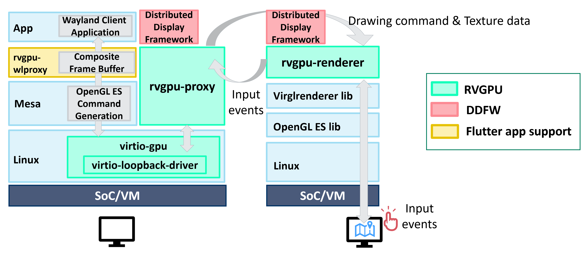
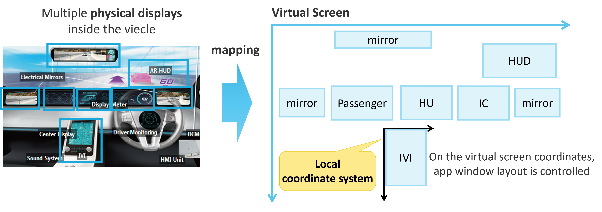
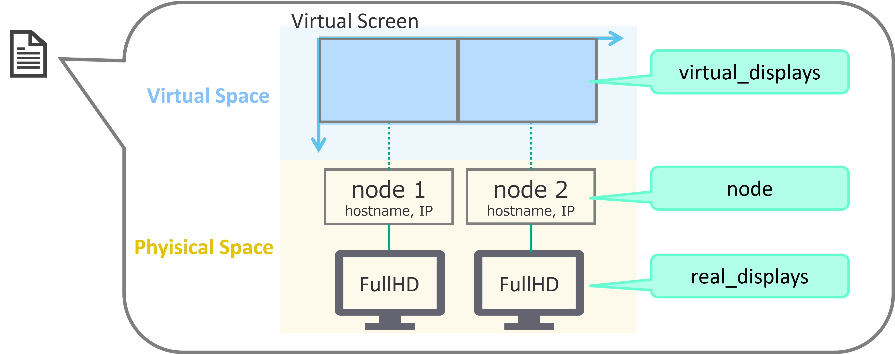
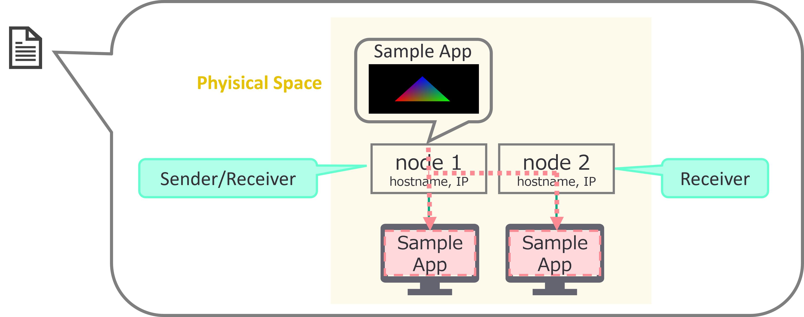
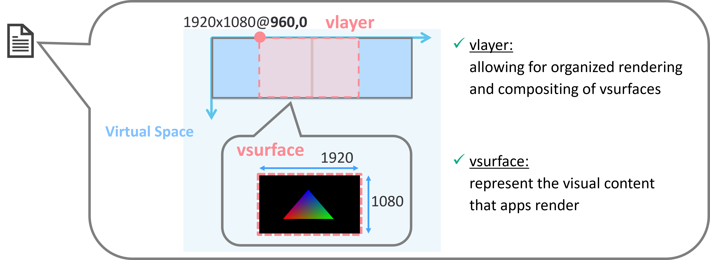
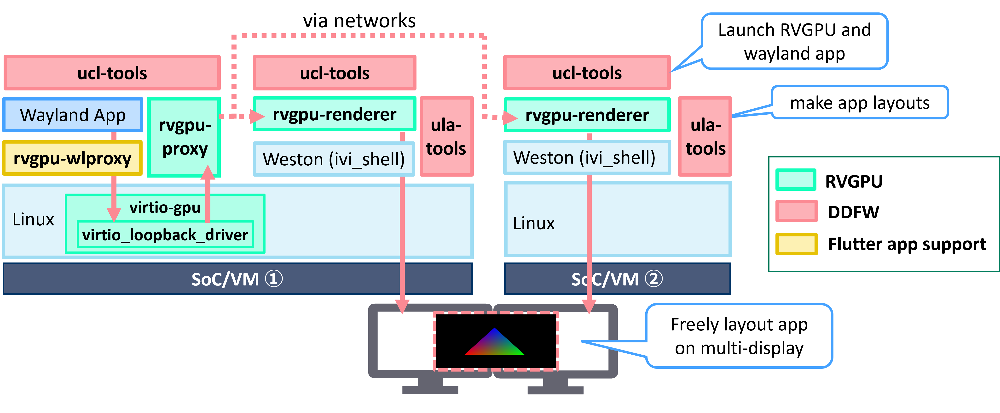
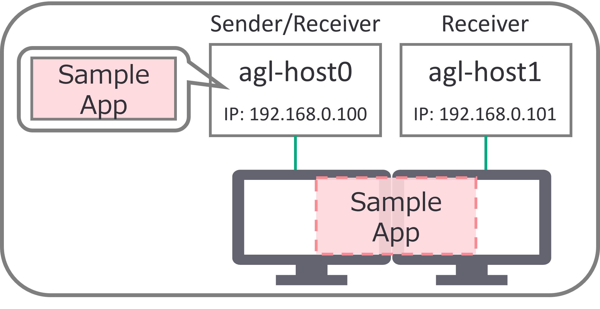

# Unified HMI

## Introduction

This document describes the design and usage of the **Unified HMI**, which is a `Software-Defined` display virtualization platform based on VirtIO GPU tecnology. Unified HMI allows for flexible development of the entire cockpit and cabin UI/UX, across multiple displays, independent of hardware and OS configuration. Applications can be rendered to any display via a unified virtual display.


## Unified HMI frameworks

Unified HMI consists of two main components:

1. Remote VirtIO GPU Device(RVGPU)：Render apps remotely in different SoCs.
2. Distributed Display Framework(DDFW)：Flexible layout control of apps across multiple displays.



### Remote Virtio GPU (RVGPU)

RVGPU is a client-server based rendering engine, which allows to render 3D on one device (client) and display it via network on another device (server)

RVGPU consists of three repositories on Github:

1. [remote-virtio-gpu](https://github.com/unified-hmi/remote-virtio-gpu): Main framework of RVGPU.
2. [virio-loopback-driver](https://github.com/unified-hmi/virtio-loopback-driver): Capture the drawing commands for VirtIO GPU and transfer them to the RVGPU framework.
3. [rvgpu-wlproxy](https://github.com/unified-hmi/rvgpu-wlproxy): Apply applications that operate on the Wayland Protocol, including Flutter apps, to RVGPU.

### Distributed Display Framework (DDFW)

DDFW provides essential services for managing distributed display applications. This framework is designed to work with a variety of hardware and software configurations, making it a versatile choice for developers looking to create scalable and robust display solutions.

As shown in the figure below, DDFW maps multiple cockpit physical displays, into a single large virtual screen.
By placing applications on the virtual screen, you can control the layout of applications, across multiple displays.



DDFW consists of three repositories on Github:

1. [ucl-tools](https://github.com/unified-hmi/ucl-tools): Unified Clustering Tools (UCL), launch applications for multiple platforms and manage execution order and survival.
2. [ula-tools](https://github.com/unified-hmi/ula-tools): Unified Layout Tools (ULA), application layout for virtual displays on virtual screen (mapped from physical displays).
3. [uhmi-ivi-wm](https://github.com/unified-hmi/uhmi-ivi-wm): Apply ivi-layer and ivi-surface layouts to the screen using the layout design output by ula-tools.

### Json settings

To run ULA, three Json files are required.

1. virtual-screen-def.json: Execution environment such as display and node (SoCs/VMs/PCs) informations. Please put this file on all related host.


2. app.json: Application execution information which can also take a sender/receiver relationship. Please put this file on one of the sender/receiver or a host that canbe communicate with them via network.


3. initial-vscreen.json: application layout information such as position and size. Please put this file on one of the sender/receiver or a host that canbe communicate with them via network.


Json files need to be created correctly for your execution environment.

## How to Build  

Follow the [AGL documentation](https://docs.automotivelinux.org/en/master/#01_Getting_Started/02_Building_AGL_Image/01_Build_Process_Overview/) for the build process, and set up the "[Initializing Your Build Environment](https://docs.automotivelinux.org/en/master/#01_Getting_Started/02_Building_AGL_Image/04_Initializing_Your_Build_Environment/)" section as described below to enable the AGL feature 'agl-uhmi'. 

For example:
```
$ cd $AGL_TOP/master
$ source ./meta-agl/scripts/aglsetup.sh -m qemux86-64 -b qemux86-64 agl-demo agl-devel agl-uhmi
```

After adding the feature, execute the command:
```
$ bitbake <image_name>
```

To add RVGPU and DDFW to the build images, please add the packagegroup that enable RVGPU(packagegroup-rvgpu) and DDFW(packagegroup-ddfw) to the installation target using the following command.
```
$ echo 'IMAGE_INSTALL:append = " packagegroup-rvgpu packagegroup-ddfw"' >> conf/local.conf
```
**Note**: RVGPU and DDFW can each be used independently. If you wish to use them individually, please add only one of the packagegroups to the installation target.

After adding the feature, execute the command:
```
$ bitbake <image_name>
```
Replace the `<image_name>` with the appropriate values you want. We have confirmed the operation with the **agl-image-weston**.

## How to setup and boot

For Environment setup instructions for each platform, refer to the following links in the AGL Documentation:
[Building for x86(Emulation and Hardware)](https://docs.automotivelinux.org/en/master/#01_Getting_Started/02_Building_AGL_Image/06_Building_the_AGL_Image/02_Building_for_x86_%28Emulation_and_Hardware%29/)
[Building for Raspberry Pi 4](https://docs.automotivelinux.org/en/master/#01_Getting_Started/02_Building_AGL_Image/06_Building_the_AGL_Image/03_Building_for_Raspberry_Pi_4/)
[Building for Supported Renesas Boards](https://docs.automotivelinux.org/en/master/#01_Getting_Started/02_Building_AGL_Image/06_Building_the_AGL_Image/04_Building_for_Supported_Renesas_Boards/)

For Raspberry Pi 4 and Supported Renesas Boards, refer to the above URL for boot methods.
For x86 emulation (qemu), network bridge is required to enable communication with other devices when using RVGPU. 

Here’s an example procedure for your reference.
```
$ sudo ip link add <bridge_name> type bridge
$ sudo ip addr add <IP address> dev <bridge_name>
$ sudo ip link set dev <interface> master <bridge_name>
$ sudo ip link set dev <bridge_name> up
```
Replace the placeholders with the appropriate values:
- `<bridge_name>`: You can assign any name, for example: `br0`
- `<IP_address>`: Enter an available IP address, for example: `192.168.0.100/24`
- `<interface>`: Specify the network interface, for example: `eth0`

To enable the use of the bridge, create or append /etc/qemu directory and /etc/qemu/bridge.conf file.
```
allow <bridge_name>
```
Make sure /etc/qemu/ has 755 permissions.
Create the following bash file named **run_qemu_bridge.sh** in any `<WORKDIR>`.
```
#!/bin/bash

KERNEL_PATH=$1
DRIVE_PATH=$2
BRIDGE_NAME="<bridge_name>"

printf -v macaddr "52:54:%02x:%02x:%02x:%02x" $(( $RANDOM & 0xff)) $(( $RANDOM & 0xff )) $(( $RANDOM & 0xff)) $(( $RANDOM & 0xff ))

qemu-system-x86_64 -enable-kvm -m 2048 \
    -kernel ${KERNEL_PATH} \
    -drive file=${DRIVE_PATH},if=virtio,format=raw \
    -cpu kvm64 -cpu qemu64,+ssse3,+sse4.1,+sse4.2,+popcnt \
    -vga virtio -show-cursor \
    -device virtio-net-pci,netdev=net0,mac=$macaddr \
    -netdev bridge,br=$BRIDGE_NAME,id=net0 \
    -serial mon:stdio -serial null \
    -soundhw hda \
    -append 'root=/dev/vda swiotlb=65536 rw console=ttyS0,115200n8 fstab=no'
```
Save the file and run the following to start QEMU.
```
sudo <WORKDIR>/run_qemu_bridge.sh <build_directory>/tmp/deploy/images/qemux86-64/bzImage <build_directory>/tmp/deploy/images/qemux86-64/agl-image-weston-qemux86-64.rootfs.ext4
```
When QEMU boot, you can log in to qemu on the terminal where you executed above command, so please assign an IP address there.

For example:
```
ifconfig <your environment> 192.168.0.100 netmask 255.255.255.0
```

## How to use Unified HMI on AGL

In the following verification procedure, it is assumed that two SoCs or Virtual Machines, are each connected to a Full HD display, with the displays, arranged side by side as shown in the figure.

In the following sections, introducing the steps to run Unified HMI frameworks on the `agl-image-weston` image.



### Environment settings (for all hosts)

To utilize Unified HMI, you need to set up each image with a distinct hostname and static IP address, and ensure that ivi-shell is running using the wayland-ivi-extension. Please note that the following configurations are examples and should be adapted to fit your specific network environment.

#### Run weston with ivi-shell

Before setting unique hostnames and configuring static IP addresses, it is essential to start Weston with ivi-shell since DDFW controls the layout of applications using ivi-shell. To initialize ivi-shell, follow these steps:

First, please create the following content as /etc/xdg/weston/weston_ivi-shell.ini 
```
[core]
shell=ivi-shell.so
modules=ivi-controller.so
require-input=false

[output]
name=HDMI-A-1
mode=1920x1080@60

[output]
name=HDMI-A-2
mode=1920x1080@60

[output]
name=HDMI-A-3
mode=1920x1080@60

[output]
name=DSI-1
mode=1920x1080@60

[output]
name=DSI-2
mode=1920x1080@60

[output]
name=DP-1
mode=1920x1080@60

[output]
name=Virtual-1
mode=1920x1080

[output]
name=Virtual-2
mode=1920x1080

[output]
name=VGA-1
mode=1920x1080

[output]
name=VGA-2
mode=1920x1080

[ivi-shell]
ivi-input-module=ivi-input-controller.so
#ivi-client-name=/usr/bin/simple-weston-client
bkgnd-surface-id=1000000
bkgnd-color=0xFF000000
```

Next, to start Weston with the configuration created above, please execute the following command.
```
ln -sf /etc/xdg/weston/weston_ivi-shell.ini /etc/xdg/weston/weston.ini
systemctl restart weston
```

**Note**: Even after the launch of the ivi-shell is complete, the screen remains black and nothing is displayed until the application is shown.

#### Configuration to run Unified HMI frameworks on launched weston.

By setting XDG_RUNTIME_DIR=/run/user/<your_UID> and WAYLAND_DISPLAY=<your_WAYLAND_DISPLAY> in /lib/systemd/system/uhmi-ivi-wm.service, you can display the applications launched by Unified HMI on Weston.

Please execute `$ls /run/user/` in your environment to check <your_UID>.
Additionally, when Weston is launched, <your_WAYLAND_DISPLAY> will be generated under /run/user/<your_UID>, so please check that as well.

e.g. In agl-image-weston, <your_UID> is set to 200 and <your_WAYLAND_DISPLAY> is set to wayland-1. Please create **/etc/default/uhmi-ivi-wm** as follows and set correct valiables:
```
XDG_RUNTIME_DIR=/run/user/200
WAYLAND_DISPLAY=wayland-1
```

#### Set Unique Hostnames

Edit the `/etc/hostname` file on each image to set a unique hostname. Here are the suggested hostnames for the first two images:

- **For the first image:**
```
echo "agl-host0" | tee /etc/hostname
```
- **For the second image:**
```
echo "agl-host1" | tee /etc/hostname
```

#### Assign Static IP Addresses

Configure a static IP address for each image by editing the `/etc/systemd/network/wired.network` file. If this file does not exist, please create a new one. Use the following template and replace `<IP_address>` and `<Netmask>` with your network's specific settings:

```ini
[Match]
KernelCommandLine=!root=/dev/nfs
Name=eth* en*

[Network]
Address=<IP_address>/<Netmask>
```

Here is how you might configure the static IP addresses for the first two images:

- **For the first image:**
```
[Match]
KernelCommandLine=!root=/dev/nfs
Name=eth* en*

[Network]
Address=192.168.0.100/24
```
- **For the second image:**
```
[Match]
KernelCommandLine=!root=/dev/nfs
Name=eth* en*

[Network]
Address=192.168.0.101/24
```

Once the hostname and IP addresses settings are complete, please reboot to reflect these settings.

### Demo Image

In this documentation, we will use the demo environment prepared as shown in the following diagram. In this diagram, there are two hosts, agl-host0 and agl-host1, each have a display output with a resolusion of 1920x1080(FullHD), arranged in order from left to right as agl-host0 and then agl-host1.



Here, agl-host0 will act as the sender, and the application will be executed on agl-host0. Both agl-host0 (itself) and agl-host1 will render it remotely as receivers, enabling the display of the application across two displays.

In the following sections, specify where to carry out the steps for agl-host0 or agl-host1 for clarity. However, in practice, the UCL and ULA commands can be executed on one of any sender/receiver or any other host.

### Customizing Virtual Screen Definitions (both agl-host0/agl-host1)

Adjust the `/etc/uhmi-framework/virtual-screen-def.json` file to match your environment. In this demo, please create that Json file as shown in below:

```
{
    "virtual_screen_2d": {
        "size": {"virtual_w": 3840, "virtual_h": 1080},
        "virtual_displays": [
            {"vdisplay_id": 0, "disp_name": "AGL_SCREEN0", "virtual_x": 0, "virtual_y": 0, "virtual_w": 1920, "virtual_h": 1080},
            {"vdisplay_id": 1, "disp_name": "AGL_SCREEN1", "virtual_x": 1920, "virtual_y": 0, "virtual_w": 1920, "virtual_h": 1080}
        ]
    },
    "virtual_screen_3d": {},
    "real_displays": [
        {"node_id": 0, "vdisplay_id": 0, "pixel_w": 1920, "pixel_h": 1080, "rdisplay_id": 0},
        {"node_id": 1, "vdisplay_id": 1, "pixel_w": 1920, "pixel_h": 1080, "rdisplay_id": 0}
    ],
    "node": [
        {"node_id": 0, "hostname": "agl-host0", "ip": "192.168.0.100"},
        {"node_id": 1, "hostname": "agl-host1", "ip": "192.168.0.101"}
    ],
    "distributed_window_system": {
        "window_manager": {},
        "framework_node": [
            {"node_id": 0, "ula": {"debug": false, "debug_port": 8080, "port": 10100}, "ucl": {"port": 7654}},
            {"node_id": 1, "ula": {"debug": false, "debug_port": 8080, "port": 10100}, "ucl": {"port": 7654}}
        ]
    }
}
```

Please put the same virtual-screen-def.json on both agl-host0/agl-host1.

Be sure to update the virtual_w, virtual_h, virtual_x, virtual_y, pixel_w, pixel_h, hostname, and ip fields to accurately reflect your specific network configuration.

### Restarting Services (both agl-host0/agl-host1)
Once you have prepared the virtual-screen-def.json file and configured the system, you need to restart the system or the following system services for the changes to take effect in all hosts:
```
systemctl restart uhmi-ivi-wm
systemctl restart ula-node
systemctl restart ucl-launcher
```

After restarting these services, your system should be ready to use the DDFW commands with the new configuration.

### Remote rendering of apps with RVGPU using UCL

UCL provides a distributed launch feature for applications using RVGPU. By preparing a app.json configuration, you can enable the launch of applications across multiple devices in a distributed environment.

#### Setting Up for Application Launch using UCL (agl-host0)

To facilitate the distributed launch of an application with UCL, you need to create a app.json file on agl-host0 that specifies the details of the application and how it should be executed on the sender and receiver nodes.

Example of `app.json`:
```
{
    "format_v1": {
        "command_type" : "remote_virtio_gpu",
        "appli_name" : "weston-simple-egl",
        "sender" : {
            "launcher" : "agl-host0",
            "command" : "/usr/bin/ucl-virtio-gpu-wl-send",
            "frontend_params" : {
                "scanout_x" : 0,
                "scanout_y" : 0,
                "scanout_w" : 1920,
                "scanout_h" : 1080,
                "server_port" : 33445
            },
            "appli" : "/usr/bin/weston-simple-egl -s 1920x1080",
            "env" : "LD_LIBRARY_PATH=/usr/lib/mesa-virtio"
        },
        "receivers" : [
            {
                "launcher" : "agl-host0",
                "command" : "/usr/bin/ucl-virtio-gpu-wl-recv",
                "backend_params" : {
                    "ivi_surface_id" : 101000,
                    "scanout_x" : 0,
                    "scanout_y" : 0,
                    "scanout_w" : 1920,
                    "scanout_h" : 1080,
                    "listen_port" : 33445,
                    "initial_screen_color" : "0x33333333"
                },
                "env" : "XDG_RUNTIME_DIR=/run/user/200 WAYLAND_DISPLAY=wayland-1"
            },
            {
                "launcher" : "agl-host1",
                "command" : "/usr/bin/ucl-virtio-gpu-wl-recv",
                "backend_params" : {
                    "ivi_surface_id" : 101000,
                    "scanout_x" : 0,
                    "scanout_y" : 0,
                    "scanout_w" : 1920,
                    "scanout_h" : 1080,
                    "listen_port" : 33445,
                    "initial_screen_color" : "0x33333333"
                },
                "env" : "XDG_RUNTIME_DIR=/run/user/200 WAYLAND_DISPLAY=wayland-1"
            }
        ]
    }
}
```

In this example, the application weston-simple-egl is configured to launch on the sender node `agl-host0` and display its output on the receiver nodes `agl-host0` and `agl-host1`. The `scanout_x`, `scanout_y`, `scanout_w`, `scanout_h` parameters define the size of the window, while `server_port` and `listen_port` ensure the communication between sender and receivers.

#### Launching the Application (agl-host0)

Once the app.json file is ready, you can execute the application across the distributed system by piping the JSON content to the `ucl-distrib-com` command along with the path to the `virtual-screen-def.json` file:

```
cat app.json | ucl-distrib-com /etc/uhmi-framework/virtual-screen-def.json
```

This command will read the configuration and initiate the application launch process, distributing the workload as defined in the JSON files.

Please ensure that the app.json file you create is correctly formatted and contains the appropriate parameters for your specific use case.

### Layout application by ULA

ULA allows for the definition of physical displays on a virtual screen and provides the ability to apply layout settings such as position and size to applications launched using the UCL Framework.

#### Creating a Layout Configuration File (agl-host0)

To define the layout for your applications, you need to create a `initial_vscreen.json` file, with the necessary configuration details on agl-host0. This file will contain the layout settings that specify how applications should be positioned and sized within the virtual screen. Here is an example of what the contents of `initial_vscreen.json` file might look like:

```
{
  "command": "initial_vscreen",
  "vlayer": [
    {
      "VID": 1010000,
      "coord": "global",
      "virtual_w": 1920, "virtual_h": 1080,
      "vsrc_x": 0, "vsrc_y": 0, "vsrc_w": 1920, "vsrc_h": 1080,
      "vdst_x": 960, "vdst_y": 0, "vdst_w": 1920, "vdst_h": 1080,
      "vsurface": [
        {
          "VID": 101000,
          "pixel_w": 1920, "pixel_h": 1080,
          "psrc_x": 0, "psrc_y": 0, "psrc_w": 1920, "psrc_h": 1080,
          "vdst_x": 0, "vdst_y": 0, "vdst_w": 1920, "vdst_h": 1080
        }
      ]
    }
  ]
}
```

In this example, the application is renderd across the right half of the agl-host0 and the left half of agl-host1 display.

- **vlayer** defines a virtual layer that represents a group of surfaces within the virtual screen. Each layer has a unique Virtual ID (VID) and can contain multiple surfaces. The layer's source (`vsrc_x`, `vsrc_y`, `vsrc_w`, `vsrc_h`) and destination (`vdst_x`, `vdst_y`, `vdst_w`, `vdst_h`) coordinates determine where and how large the layer appears on the virtual screen.

- **vsurface**  defines individual surfaces within the virtual layer. Each surface also has a VID, and its pixel dimensions (`pixel_w`, `pixel_h`) represent the actual size of the content. The source (`psrc_x`, `psrc_y`, `psrc_w`, `psrc_h`) and destination (`vdst_x`, `vdst_y`, `vdst_w`, `vdst_h`) coordinates determine the portion of the content to display and its location within the layer.

#### Applying the Layout Configuration (agl-host0)

Once you have created the `initial_vscreen.json` file with your layout configuration, you can apply it to your system using the following command:

```
cat initial_vscreen.json | ula-distrib-com
```

Executing this command will process the configuration from the JSON file and apply the layout settings to the virtual screen. As a result, the applications will appear in the specified positions and sizes according to the layout defined in the Json file.

Ensure that `initial_vscreen.json` file you create accurately reflects the desired layout for your applications and display setup.

**Note**: Due to the specifications of ivi_shell, when an application is stopped after being displayed, the image that was shown just before stopping remains on the screen. To avoid this, please eigther restart weston or display another image on ivi_shell to update the displayed content.
