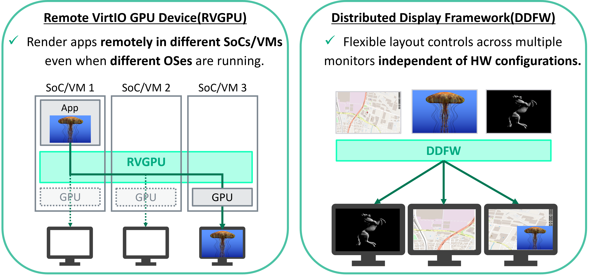
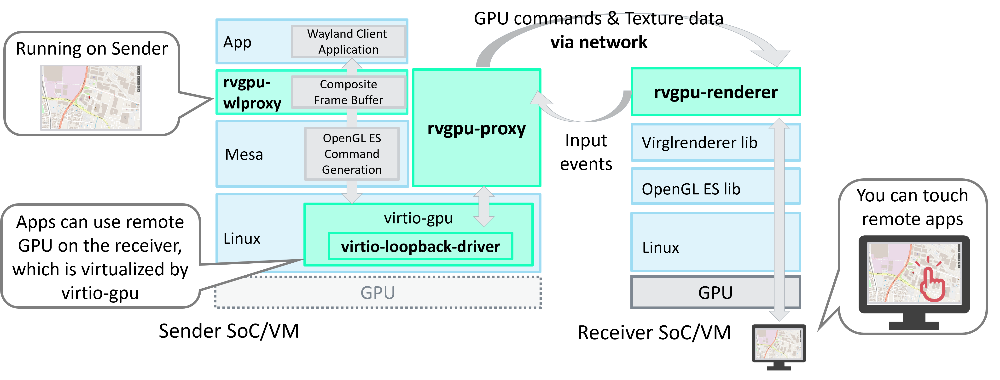
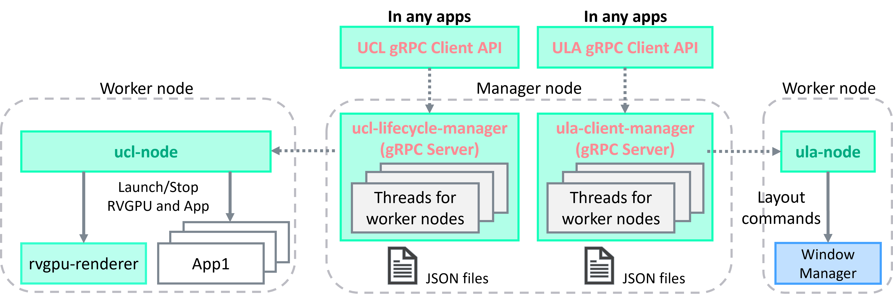

# Unified HMI

## Introduction

This document describes the design and usage of the **Unified HMI**, which is a `Software-Defined` display virtualization platform based on VirtIO GPU technology. Unified HMI allows for flexible development of the entire cockpit and cabin UI/UX, across multiple displays, independent of hardware and OS configurations.


## Unified HMI frameworks

Unified HMI consists of two main components:



From here, easily explain about both RVGPU and DDFW. If you want to learn more about each component and how to use them, please refer to the adapted URL.

### Remote Virtio GPU (RVGPU)

RVGPU is a client-server based rendering engine, which allows to render 3D on one device (client) and display it via network on another device (server)

RVGPU consists of three repositories on Github:

1. [remote-virtio-gpu](https://github.com/unified-hmi/remote-virtio-gpu): Main framework of RVGPU, including **rvgpu-proxy** and **rvgpu-renderer**. Transfer the drawing commands to the remote Soc/VM and render them on the remote display.
2. [virio-loopback-driver](https://github.com/unified-hmi/virtio-loopback-driver): Capture the drawing commands for VirtIO GPU and transfer them to the RVGPU framework.
3. [rvgpu-wlproxy](https://github.com/unified-hmi/rvgpu-wlproxy): Apply applications that operate on the Wayland Protocol, including Flutter apps, to RVGPU.



### Distributed Display Framework (DDFW)

DDFW provides essential services for managing distributed display applications. This framework is designed to work with a variety of hardware and software configurations, making it a versatile choice for developers looking to create scalable and robust display solutions.

As shown in the figure below, DDFW maps multiple cockpit physical displays, into a single large virtual screen.
By placing applications on the virtual screen, you can control their layout across multiple displays.


DDFW consists of three repositories on Github:

1. [ucl-tools](https://github.com/unified-hmi/ucl-tools): Unified Clustering Tools (UCL), launch/stop applications for multiple platforms and manage overall lifecycle of applications
2. [ula-tools](https://github.com/unified-hmi/ula-tools): Unified Layout Tools (ULA), application layout for virtual displays on virtual screen (mapped from physical displays).

#### DDFW APIs

The API functionality of both UCL and ULA are both exposed with gRPC. Once the gRPC Servers (**ucl-lifecycle-manager** for UCL and **ula-client-manager** for ULA) are running, you can launch gRPC Client API from any application or command line and easily use their functions.

Reference implementations of gRPC Client for each UCL/ULA are released [here](https://github.com/unified-hmi/uhmi-grpc-client-ref). If you want to implement UCL/ULA APIs in your existing apps, please refer to them.



### Json settings

To run Unified HMI frameworks, you need to prepare three Json files correctly for your execution environment.

1. virtual-screen-def.json: Execution environment such as display and node (SoCs/VMs/PCs) informations. Please put this file on all related host.


2. app.json: Application execution information which can also take a sender/receiver relationship. Please put this file on one of the sender/receiver or a host that can be communicate with them via network.


3. initial-vscreen.json: application layout information such as position and size. Please put this file on one of the sender/receiver or a host that can be communicate with them via network.


Json files need to be created correctly for your execution environment.

**Placement Guidelines:**
- `virtual-screen-def.json`: Place on every node participating in the distributed display system.
- `app.json` and `initial-vscreen.json`: Place on the sender node or a node that can communicate with all participants.

## How to install Unified HMI frameworks in your Build

Follow the [AGL documentation](https://docs.automotivelinux.org/en/master/#01_Getting_Started/02_Building_AGL_Image/01_Build_Process_Overview/) for the build process, and set up the "[Initializing Your Build Environment](https://docs.automotivelinux.org/en/master/#01_Getting_Started/02_Building_AGL_Image/04_Initializing_Your_Build_Environment/)" section as described below to enable the AGL feature 'agl-uhmi'. 

For example:
```
$ cd $AGL_TOP/master
$ source ./meta-agl/scripts/aglsetup.sh -m qemux86-64 -b qemux86-64 agl-demo agl-devel agl-uhmi
```

After adding the feature, execute the command:
```
$ bitbake <image_name>
```

To add RVGPU and DDFW to the build images, please add the packagegroup that enable RVGPU(packagegroup-rvgpu) and DDFW(packagegroup-ddfw) to the installation target using the following command.
```
$ echo 'IMAGE_INSTALL:append = " packagegroup-rvgpu packagegroup-ddfw"' >> conf/local.conf
```
**Note**: RVGPU and DDFW can each be used independently. If you wish to use them individually, please add only one of the packagegroups to the installation target.

After adding the feature, you can build AGL image by executing following command:
```
$ bitbake <image_name>
```
Replace the `<image_name>` with the appropriate values you want. We have confirmed the operation with the **agl-ivi-demo-flutter**.

## How to setup and boot

For Environment setup instructions for each platform, refer to the following links in the AGL Documentation:
* [Building for x86(Emulation and Hardware)](https://docs.automotivelinux.org/en/master/#01_Getting_Started/02_Building_AGL_Image/06_Building_the_AGL_Image/02_Building_for_x86_%28Emulation_and_Hardware%29/)
* [Building for Raspberry Pi 4](https://docs.automotivelinux.org/en/master/#01_Getting_Started/02_Building_AGL_Image/06_Building_the_AGL_Image/03_Building_for_Raspberry_Pi_4/)
* [Building for Supported Renesas Boards](https://docs.automotivelinux.org/en/master/#01_Getting_Started/02_Building_AGL_Image/06_Building_the_AGL_Image/04_Building_for_Supported_Renesas_Boards/)

## Preconfigured Images for using Unified HMI

Preconfigured images for testing Unified HMI on the AGL have been released [here](https://gitlab.com/automotivegradelinux/AGL/meta-agl-devel/-/tree/master/meta-uhmi/meta-agl-uhmi-demo?ref_type=heads)
By using them, you can easily perform tests in just a few steps.

## How to use Unified HMI

In the following verification procedure, it is assumed that two SoCs or Virtual Machines, are each connected to a Full HD display, arranged side by side as shown in the following diagram.

Here, agl-host0 will act as the sender, and the application will be executed on agl-host0. Both agl-host0 (itself) and agl-host1 will render it remotely as receivers, enabling the display of the application across two displays.


### Set Hostnames and IP addresses.

Please set unique hostnames and IP addresses to ensure correct communication between nodes over the network.

### Set environment variables

For using Unified HMI, please set `XDG_RUNTIME_DIR=/run/user/<your_UID>` and `WAYLAND_DISPLAY=<your_WAYLAND_DISPLAY>` correctly in **/lib/systemd/system/ucl-node.service**.
Please execute `$ls /run/user/` in your environment to check `<your_UID>`.

e.g. In agl-ivi-demo-flutter, <your_UID> is set to 1001 and <your_WAYLAND_DISPLAY> is set to wayland-0. Please create **/etc/default/ucl-node** as follows and set correct variables:
```
XDG_RUNTIME_DIR=/run/user/1001
WAYLAND_DISPLAY=wayland-0
```

**Note:** When using agl demo images like agl-ivi-demo-flutter, this setup is not required.

### Customizing Virtual Screen Definitions (both agl-host0/agl-host1)

Adjust the `/etc/uhmi-framework/virtual-screen-def.json` file to match your environment. In this demo, please modify Json file as shown in below:

```
{
    "virtual_screen_2d": {
        "size": {"virtual_w": 3840, "virtual_h": 1080},
        "virtual_displays": [
            {"vdisplay_id": 0, "disp_name": "AGL_SCREEN0", "virtual_x": 0, "virtual_y": 0, "virtual_w": 1920, "virtual_h": 1080},
            {"vdisplay_id": 1, "disp_name": "AGL_SCREEN1", "virtual_x": 1920, "virtual_y": 0, "virtual_w": 1920, "virtual_h": 1080}
        ]
    },
    "virtual_screen_3d": {},
    "real_displays": [
        {"node_id": 0, "vdisplay_id": 0, "pixel_w": 1920, "pixel_h": 1080, "rdisplay_id": 0},
        {"node_id": 1, "vdisplay_id": 1, "pixel_w": 1920, "pixel_h": 1080, "rdisplay_id": 0}
    ],
    "node": [
        {"node_id": 0, "hostname": "agl-host0", "ip": "192.168.0.100"},
        {"node_id": 1, "hostname": "agl-host1", "ip": "192.168.0.101"}
    ],
    "distributed_window_system": {
        "ucl_lifecycle_manager" : {"node_id" : 0, "port": 6543},
        "ula_client_manager" : {"node_id" : 0, "port": 6443},
        "framework_node": [
            {"node_id": 0,"ula": {"debug": false, "debug_port": 8080, "port": 10100},"ucl_node": {"port": 7654},
             "compositor": [{"vdisplay_ids": [0], "sock_domain_name": "rvgpu-compositor-0", "listen_port": 36000}]
            },
            {"node_id": 1,"ula": {"debug": false, "debug_port": 8080, "port": 10100},"ucl_node": {"port": 7654},
             "compositor": [{"vdisplay_ids": [1], "sock_domain_name": "rvgpu-compositor-1", "listen_port": 36001}]
            }
        ]
    }
}
```

Please put the same virtual-screen-def.json on both agl-host0/agl-host1.

Be sure to set the hostname and IP fields in the node key to accurately reflect your specific network configuration.

### Restarting Services
After updating configuration files, restart the relevant services on each node using the following commands. A full system reboot is not required unless otherwise specified:
```
$ systemctl restart ula-node
$ systemctl restart ucl-node
```

Also, please restart the following system services only in one node indicated as **ucl_lifecycle_manager** or **ula_client_manager** in virtual-screen-def.json.
```
$ systemctl restart ucl_lifecycle_manager
``` 

```
$ systemctl restart ula_client_manager
``` 

After restarting these services, your system should be ready to use DDFW commands with the new configuration.

### Remote rendering of apps with RVGPU using UCL

UCL provides a distributed launch feature for applications using RVGPU. By preparing an app.json configuration, you can enable the launch of applications across multiple devices in a distributed environment.

#### Setting Up for Application Launch using UCL (agl-host0)

To facilitate the distributed launch of an application with UCL, you need to create an app.json file on agl-host0 that specifies the details of the application and how it should be executed on the sender and receiver nodes.

Example of `app.json`:
```
{
  "format_v1": {
    "command_type": "remote_virtio_gpu",
    "appli_name": "glmark2-es2-wayland",
    "sender": {
      "launcher": "agl-host0",
      "command": "ucl-virtio-gpu-wl-send",
      "frontend_params": {
        "scanout_x": 0,
        "scanout_y": 0,
        "scanout_w": 1920,
        "scanout_h": 1080
      },
      "appli": "/usr/bin/glmark2-es2-wayland -s 1920x1080 -b desktop:blur-radius=5:effect=blur:passes=1:separable=true:windows=4 --run-forever",
      "env": "LD_LIBRARY_PATH=/usr/lib/mesa-virtio"
    },
    "receivers": [
      {
        "launcher": "agl-host0",
        "backend_params": {
          "listen_port": 36000
        }
      },
      {
        "launcher": "agl-host1",
        "backend_params": {
          "listen_port": 36001
        }
      }
    ]
  }
}
```

In this example, the application glmark2-es2-wayland is configured to launch on the sender node `agl-host0` and display its output on the receiver nodes `agl-host0` and `agl-host1`. The `scanout_x`, `scanout_y`, `scanout_w`, `scanout_h` parameters define the size of the window. 

Please set `listen_port` correctly to match with one defined as **framework_node** keys in virtual-screen-def.json, ensuring the communication between sender and receivers.

#### Launching the Application by UCL (agl-host0)

Once the app.json file is ready, you can execute the application across the distributed system by piping the JSON content to the `ucl-api-comm` command, which is the reference implementation for UCL APIs.

Before launching applications, please start rvgpu-renderer on all receivers:
```
$ ucl-api-comm -c launch_compositor_async
```

Then, launch apps as below:
```
$ ucl-api-comm -c run_command <path to app.json>
```

Please ensure that the app.json file you create is correctly formatted and contains the appropriate parameters for your specific use case.

### Layout the application by ULA

ULA allows you to define physical displays on a virtual screen and provides the ability to apply layout settings such as position and size to applications.

#### Creating a Layout Configuration File (agl-host0)

To define the layout for your applications, you need to create a `initial_vscreen.json` file, with the necessary configuration details on agl-host0. This file will contain the layout settings that specify how applications should be positioned and sized within the virtual screen. Here is an example of what the contents of `initial_vscreen.json` file might look like:

```
{
  "command": "initial_vscreen",
  "vlayer": [
    {
      "appli_name": "glmark2-es2-wayland",
      "VID": 910000,
      "coord": "global",
      "virtual_w": 1920,
      "virtual_h": 1080,
      "vsrc_x": 0,
      "vsrc_y": 0,
      "vsrc_w": 1920,
      "vsrc_h": 1080,
      "vdst_x": 960,
      "vdst_y": 0,
      "vdst_w": 1920,
      "vdst_h": 1080,
      "z_order": 1,
      "vsurface": [
        {
          "VID": 5100,
          "pixel_w": 1920,
          "pixel_h": 1080,
          "psrc_x": 0,
          "psrc_y": 0,
          "psrc_w": 1920,
          "psrc_h": 1080,
          "vdst_x": 0,
          "vdst_y": 0,
          "vdst_w": 1920,
          "vdst_h": 1080
        }
      ]
    }
  ]
}
```

In this example, the application is rendered across the right half of the agl-host0 and the left half of agl-host1 display.

- **vlayer** defines a virtual layer that represents a group of surfaces within the virtual screen. Each layer has a unique Virtual ID (VID) and can contain multiple surfaces. The layer's source (`vsrc_x`, `vsrc_y`, `vsrc_w`, `vsrc_h`) and destination (`vdst_x`, `vdst_y`, `vdst_w`, `vdst_h`) coordinates determine where and how large the layer appears on the virtual screen.

- **vsurface**  defines individual surfaces within the virtual layer. Each surface also has a VID, and its pixel dimensions (`pixel_w`, `pixel_h`) represent the actual size of the content. The source (`psrc_x`, `psrc_y`, `psrc_w`, `psrc_h`) and destination (`vdst_x`, `vdst_y`, `vdst_w`, `vdst_h`) coordinates determine the portion of the content to display and its location within the layer.

#### Applying the Layout Configuration (agl-host0)

Once you have created the `initial_vscreen.json` file with your layout configuration, you can apply it to your system using the following command:

```
$ ula-grpc-client -c DwmSetLayoutCommand <path to initial-vscreen.json>
```

Executing this command will process the configuration from the JSON file and apply the layout settings to the virtual screen. As a result, the applications will appear in the specified positions and sizes according to the layout defined in the JSON file.

Ensure that the `initial_vscreen.json` file you create accurately reflects the desired layout for your applications and display setup.
