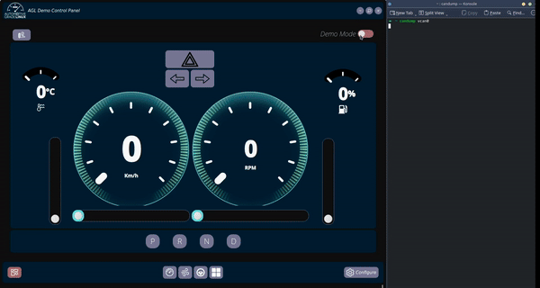

# CARLA with AGL


As part of the [agl-demo-control-panel](https://gerrit.automotivelinux.org/gerrit/admin/repos/src/agl-demo-control-panel,general) application, `carla_to_CAN` and `record_playback.py` scripts provide a way to record CAN messages generated during a CARLA simulation. The `can_messages.txt` playback file generated, can then be used to to playback the messages via CLI or GUI.



## Setting up CARLA

You can follow the steps provided in the [CARLA documentation](https://carla.readthedocs.io/en/latest/start_quickstart/#carla-installation) for installing CARLA.

We recommend using the [CARLA V0.9.15](https://github.com/carla-simulator/carla/releases/tag/0.9.15), and using the supported Python version to run the `carla_to_CAN.py` script (Other releases have not been validated).

_Note_: Use a version of python compatible with CARLA to create the venv **(Python 3.9 tested with CARLA V0.9.15)**

1. Running the CARLA Server

	```bash
	# Move to the installation directory
	$ cd /path/to/CARLA_<version>

	# Start the CARLA Server
	$ ./CarlaUE4.sh

	# To run using minimum resources
	$ ./CarlaUE4.sh -quality-level=Low -prefernvidia
	```

	You may also add the `-RenderOffScreen` flag to start CARLA in off-screen mode. Refer to the various [rendering options](https://carla.readthedocs.io/en/latest/adv_rendering_options/#no-rendering-mode) for more details.

	Another way of running the CARLA server without a display is by using [CARLA in Docker](https://carla.readthedocs.io/en/latest/build_docker/).

2. Starting a Manual Simulation

	```bash
	# Navigate to directory containing the demo python scripts
	# 
	$ cd /path/to/CARLA_<version>/PythonAPI/examples
	```
	
	Create a Python virtual environment and resolve dependencies
	```bash 
	$ python3 -m venv carlavenv
	$ source carlavenv/bin/activate
	$ pip3 install -r requirements.txt

	# Start the manual_control.py script
	$ python3 manual_control.py
	```
_Tip_: If facing issues running the `manual_control.py` script, you may try removing `numpy` version from `requirements.txt` and comment out line `385` from the script.
```python
.
.
.

class KeyboardControl(object):
    """Class that handles keyboard input."""
    def __init__(self, world, start_in_autopilot):
        self._autopilot_enabled = start_in_autopilot
        self._ackermann_enabled = False
        self._ackermann_reverse = 1
        if isinstance(world.player, carla.Vehicle):
            self._control = carla.VehicleControl()
            self._ackermann_control = carla.VehicleAckermannControl()
            self._lights = carla.VehicleLightState.NONE
            # world.player.set_autopilot(self._autopilot_enabled)    <<------ # disable autopilot
            world.player.set_light_state(self._lights)
        elif isinstance(world.player, carla.Walker):
.
.
.
```

## Converting CARLA data into CAN

The `carla_to_CAN.py` script can be run run alongside an existing CARLA simulation to fetch data and convert it into CAN messages based on the [agl-vcar.dbc](https://git.automotivelinux.org/src/agl-dbc/plain/agl-vcar.dbc) file.

While the `record_playback.py` script is responsible for recording amd playing back the CAN data for later sessions.

_NOTE_: This does **not** require the CARLA server to be running.

To access these scripts, clone the [AGL Demo Control Panel](https://gerrit.automotivelinux.org/gerrit/admin/repos/src/agl-demo-control-panel,general) project.

```bash
# Move to the Scripts directory
$ cd /path/to/agl-demo-control-panel/

# Fetch the agl-vcar.dbc file
$ wget -nd -c -P Scripts "https://git.automotivelinux.org/src/agl-dbc/plain/agl-vcar.dbc"
$ cd Scripts/
```

Create a Python (3.9) virtual environment and resolve dependencies.
```bash
$ python3 -m venv carlavenv
$ source carlavenv/bin/activate
$ pip3 install -r requirements.txt

# Optionally, set up the vcan0 interface
$ ./vcan.sh
```

1. Converting CARLA Data into CAN

	```bash
	$ python -u carla_to_CAN.py --interface vcan0
	# OR
	$ python -u carla_to_CAN.py --interface vcan0 --host <carla_server_ip> --port <carla_server_port>
	```

2. Recording and Playback of CAN messages

	```bash
	$ python -u record_playback.py
	# OR
	$ python -u record_playback.py --interface (or) -i can0 # default vcan0
	```

	CLI Options:

	- 1: Captures CAN messages and writes them into 'can_messages.txt' 
	- 2: Replays captured CAN messages
	- 3: Exit

## CAN interface to AGL Demo Platform

To use the **`carla_to_CAN.py`** and **`record_playback.py`** scripts to send messages on the CAN interface, one can use the CAN bus or use CAN over Ethernet using **cannelloni**.

**cannelloni** is available in AGL, just add `IMAGE_INSTALL:append = " cannelloni"`	to your `conf/local.conf`.

To set up the CAN interface between the Host system and the target machine(s) refer to the [cannelloni docs](https://github.com/mguentner/cannelloni).
