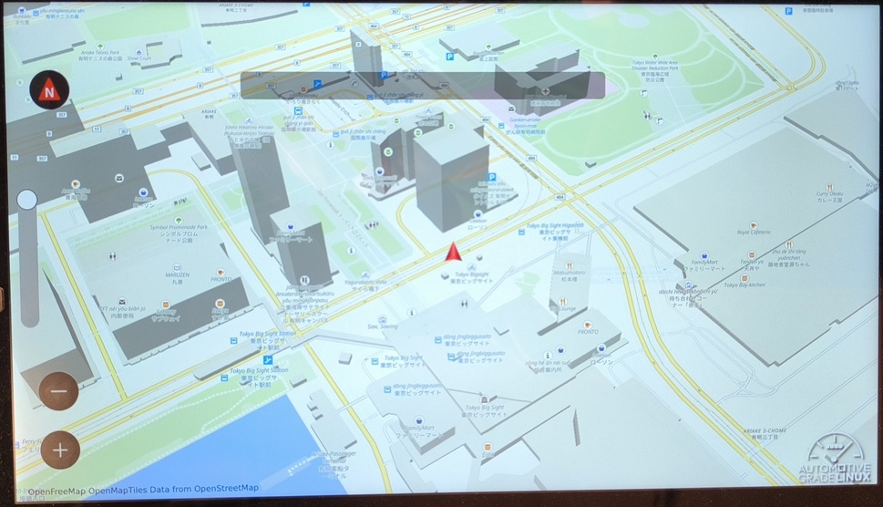

# What is Momi Navi

Momi Navi is a example application for navigation.  It run on simple ivi demo (that name is momi IVI) for the instrument cluster container integration.

## How to use

The momi navi uses maplibre plugin of Qt location.

More detail of maplibre, let's see [this page](https://maplibre.org/).

Map data is download from https://tile.openstreetmap.jp as default.

## Extra configuration

Momi navi supports configuration for customize.

When you set environment variable to local.conf (or site.conf), you can customize Momi navi.

| Environment variable | Customizing parametor |
|:---|:---|
| MOMIMAP_INITIAL_LATITUDE | Default location |
| MOMIMAP_INITIAL_LONGITUDE | Default location |

When you set environment variable to /etc/default/mominavi at target, you can customize Momi navi.

| Environment variable | Customizing parametor |
|:---|:---|
| MOMIMAP_MAPLIBRE_STYLE | Map style URL |
| MOMIMAP_MAP_COPYRIGHT | Copyright for map. (Must be set, if you set MOMIMAP_MAPLIBRE_STYLE) |

