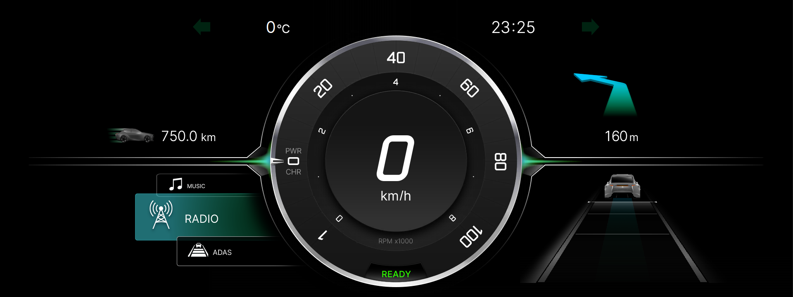

# Cluster Ref GUI

## What is Cluster Ref GUI

Cluster Ref GUI is an example application for the AGL Instrument Cluster HMI.  That is used in the AGL Instrument Cluster platform with container integration.  It's licensed under Apache 2.0, other than font data.  The font data is licensed under SIL Open Font License 1.1.

Initially, it was contributed by Panasonic Automotive Systems.  It is maintained by the AGL Instrument Expert Group now.




## How to use

Cluster Ref GUI is fully dependent on [cluster-service](../10_IC_Service/01_Instrument_Cluster_Service.md).  It shows the vehicle signals such as speed, fault lamp and others that are received from the cluster service.

As a default integration, Cluster Ref GUI runs in demo mode.  The demo signal is generated by cluster-service.

If you want to control behavior by CAN signals, you need to change the running mode of the cluster service from demo to CAN.  It is set by /lib/systemd/system/cluster-service.service.  CAN messages are defined at [AGL CAN definition](../../80_DevTools/03_AGL_Virtual_Car_CAN/01_agl-vcar.md). 

**Demo mode (default):**
```
[Unit]
Description=AGL Cluster Service
After=basic.target
Requires=basic.target

[Service]
Type=notify
ExecStart=/usr/bin/cluster_service --demo
Restart=on-failure
StartLimitInterval=0

[Install]
WantedBy=basic.target
```

**Socket CAN mode (use can0 interface):**
```
[Unit]
Description=AGL Cluster Service
After=basic.target
Requires=basic.target

[Service]
Type=notify
ExecStart=/usr/bin/cluster_service --can=can0
Restart=on-failure
StartLimitInterval=0

[Install]
WantedBy=basic.target
```

## CAN signals

The definition of CAN signals is [that](https://git.automotivelinux.org/src/agl-dbc/).  That is defined as an independent existing vehicle.
