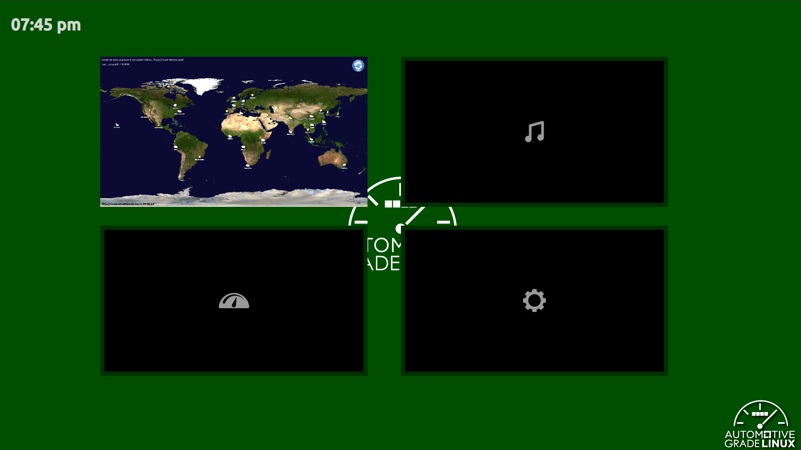

# What is Momi Screen

Momi Screen is an example of the Home Screen of Momi IVI.  Momi IVI is the simplest Qt-based IVI demo.  It aims to show how to create a container guest with sound, graphics, and media support.

Momi Screen maid by QML with QtWaylandCompositor library.  It uses DRM Lease infrastructure.

## How to use

As a default behavior of Momi Screen, it displays Momi Navi first.  If the user touches the AGL logo, it changes to the application selection screen.  The user can select their own favorite application.

