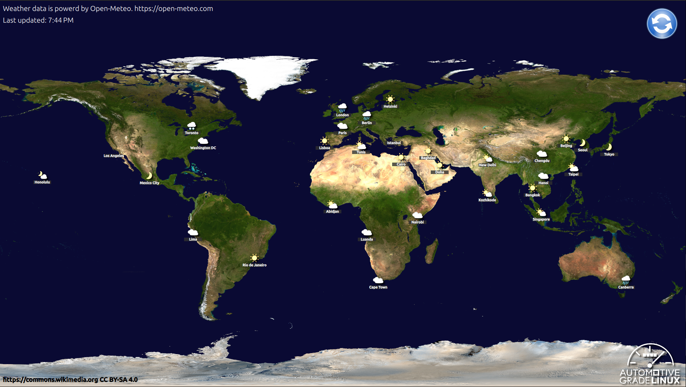

# What is Momi Weather

Momi Weather is a example application for weather.  It's a part of Momi IVI.  It aims to show how to create a application with internet connection.

## How to use

Momi Weather show world wide weather on screen.  If a user push update button at top left, the weather information will update.

## References

[Open Meteo](https://open-meteo.com/) Free Weather API.
