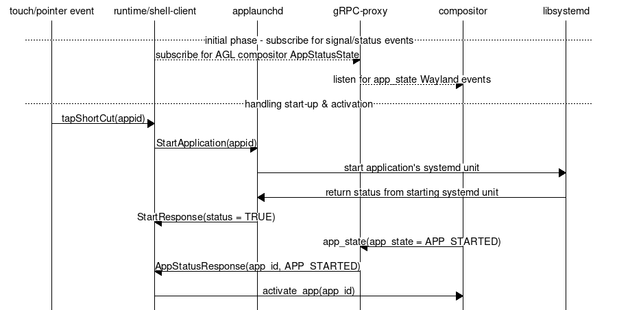
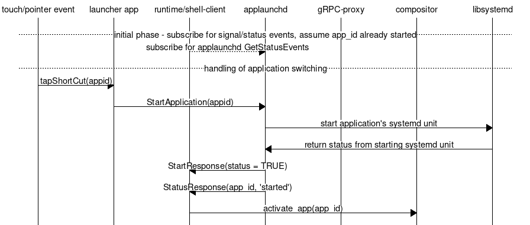

# Introduction

At system runtime, it may be necessary for applications to start other
applications on demand. Such actions can be executed in reaction to a user
request, or they may be needed to perform a specific task.

In order to do so, running applications and services need an established way of
discovering installed applications and executing those.

In order to provide a language-independent interface for applications and
service to use, AGL includes `applaunchd`, a system service.

# Application launcher service

The purpose of `applaunchd` is to enumerate applications available on the
system and provide a way for other applications to query this list and start
those on demand.  It is also able to notify clients of the startup and
termination of applications it manages.

To that effect, `applaunchd` provides a gRPC interface which other applications
can use in order to execute those actions.

*Note: `applaunchd` will only send notifications for applications it started;
it isn't aware of applications started by other means (`systemd`, direct
executable call...), and therefore can't send notifications for those.*

## Application discovery

Applications are enumerated from systemd's list of available units based on the
pattern `agl-app*@*.service`, and are started and controled using their systemd
unit.  Please note `applaunchd` allows only one instance of a given
application.

## Application identifiers

Each application is identified by a unique Application ID. Although this ID can
be any valid string, it is highly recommended to use the "reverse DNS"
convention in order to avoid potential name collisions.

## gRPC interface

The interface provides methods for the following actions:

- retrieve the list of available applications
- request an application to be started
- subscribe to status events

Moreover, with the gRPC the client subscribes to a status signal to be notified
when an application has successfully started or its execution terminated.

The gRPC protobuf file provides a Request and Response arguments to RPC methods
even though in some cases these might be empty in order to allow forward
compatibility in case additional fields are required.
It is a good standard practice to follow up with these recommendation when
developing a new protobuf specification.

### Applications list

The `ListApplications` method allows clients to retrieve the list of available
applications. 

The `ListRequest` is an empty message, while `ListResponse` contains the following:

```
message AppInfo {
  string id = 1;
  string name = 2;
  string icon_path = 3;
}

message ListResponse {
  repeated AppInfo apps = 1;
}
```

### Application startup request

Applications can be started by using the `StartApplication` method, passing the
`StartRequest` message, defined as:

```
message StartRequest {
  string id = 1;
}
```

In reply, the following `StartResponse` will be returned:

```
message StartResponse {
  bool status = 1;
  string message = 2;
}
```

The "message" string  of `StartResponse` message will contain an error message
in case we couldn't start the application for whatever reason, or if the "id"
isn't a known application ID. The "status" string would be boolean set to
boolean `TRUE` otherwise.

If the application is already running, `applaunchd` won't start another
instance, but instead reply with a `AppStatus` message setting the `status`
string to "started".

### Status notifications

The gRPC interface provides clients with a subscription model to receive
status events. Client should subscribe to `GetStatusEvents` method to receive
them.

The `StatusRequest` is empty, while the `StatusResponse` is defined as
following:

```
message AppStatus {
  string id = 1;
  string status = 2;
}

message LauncherStatus {
}

message StatusResponse {
  oneof status {
    AppStatus app = 1;
    LauncherStatus launcher = 2;
  }
}
```

As mentioned above, the `status` string is set to "started" and is also emitted
if `applaunchd` receives a request to start an already running application.
This can be useful, for example, when switching between graphical applications:

- the application switcher doesn't need to track the state of each application;
  instead, it can simply send a `StartApplication` request to `applaunchd`
  every time the user requests to switch to another application. Obviously, the
  client needs to subscribe to get these events and act accordingly.
- the shell client then receives the `StatusResponse` with the message `status`
  string set to "started" indicating it that it should activate the window with
  the corresponding `id` string, or alternatively the string `status` is
  set to "terminated" to denote that the application has been terminated,
  forcibly or not

## A deeper look at start-up, activation and application switching

Application start-up, activation and application switching are sometimes
conflated into a single operation but underneath some of these are distinct
steps, and a bit flaky in some circumstances.
The [AGL compositor](../02_agl_compositor.md) has
some additional events which one can use when creating an application
start-up & switching scheme in different run-times.

Start-up of application is handled entirely by `applaunchd` service while
activation -- the window which I want to display, but which has never been
shown, and application switching -- bring forward an application already
shown/displayed in the past, are operations handled entirely by the
AGL compositor.

The issue stems from the fact that underneath `applaunchd` can't make any
guarantees when the application actually started, as it calls into libsystemd
API to start the specific application systemd unit.

If `StartApplication` can't start the systemd unit, it returns a false
`status` boolean value and a error message in `StartResponse` message, but if
the application is indeed started we doesn't really know the *moment* when the
application is ready to be displayed. Additionally, the AGL compositor
performed the activation on its own when it detected that a new application
has been started, but that implicit activation can now be handled outside
by the desktop run-time/shell client.

*Note: Some of the run-times still rely on the compositor to perform activation
as this synchronization part between `applaunchd` has not been implemented. The
plan is to migrate all of remaining run-times to using this approach.*

### Start-up & activation

This means that we require some sort of interaction between `StartApplication`
method and the events sent by the AGL compositor in order to correctly handle
start-up & activation of application.

There are couple of ways of achieving that, either using Wayland native calls,
or using the gRPC proxy interface, which underneath is using the same Wayland
native calls.

For the first approach, the AGL compositor has an `app_state` Wayland event
which contains the application ID, and an enum `app_state` that will propagate
the following application state events:

```
<enum name="app_state" since="3">
  <entry name="started" value="0"/>
  <entry name="terminated" value="1"/>
  <entry name="activated" value="2"/>
  <entry name="deactivated" value="3"/>
</enum>
```

The `started` event can be used in correlation with the `StartApplication`
method from `applaunchd` such that upon received the `started` even, it can
explicitly activate that particular appid in order for the compositor to
display it. See [AGL compositor](../02_agl_compositor.md)
about how activation should be handled.

*Note: These can only be received if by the client shell which binds to the
agl_shell interface*.

Alternatively, when using the gRPC proxy one can register to receive these
status events similar to the `applaunchd` events, subscribing to
`AppStatusState` method from the grpc-proxy helper application, which has the
following protobuf messages:

```
message AppStateRequest {
}
message AppStateResponse {
        int32 state = 1;
        string app_id = 2;
}
```

The integer state maps to the `enum app_state` from the Wayland protocol, so
they are a 1:1 match.

Here's the state diagram for the Qt homescreen implementation of the
application start-up:



### Application switching

With the compositor providing application status events, it might seem that the
`applaunchd`'s, `GetStatusEvents` might be redundant, but in fact it is being
used to perform application switching. The run-time/shell client would in fact
subscribe to `GetStatusEvents` and each application wanting to switch to another
application would basically call `StartApplication`. That would eventually reach
the run-time/shell-client and have a handler that would ultimately activate the
application ID.



*Note: In practice, the run-time/shell-client would subscribe to both `applaunchd`
and to the AGL compositor, either Wayland native events, or using the gPRC-proxy
helper client, although the diagrams show them partly decoupled*.
