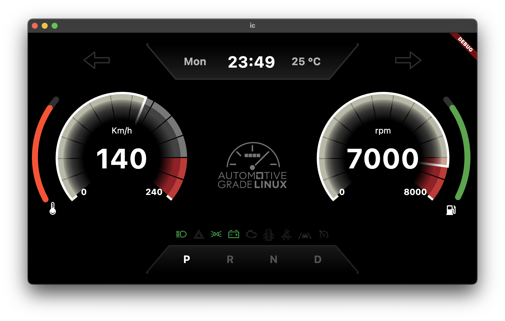
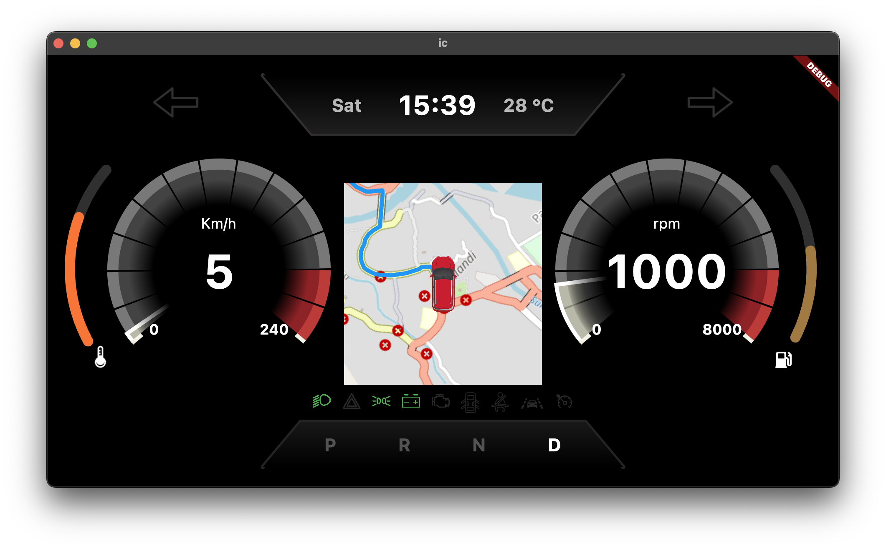

# Build and Boot AGL Flutter Instrument Cluster demo image made for GSoC 

## 0. Prepare Your Build Host

- Install the required tools to build an AGL Image. For detailed explanation, check [Preparing Your Build host](https://docs.automotivelinux.org/en/needlefish/#0_Getting_Started/2_Building_AGL_Image/1_Preparing_Your_Build_Host/)

## 1. Define Your Top-Level Directory

```bash
$ export AGL_TOP=$HOME/AGL
$ echo 'export AGL_TOP=$HOME/AGL' >> $HOME/.bashrc
$ mkdir -p $AGL_TOP
```

## 2. Download the repo Tool and Set Permissions

```bash
$ mkdir -p $HOME/bin
$ export PATH=$HOME/bin:$PATH
$ echo 'export PATH=$HOME/bin:$PATH' >> $HOME/.bashrc
$ curl https://storage.googleapis.com/git-repo-downloads/repo > $HOME/bin/repo
$ chmod a+x $HOME/bin/repo
```

## 3. Download the AGL Source Files
To download the latest **master** branch  AGL files, use the following commands:
```bash
$ cd $AGL_TOP
$ mkdir master
$ cd master
$ repo init -u https://gerrit.automotivelinux.org/gerrit/AGL/AGL-repo
$ repo sync
```

## 4. Initialize the build environment using aglsetup.sh Script
To initialize the build environment, we must use the setup script.
This script is available here: 
```bash
$ $AGL_TOP/master/meta-agl/scripts/aglsetup.sh
```
Run the script:

```bash
$ cd $AGL_TOP
$ source master/meta-agl/scripts/aglsetup.sh -b build-flutter-cluster -m qemux86-64 agl-demo agl-devel
```

- Here `-b` is used to specify the build directory and `-m` is used to specify the target platform.

- Running this script, will create a build directory if it does not exist. Default build directory: `$AGL_TOP/master/build-flutter-cluster`
- Default target paltform: `qemux86-64`

** NOTE: Set the API key in local.conf **
 
- By default navigation will not work, you need to set your openrouteservie API key to the variable `OPENROUTE_API_KEY` in your local.conf
- It is present at `$AGL_TOP/master/build-flutter-cluster/conf/local.conf`
 
- Example: Just add `OPENROUTE_API_KEY = "your_openrouteservice_api_key"` to the end of local.conf


## 5. Using BitBake

```bash
$ cd $AGL_TOP/master/build-flutter-cluster
$ source agl-init-build-env
$ bitbake agl-cluster-demo-platform-flutter
```

## 6. Deploying the AGL Demo Image
Boot the image using QEMU

```bash
$ cd $AGL_TOP/master/build-flutter-cluster
$ source agl-init-build-env
$ runqemu kvm serialstdio slirp publicvnc
```

## 6. Run the Graphics
To get graphics of the app, you need VNC client like VNC Viewer or Vinagre

- Open the VNC client
- Enter the server address as `localhost:0` 

That's it, you should get something like this:


## 7. To start navigation widget
To get the navigation, you need to use `kuksa_viss_client` or `kuksa_vss_init.py` script.

#### **Using inbuilt `kuksa_vss_init.py` script**

 After running the build, you should get this:
 
```bash
Automotive Grade Linux 13.93.0 qemux86-64 ttyS0

qemux86-64 login: 

```

Login as root

```bash
qemux86-64 login: root
```
Now run the script

```bash
root@qemux86-64:~# /usr/sbin/kuksa_vss_init.py
```

#### **Using `kuksa_viss_client`** 

Know more about kuksa_viss_client, [Follow this](https://github.com/eclipse/kuksa.val/tree/master/kuksa_viss_client)

- Run the kuksa_viss_client
- Authorize using token

Then

```bash
Test Client> setValue Vehicle.Cabin.SteeringWheel.Switches.Info true
```



